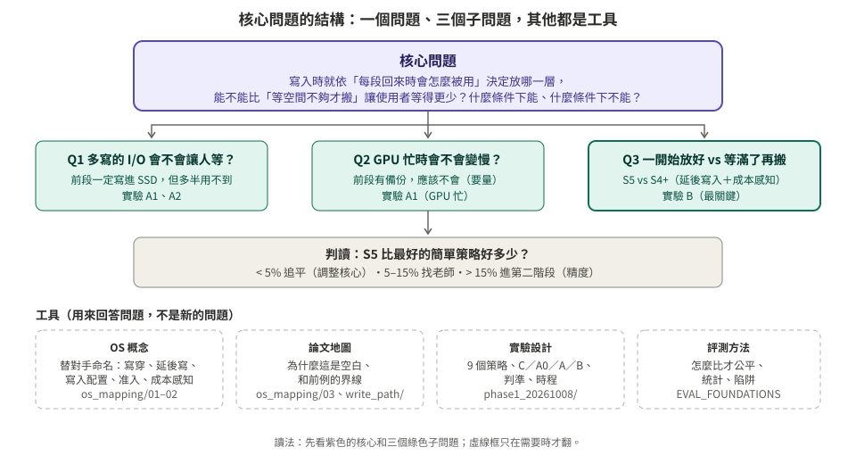
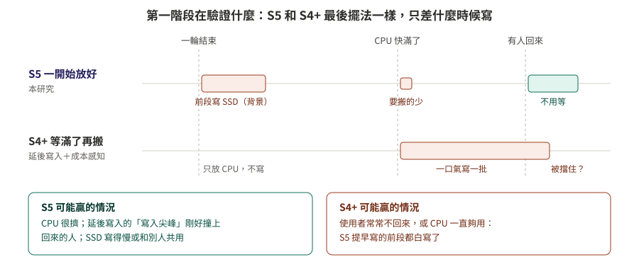

# 核心問題（總綱）

> **一句話**：在長 context、使用者會回來的情境下，**寫入 KV 時就依「每一段回來時會怎麼被用」決定放哪一層**，能不能比「等空間不夠才搬」讓使用者等得更少？什麼條件下能、什麼條件下不能？

**日期**：2026-10-08
**用途**：所有文件的入口。核心只有這一頁；其他資料夾都是用來回答這個問題的工具。核心要改時，先改這一頁。

---

## 1. 為什麼問這個（三句話）

1. **現象**：長 context 的 KV 太大，GPU 放不下，只能放到 CPU 或 SSD；使用者回來時要搬回來，搬得慢就撞牆。
2. **現有做法的空白**：
   - 讀取端最好的方法（Cake）假設 KV 早就全部存好，只管「回來時怎麼拿最快」；
   - 系統端多半是「全部寫」或「等擠出來才寫」（`write_path_20261008/02`）。
3. **觀察**：每一段 KV 回來時的命運，在寫入時就大致看得出來：後段一定被搬，前段多半被重算。所以可以在寫入時就把每一段放到適合的層。

---

## 2. 三個子問題（第一階段要回答的）

| # | 子問題 | 為什麼重要 | 怎麼回答 |
|:--|:--|:--|:--|
| Q1 | **多寫的 I/O 會不會讓人等？** 前段一定寫進 SSD，但多半用不到 | 這是本研究的代價。老師的第一個疑問也是這個 | `phase1/05` 的 A1、A2 |
| Q2 | **GPU 忙的時候會不會變慢？** | 「前段不存」會在這時吃虧；改成每段都存之後應該不會，但要量 | A1（GPU 忙） |
| **Q3** | **一開始就放好，比等滿了再搬好多少？** | 延後寫入＋成本感知（S4+）最後的擺法和本研究一樣，只差在時間點。這就是本研究的淨價值 | B 實驗：**S5 vs S4+** |

### 白話：第一階段到底在驗證什麼

用筆記來比喻：
- **你（S5）**：出門前就分好。不常用的筆記收進倉庫（SSD），常用的放抽屜（CPU）。
- **朋友（S4+）**：先全部堆在抽屜，抽屜滿了才把不常用的搬去倉庫。

最後兩個人的擺法一模一樣。差別只有**什麼時候搬**：
- 你提早搬，可能**白搬**：如果根本沒人回來，或抽屜一直夠放。
- 朋友臨時搬，可能剛好**擋到人**：一口氣搬一大批的時候，有人回來要拿東西，就得等。

第一階段就是量這兩種情況哪一種比較常發生、差多少。前面的 C、A0 是先確認尺準不準、Cake 在這台機器上有沒有用；A1、A2 是量你的代價（多寫會不會擋人、GPU 忙時會不會變慢）；B 才是比輸贏。

**寫入容不容易干擾別人？** 平常不會：寫入在背景進行，沒人在等它。只有碰到五種情況才會拖慢別人（`write_path_20261008/01` §2），例如讀寫搶同一顆 SSD、PCIe 兩個方向同時傳。MI300X 的本地 SSD 寫入很快（既有量測 1,886 MiB/s），影響可能不大；NFS（683 MiB/s）或鄰居同時在用磁碟時，才比較容易看到。所以 Q1 要實測，不能用猜的。

**判讀**（開跑前寫死，`phase1/05` §6）：S5 比最好的簡單策略好：
- 不到 5%：簡單策略追平，核心要調整；
- 5–15%：找老師判斷；
- 超過 15%：進第二階段（精度）。

---

## 3. 核心以外的東西放在哪裡

| 資料夾 | 回答什麼 | 什麼時候看 |
|:--|:--|:--|
| [phase1_20261008/](phase1_20261008/README.md) | **怎麼回答 Q1–Q3**：9 個策略、實驗、判準、時程 | 執行實驗時 |
| [write_path_20261008/](write_path_20261008/README.md) | 大家怎麼寫 KV、寫入的五種瓶頸（Q1 的背景） | 被問「寫入有什麼代價」時 |
| [os_mapping_20261008/](os_mapping_20261008/README.md) | 用 OS 的語言描述設計和對手；61 篇論文地圖 | 寫相關工作、替對手命名時 |
| [EVAL_FOUNDATIONS_20261007.md](EVAL_FOUNDATIONS_20261007.md) | 怎麼比才公平、統計、陷阱 | 設計量測時 |
| [research_20261007_vlm/](research_20261007_vlm/V01_video_kv_rekv_mukv.md) | 影片情境（CVPR 的可能性） | 10/21 決定要不要爭取 CVPR 時 |

---

## 4. OS 的角度要用到什麼程度

**OS 是描述的語言，不是研究問題。** 核心只需要四個 OS 概念：

| 概念 | 在核心裡的角色 |
|:--|:--|
| **寫入時機**：寫穿 vs 延後寫 | 對手：S1（寫穿）、S4（延後寫） |
| **寫入配置**：新的 KV 要不要佔用 CPU | 本研究用 OS 的話說，就是「依位置逐段決定配置與否」 |
| **准入**：要不要寫 | 對手：建議加的 S1s（命中 2 次才寫） |
| **替換**：LRU vs 成本感知 | 對手：S2b、S4+ |

其他概念先固定或往後放：預取（第三階段的預測器）、粒度（固定 512 token）、注意力重要度（有損，第二階段才相關）、作業系統自己的 page cache（繞過，只影響量測）。

**為什麼不能直接用 OS 的答案**（例如「用延後寫就好」）？因為 KV 有兩個 OS 沒有的特點：
1. **丟了可以重算**：所以「不寫」或「晚點寫」不會遺失資料，只會付出重算的時間；
2. **重算的代價依位置而不同**：所以每一段該放哪裡不一樣。

這兩點正是本研究的出發點，也是它和經典 OS 策略不同的地方。

---

## 5. 和最接近的前例的界線（限於讀過的 61 篇）

| 前例 | 什麼時候決定 | 依什麼決定 | 無損？ | 和本研究的差別 |
|:--|:--|:--|:--|:--|
| **HCache** | 寫入時 | 依「層」比較重算與傳輸的成本 | 是 | 它決定每一層存什麼（hidden／KV／不存）；我們依 token 位置決定放哪一層 |
| **KVDrive** | 寫入時（prefill 後） | 注意力重要度 | 否（稀疏注意力） | 有損、各請求不共享；我們是跨請求、無損 |
| **AdaptCache、EvicPress** | 存入時 | 每段 context 的效用 | 否（壓縮） | 靠有損壓縮換空間，以整段 context 為單位 |
| **Marconi** | 寫入時（准入） | 前綴樹的分支點 | 是 | 混合模型（Attention＋SSM）的狀態，決定存不存，不決定放哪一層 |
| **Pensieve、AsymCache** | 逐出時 | 位置（重算成本） | 是 | 也用位置，但在空間不夠時才決定 |
| **Cake、CacheFlow** | 讀取時 | 位置（重算 vs 搬運） | 是 | 也用位置，但假設 KV 早已存好，只決定怎麼拿回來 |
| **本研究** | **寫入時** | **位置** | **是** | 多層、跨請求 |

這張表只涵蓋讀過的論文（評測卡、write_path、os_mapping 的整理），**動手寫論文前要再查新**。

---

## 6. 什麼時候核心要改

| 結果 | 核心怎麼改 |
|:--|:--|
| Q3：S5 明顯贏 S4+ | 核心不變，進第二階段（加精度狀態） |
| Q3：只在某些條件下贏（例如 SSD 寫得慢、或延後寫入的寫入尖峰擋到人） | 核心縮小成「什麼條件下寫入時就該放好」，把條件說清楚 |
| Q3：S4+ 追平 | 照實寫成「何時不值得做」，和老師討論方向 |
| A0：Cake 在這台機器上本身就沒好處 | 先停，找老師；以 Cake 為基礎的比較都要重想 |

---

## 7. 預測放在哪裡（第三階段，不是現在）

上面的比喻已經說明了預測的用處：**S5 和 S4+ 誰贏，取決於未來**。會不會有人回來、什麼時候回來、回來時 GPU 忙不忙、那時候有沒有別人在讀 SSD，這些在寫入當下都不知道。

所以預測器的任務很明確：**替每個 session 判斷該「現在放好」（S5）還是「晚點再說」（S4+）**。

| 要預測的 | 寫入時能用的訊號 | 對應的決定 |
|:--|:--|:--|
| 會不會回來 | 輪數、內容類型、過去的模式 | 不回來就不必提早寫前段 |
| 多久之後回來 | 上一輪回答的長度、工具類型、過去的間隔 | 很快回來就留在 CPU；很久才回來就提早放好 |
| 回來時 GPU 多忙 | 佇列長度、batch 的歷史 | 前段需不需要備份、分界 b 該設在哪 |
| 什麼時候有別人在讀 SSD | 其他 session 的回來時間 | 避開尖峰時段再寫 |

**為什麼現在不做**：老師說預測器放後面。而且第一階段如果顯示 S5 和 S4+ 在所有情況下都差不多，預測就沒有東西可以選，也不需要做。

**第一階段可以先低成本量「預測最多值多少」**（建議，待你決定）：B 實驗是照固定的回來順序重播，所以未來是已知的。可以加一組 **S5-oracle**：事先知道每個 session 會不會回來、何時回來，再決定要現在放好還是晚點再說。它和 S5、S4+ 的差距，就是一個完美的預測器最多能帶來的好處。差距很小，第三階段就不必做預測器。
