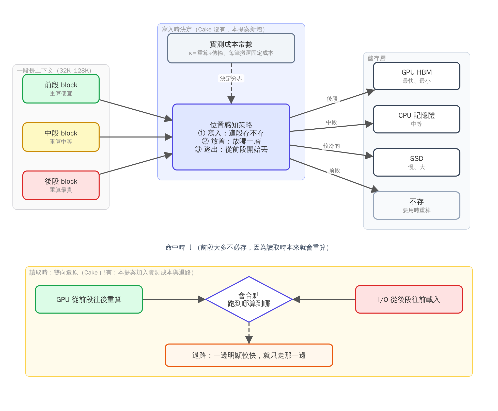
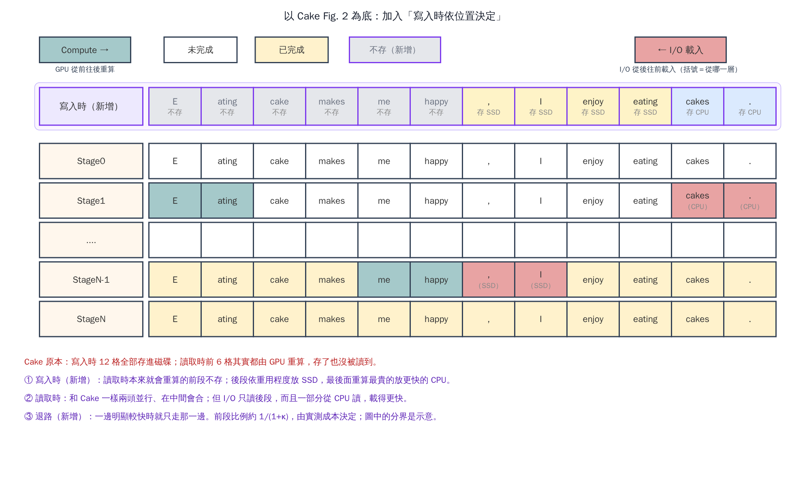
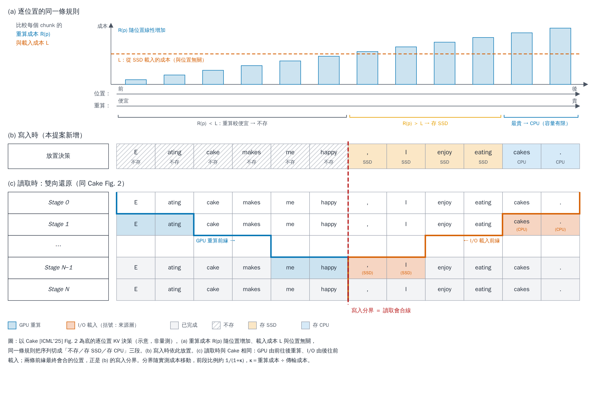

# 方向草稿：以 Cake 為基底，延伸到「要不要存、存在哪、依位置決定」

> 狀態：想法階段，還沒有任何實驗。
> 標註：〔原文〕論文原句；〔AMD 實測〕MI300X 量到的；〔算術〕用公式和實測常數算的，不是量測；〔推論〕我的判讀。

---

## 1. 要解決什麼問題

- 長上下文輸入時，prefill 階段產生 KV cache 的運算量很大，是推論的主要瓶頸〔Cake 原文〕。
- prefix caching 把算過的 KV 存起來重用，可以省掉重複運算〔Cake 原文〕。
- 但 GPU 和 CPU 記憶體放不下那麼多 KV，所以大量 KV 只能放在容量大、頻寬低的磁碟或遠端儲存。依 AttentionStore 的評估，約 80% 的快取命中發生在磁碟層〔Cake 原文引用 AttentionStore〕。
- 從這類儲存讀回大量 KV 會產生嚴重的 I/O 延遲，拉長第一個 token 出來的時間（TTFT）〔Cake 原文〕。
- 過去的系統不是只靠重算，就是只靠 I/O 載入，沒有把兩種資源同時用上〔Cake 原文〕。

## 2. Cake 做了什麼

- **做法**：同一段上下文，GPU 從最前面的 chunk 往後重算，I/O 從最後面的 chunk 往前載入，兩邊實際跑到哪就在哪會合。
- **為什麼這樣分**：越後面的 token 重算越貴（要看的前文越長），而載入一個 token 的成本跟位置無關。所以便宜的前段交給 GPU 算，昂貴的後段交給 I/O 載〔Cake 原文〕。
- **效果**：TTFT 平均比只算或只載快 2.6 倍〔Cake 原文〕。

## 3. Cake 沒處理的地方

1. **假設 KV 早就全部存好**〔原文：「we precompute and store all requests' KV cache in advance」〕。它只處理「已經命中之後怎麼最快拿到」，不處理：
    - 這段 KV 要不要存；
    - 存在哪一層（GPU、CPU 記憶體、SSD）；
    - 存進去要花多少寫入頻寬、佔多少空間。

    詳細分析見 §3.1。
2. **只有一個儲存層，而且是模擬的**。I/O 時間是依頻寬算出延遲再暫停傳輸，沒有接真實裝置〔原文〕，也沒有 GPU／CPU／SSD 多層的情況。
3. **沒有「依位置決定存放」**。它的機制本身已經說明「前段會被重算」，卻仍然把整段的 KV 都存著、準備載入。
4. **沒有退路**。兩邊快慢差很多時仍硬分工；GPU 只剩 12.5% 可用時，比單純載入還慢 25%〔原文 Table 6〕。作者把「估計機制」和「退回單一路徑」列為未來工作〔原文〕。
5. **context 只到 16K**（4K–16K 的合成 prompt）〔原文〕。

### 3.1 為什麼「假設全部存好」是問題

**Cake 的評估怎麼做**：每個請求的 KV 事先算好、全部放進儲存，再量讀取時的 TTFT〔原文〕。這個設定等於假設三件事：容量無限、寫入免費、只有一層。真實系統裡三者都不成立。

**不考慮的後果**〔推論，待實驗驗證〕：

1. **容量：存了不會讀的東西，擠掉會讀的東西**。
    - 快取層的容量是固定的。每段 context 都全存，能放進去的 context 數量就變少，命中率下降；沒命中的請求只能整段重算，TTFT 回到最差情況。
    - Cake 讀取時，前段大約 1/(1+κ) 本來就會被重算。如果只存後段的 κ/(1+κ)，同樣容量最多能多放 (1+κ)/κ 倍的 context〔算術，上限：假設讀取時的會合點正好落在寫入分界〕：
        - κ ≈ 0.72（搬得慢）：最多約 2.4 倍；
        - κ ≈ 11.65（搬得快）：最多約 1.09 倍。
    - 這個上限要容量吃緊才兌現。容量夠大時，全存也不會擠掉任何東西，這一點就不成立。
2. **寫入頻寬：寫入和讀取搶同一條路**。
    - 存 KV 要經過 PCIe，寫進 SSD 還要吃 SSD 頻寬。這條路同時也是別的請求載入 KV 的路。
    - Cake 的 TTFT 不含寫入成本，因為 KV 是事先寫好的。實際上線時，前段那 1/(1+κ) 的寫入量可能永遠不會被讀回，卻會拖慢其他請求的載入。
    - 次要影響：SSD 寫入量直接消耗壽命。
3. **只有一層：最貴的後段，從最慢的地方載入**。
    - Cake 只從單一儲存層載入。最後幾個 chunk 重算最貴，若 GPU 或 CPU 還有空間，放在那裡可以直接用或更快載入，但 Cake 的設定裡沒有這個選項。

**考慮之後為什麼比較好**：讀取時的會合點已經告訴我們「哪一段會被重算、哪一段要被載入」。把同一條規則提前到寫入時用，前段不存（省容量、省寫入），後段依重算成本放到對應的層（越貴放越快的層）。寫入不需要另一套規則，只是把 Cake 讀取時已知的資訊提早用上。

**反面（這樣做可能變差的情況）**：
- 讀取時頻寬或算力變了，會合點往後移，原本沒存的前段就要多重算，TTFT 可能變差（見 §7 第 4 點）。
- 共用的前段（系統提示）不存，可能害到別的請求（見 §7 第 3 點）。
- 模型撐得住 INT4 時，容量壓力本來就小，第 1 點的效益會被吃掉（見 §7 第 1 點）。

**要用什麼實驗證明**：

| 實驗 | 要回答的問題 | 做法 | 看什麼 | 什麼結果代表這點不成立 |
|---|---|---|---|---|
| E1 容量 × 命中率 | 全存是否真的擠掉會讀的 KV | 模擬器＋真實 trace（Mooncake，block 為 512 token），掃快取容量；比較「全存＋Cake 讀取」與「依位置寫入＋Cake 讀取」 | 命中率、TTFT p50／p99、整段重算的請求比例；分 κ 小與 κ 大兩組 | 在合理的容量範圍內，命中率或 TTFT 改善 < 5% |
| E2 寫入干擾 | 寫入是否拖慢其他請求的載入 | MI300X＋vLLM `OffloadingConnector` 實測：一邊有請求在寫 KV，一邊有請求在載入 | 每個請求的寫入位元組、載入請求的 TTFT 變化 | 寫入同時進行時，載入請求的 TTFT 沒有可量到的變化 |
| E3 多層 vs 單層 | 多一層是否值得 | 總容量固定，比較「只有 SSD」與「CPU＋SSD」，以及後段留 GPU 的情況 | TTFT、各層的使用量 | 多層與單層的 TTFT 差距在量測誤差內 |
| E4 穩健性 | 會合點移動時會不會變差 | 讀取時把頻寬或可用算力調低或調高（例如 ±50%），寫入時的決定不變 | TTFT 相對全存的最差情況；退路觸發的次數 | 擾動下 TTFT 常比全存差，而且退路救不回來 |

E1 是主實驗，E2 到 E4 補充。E1 不成立的話，這一點就不能當成主要動機。§8 的第一步就是 E1 的最小版本。

## 4. 因為這些缺點，會導致什麼

**核心觀察**：Cake 讀取時，前段大多是用重算補回來的。所以**前段的 KV 就算存了，很多時候也不會被讀到**〔推論〕。這會造成三個浪費：

1. **浪費儲存容量**：前段 KV 佔著位置，排擠了真正需要被載入的後段。在容量有限的快取層，這直接降低命中率。
2. **浪費寫入頻寬與 SSD 壽命**：每一段 KV 都要寫進 SSD，但其中前段那部分可能永遠不會被讀回。
3. **快的層放錯東西**：最該留在快層的是「重算最貴」的後段，但現在的系統依「最近有沒有用」決定（LRU），不看位置。而且 vLLM、SGLang 逐出時是從尾巴先丟〔vLLM 文件〕，剛好把最貴的那段先丟掉。

**前段會被重算多少？**〔算術，一階近似〕
- 依 Cake 的會合邏輯，被重算的前段比例大約是 1/(1+κ)，κ ＝ 重算成本 ÷ 傳輸成本（CacheFlow 寫出了同一個切點公式）。
- 我們在同一張 MI300X 上，只換模型或長度，κ 就在 0.72 到 11.65 之間變動〔AMD 實測〕。換算下來：
    - 搬得慢（κ ≈ 0.72）：約 58% 的前段會被重算，這部分根本不必存；
    - 搬得快（κ ≈ 11.65）：只有約 8%。

**所以這個方向的效益是平台與模型相依的**：搬得越慢（越接近 SSD 或遠端儲存），能省的越多。

## 5. 所以想做什麼

把 Cake「讀取時」的雙向還原，延伸成**一套貫穿寫入、放置、逐出、讀取的位置感知（block 級）策略**，涵蓋 GPU／CPU／SSD 三層，context 拉到 32K–128K。

**怎麼讀這張圖**：(A) 由左到右是一個 chunk 的生命週期：寫入、存放、讀取。三欄共用同一組儲存層。紫框是本提案新增或修改的部分，藍框是 Cake 原有，綠框表示資料已在 GPU。

- **(A) 左：寫入路徑（新增）**。prefill 算完 KV 後，逐個 chunk 比較「重算成本 R(p)」與「各層的載入成本」。R(p) 隨位置變貴，所以：
    - 前段重算便宜，不存；
    - 中段放 SSD，後段放 CPU；
    - 最後幾格重算最貴，留在 GPU，再依品質預算 ε 選 BF16、FP8 或 INT4。
- **(A) 中：六態儲存層**。GPU 一層再分 BF16／FP8／INT4 三種精度，加上 CPU、SSD 與「不存」，共六種狀態，每個 chunk 只處於其中一種。FP8 與 INT4 的品質影響依模型與任務而定。
- **(A) 右：讀取路徑（Cake 的雙向還原，改造後）**。三條來源各自接到一個讀取動作：
    - 已在 GPU 的直接可用（FP8／INT4 需反量化）；
    - 放在 CPU 或 SSD 的，由 I/O 從後段往前載入。Cake 原本只從磁碟載，本提案改為多層；
    - 不存的前段，由 GPU 從前段往後重算，這部分 Cake 原本就有。
    三者在「會合」後開始 decode。另外新增退路：一邊明顯較快時，只走那一邊。
- **左右怎麼接起來**：寫入時「不存」的前段，正好是讀取時 GPU 本來就會重算的那段；寫入時放到 CPU 或 SSD 的後段，正好是讀取時 I/O 要載入的那段。
- **(B)** 重繪自 Cake 論文 Fig. 2，用 12 個 chunk 對比兩種做法：
    - Cake：12 格全存磁碟，讀取時前 6 格重算、後 6 格從磁碟載；
    - 本提案：前 6 格不存，後 6 格依序放 SSD、SSD、CPU、GPU-INT4、GPU-FP8、GPU-BF16。讀取時前 6 格同樣重算，SSD、CPU 的格子由 I/O 載入，GPU 上的格子直接可用。
    紅色虛線是「寫入分界 ＝ 讀取會合線」：兩種做法的會合點相同，但本提案 I/O 要搬的格數變少、來源也更快。

原始檔：`figures/fig_cake_extension.svg`（可編輯）；產生腳本：`figures/specs/make_fig_cake_extension.py`。12 個 chunk 與分界位置是示意，實際分界由實測成本決定；圖中各層只標相對快慢，不標具體頻寬。

### 同一件事，用 Cake Fig. 2 的樣式畫

- 下面的 Stage0 到 StageN 跟 Cake 原圖相同：GPU 從前往後算（綠），I/O 從後往前載（紅），在中間會合。
- 最上面多一列「寫入時（新增）」：讀取時本來就會由 GPU 重算的前 6 格不存；後面的存 SSD，最後兩格重算最貴，存更快的 CPU。
- 紅色格子的括號標出「從哪一層載入」。

原始檔：`figures/fig_cake_fig2_ours.svg`；規格：`figures/specs/fig_cake_fig2_ours.json`。

### 核心圖：同一條逐位置規則，寫入分界 ＝ 讀取會合線

- **(a)** 每個 chunk 有 6 種狀態，不是只有 3 種：GPU 內的 BF16、FP8、INT4（用品質換空間），以及 CPU、SSD、不存（無損，但要用時付代價）。INT8 可視為精度的另一階。
- **(b)** 同一條逐位置規則：重算成本 R(p) 隨位置變貴，跟各層的載入成本比較。重算比較便宜的不存；越貴的放越快的層（SSD → CPU → GPU）。留在 GPU 的，再依品質預算 ε 選 BF16、FP8 或 INT4。左右不是兩套規則。
- **(c)** 寫入時，每一格選一種狀態，六種狀態都會出現。
- **(d)** 讀取時跟 Cake 一樣：藍色階梯是 GPU 重算的前緣，橘色階梯是 I/O 載入的前緣。已經在 GPU 的格子直接可用，不必搬。兩條前緣會合的位置（紅色虛線），正好是 (c) 的寫入分界。
- 分界會隨實測成本移動；精度能不能降，取決於模型與任務。

產生方式：`python3 figures/specs/make_fig_cake_staircase.py`（輸出 `figures/fig_cake_staircase.svg`）；配色用色盲友善的 Okabe–Ito 色系；圖中數值為示意。

| 時機 | Cake | 想做的 |
|---|---|---|
| 寫入時 | 全部都存 | 依位置決定：前段（反正會被重算的）不存或只存在便宜的層；後段存在能快速載入的層 |
| 放在哪 | 只有一層儲存 | GPU／CPU／SSD 三層，依「這段重算多貴、載入多快」決定 |
| 逐出時 | 不處理 | 從前段開始逐出（跟 Pensieve 同方向），不從尾巴丟 |
| 讀取時 | 雙向並行，沒有退路 | 雙向並行，但成本用實測（包含每筆搬運的固定成本），並在一邊明顯比較快時退回單一路徑 |
| 長度 | 4K–16K | 32K–128K |

**「token 層級」要講精確**：實際系統以 block 為單位（vLLM 預設 16 token），所以這裡的「token 層級」是指「依 block 在序列中的位置」決定，不是逐個 token。

**多輪對話的額外好處**〔推論，需要驗證〕：如果每一輪只是在後面追加內容，會合點只會往後移。那麼前面那一段在之後每一輪都會被重算，從一開始就不必寫入。這個論證成立的前提是：讀取時的算力與 I/O 速度大致不變、重用是「往後追加」、引擎支援非前綴命中。

## 6. 最接近的前作與差別

| 論文 | 已經做了什麼 | 我們多了什麼 |
|---|---|---|
| Cake（ICML'25） | 讀取時雙向並行 | 寫入與放置也依位置決定；多層；實測成本；退路 |
| CacheFlow（arXiv 2604.25080） | 推出最佳切點公式 ℓ ＝ L × T_io ÷ (T_comp + T_io) | 把切點用在寫入端，並證明多輪下會合點單調後移 |
| Pensieve（EuroSys'25） | 從對話開頭逐出，丟掉的要用時重算 | 加入 SSD 層與寫入決策；以 SSD 取回成本決定 |
| HCache（EuroSys'25） | 在「層」的維度決定哪些層不必存，要用時重算 | 改在「位置」的維度決定，而且不限 MHA |
| AsymCache（arXiv 2606.02964） | 用位置線性成本做逐出 | 寫入與多層放置 |
| py-kvcache（arXiv 2609.11744） | 依硬體量出損益平衡長度，短的不存也不載 | 以 block 位置判斷，而不是整段前綴長度 |
| SGLang HiCache／Dynamo KVBM | 依「用過幾次」決定要不要寫 | 依「位置與成本」決定 |

**新穎性判斷**：部分已知，算窄新。每個零件都有人做過，空白在「寫入時、依位置、多層、多輪下單調」這個組合〔9/24 查新〕。動手前要再做一次查新。

## 7. 會被問到的問題與風險

1. **INT4 會不會讓這件事沒必要？** 我們量到，模型撐得住 INT4 時，空間壓力會大幅下降，放置策略只剩 2–3.5% 的空間〔AMD 實測，初步〕。這個方向的效益要在「不能降精度」或「壓力很大」的情況下才明顯。
2. **搬得快的平台上效益很小**：κ 大時，被重算的前段只有約 8%〔算術〕。
3. **共用的前段**：系統提示這類開頭常被很多請求共用，而且很熱。前段不存，可能害到別的請求，要另外處理。
4. **會合點會動**：Cake 自己說，會合點會隨當下的算力與 I/O 變化〔原文〕。寫入時的決定必須能容忍讀取時的變化。
5. **要改引擎**：vLLM 和 SGLang 只認「從頭開始的連續前綴」命中。前段沒存的話，後段在原生查找下永遠不會被算成命中，所以要做「區段命中」。
6. **SSD 結論目前不確定**：MI300X 容器沒有本地 NVMe，SSD 路徑的實測速度不能代表一般伺服器。

## 8. 第一步（約一週，只用模擬器）

1. 在現有模擬器加一個模式：「區段命中＋雙向還原＋依位置寫入」，成本常數用 MI300X 實測值。
2. 比較四種做法：
    1. 現狀：全存＋LRU；
    2. Cake 式：全存＋雙向讀取；
    3. Pensieve 式：前段逐出；
    4. 提案：依位置寫入＋雙向讀取＋前段逐出。
3. 量：寫入位元組、各層容量需求、TTFT，以及跟 oracle 的差距。
4. **判準**：
    - 提案相對 Cake 式，在 TTFT 不變差的前提下，寫入量或容量需求能省一個有意義的比例（例如 ≥ 30%）→ 做引擎原型；
    - 否則放棄，結果寫進分析型論文當「何時不值得做」的一個例子。

---

## 9. 能不能建立在 Cake 上發表（2026-10-01 評估）

可以。建立在前作上是常態，Cake 本身也是建立在 AttentionStore 上。問題不在能不能，而在會不會被判定為「Cake 多加一步」。目前有三個風險：

1. **自己的初步數據不支持（最嚴重）**。模型撐得住 INT4 時，INT4 單獨就拿走 oracle 空間的 91.8%／103.9%，放置策略只剩 2–3.5%〔AMD 實測，初步〕，低於 `< 5%` 的 NO-GO 線。必須先證明在「不能降精度」或「壓力很大」的情況下，空間明顯大於 5%。
2. **新穎性窄**。零件都有人做過（見 §6），空白只在「寫入時 × 依位置 × 多層 × 多輪」的組合。組合型貢獻需要一個洞見撐住；候選是「寫入分界 ＝ 讀取會合線」，要有成本模型推導與實測驗證。上次查新是 9/24，動手前要重做。
3. **硬體條件**。MI300X 沒有 NVMe，SSD 路徑實測 1.3–3.2 GB/s（overlay）。SSD 層要嘛換有 NVMe 的環境，要嘛在論文中明說是以量到的常數模擬。

**最少需要**：
1. Oracle go/no-go：模擬器加入本提案模式，用 MI300X 實測常數，與 Cake／LRU／Pensieve 比較；`< 5%` 就停。
2. 反例：找出 Cake 全存磁碟、或 LRU 從尾巴丟，實際造成命中率下降的 workload，並量出差距。
3. 真實 I/O：Cake 原文的 I/O 是模擬的，以 vLLM 真實搬運量測本身就是差異點。
4. 重做查新。

**投稿場所**：Oracle 尚無結果，依 CLAUDE.md「9 月底沒有 Oracle 就放棄 MLSys 這一輪」，MLSys 2027（10/30）不實際；目標改為 EuroMLSys 2027（約 2 月，6 頁）。

## 參考

- Cake：Jin et al., "Compute Or Load KV Cache? Why Not Both?", ICML'25, https://arxiv.org/abs/2410.03065（80% 一句在 Introduction，引用 AttentionStore／CachedAttention）
- AttentionStore／CachedAttention：Gao et al., USENIX ATC'24
- CacheFlow：https://arxiv.org/abs/2604.25080
- Pensieve：EuroSys'25，https://arxiv.org/abs/2312.05516
- HCache：EuroSys'25，https://arxiv.org/abs/2410.05004
- AsymCache：https://arxiv.org/abs/2606.02964
- py-kvcache：https://arxiv.org/abs/2609.11744
- vLLM prefix caching 設計文件（逐出從尾巴開始）：https://docs.vllm.ai/en/stable/design/prefix_caching/
