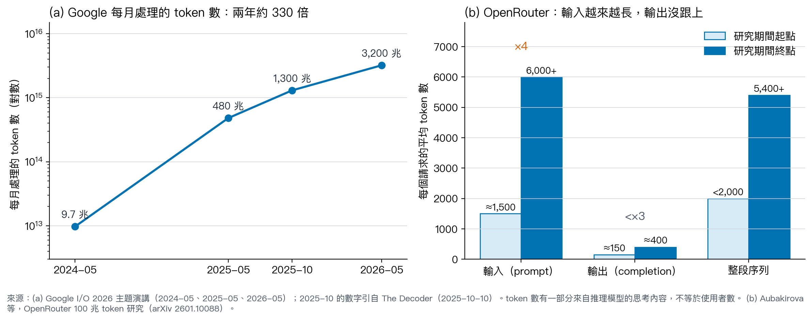
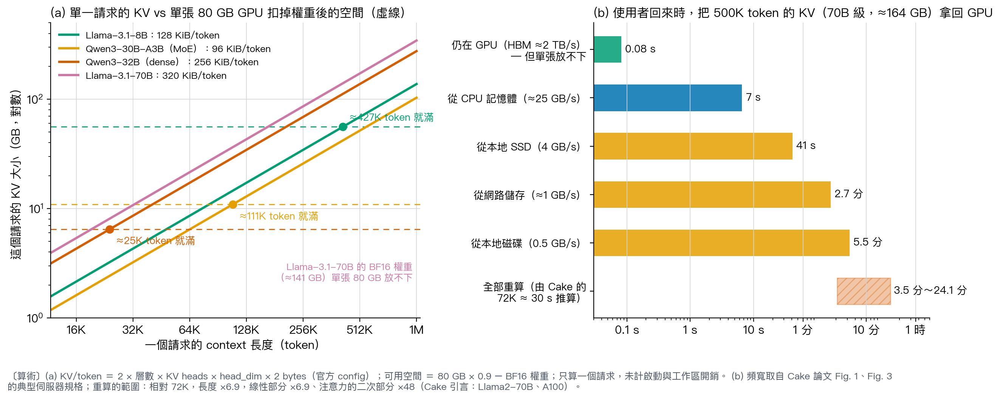
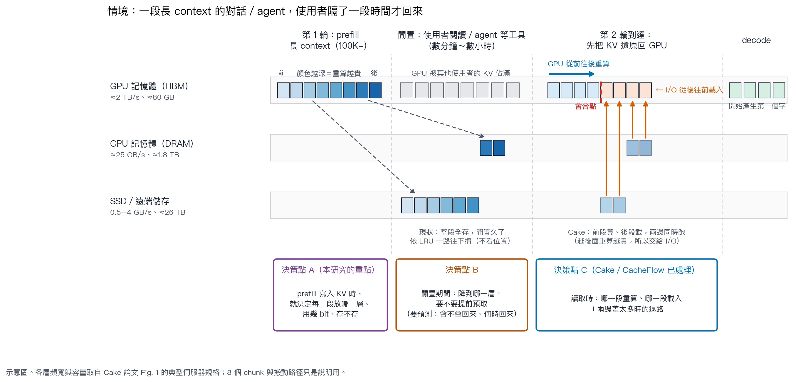
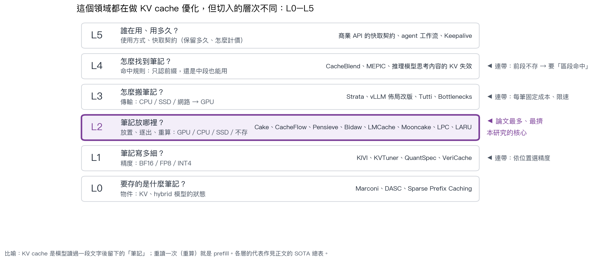
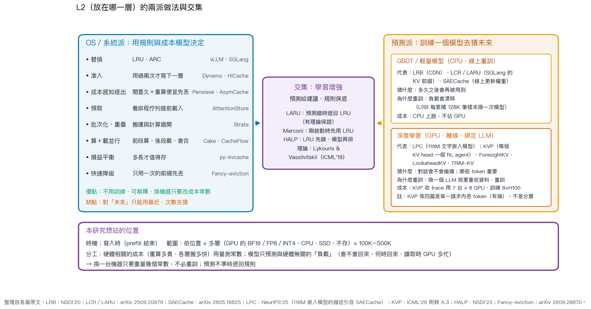
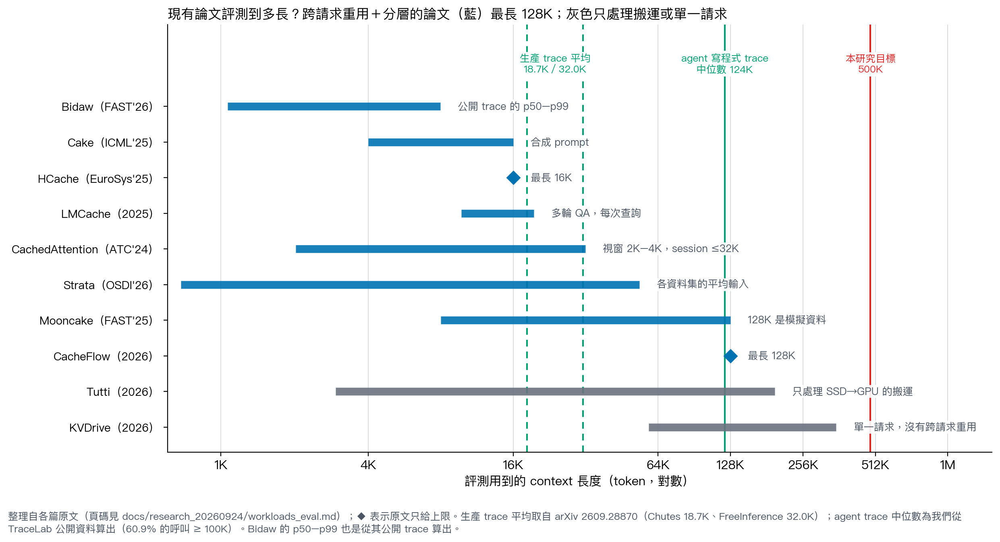
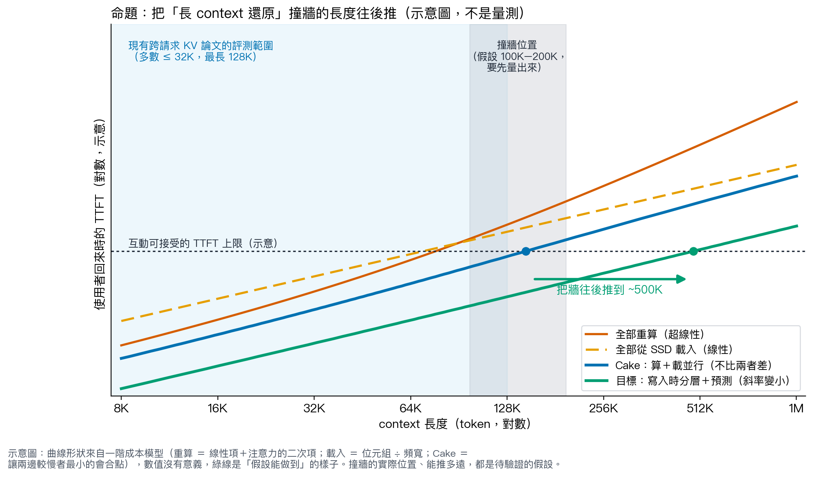
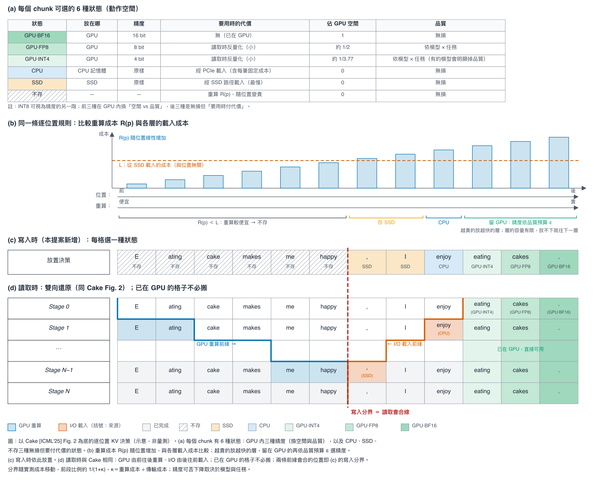

# 長 context 下的 KV Cache 分層管理：研究介紹

> **一句話**：在 prefill 寫入 KV 時，就用「OS 式的成本規則＋輕量預測」決定每一段 KV 放 GPU（用幾 bit）、CPU、SSD，還是不存，讓使用者隔一段時間回來時仍能快速還原，把長 context 推論效能「撞牆」的長度往後推（目標：從約 100K–200K 推到 500K；目前是待驗證的假設）。

**日期**：2026-10-06
**狀態**：研究方向與計畫。本方向還沒有實驗結果；本文只談故事與方法，不談硬體量測（另有報告）。
**相關文件**：[SOTA 分析](SOTA_ANALYSIS_20261006.md)（附檔：逐篇細節、評測設定盤點）；[下一步](NEXT_STEPS_20261006.md)（時程、還要補的能力、請老師決定的事）

**標註**：
- [n]：論文或公開資料的原文，編號對應文末的參考文獻（IEEE 格式）。
- 〔算術〕：用公開規格或論文裡的數字代公式算的，不是量測。
- 〔推論〕：我的判讀，還沒有實驗支持。
- 〔假設〕：本研究要驗證的命題。
- 〔示意〕：圖只表達概念，數值沒有意義。

---

## 摘要

1. **背景**：LLM 已是大規模線上服務，輸入越來越長、用量暴增、價格快速下降，長 context、RAG、多輪對話、agent 成為常態。業界的共同解法是把算過的 KV 存起來重用，這已經是產品功能和價格槓桿。
2. **問題**：KV 隨長度線性變大，重算隨長度超線性變貴；GPU、CPU、磁碟的速度差兩到三個數量級。30B 等級的模型在單張 80 GB GPU 上，一個請求約 2.5 萬（dense）到 11 萬（MoE）token 的 KV 就把剩下的空間用完〔算術〕。
3. **這個領域**：可以分成 L0–L5 六層。**L2「KV 放在哪一層」最關鍵也最擠**，做法分成 OS／系統派（規則、成本模型、排程）與預測派（GBDT 或深度學習）。
4. **求證**：「預測派都要大量訓練、換一台 server 就要重訓」只對一部分成立。深度學習派確實訓練重、而且綁定 LLM；GBDT 派重訓便宜，原因是負載漂移，不是換 server；真正要重來的是「把硬體成本學進模型」的那部分（§5.4）。
5. **起點**：選 Cake，是因為它的核心是由因果注意力推出的結構性質（越後面重算越貴），不用訓練、會自動適應，而且前提寫得清楚、可以延伸。但它和大部分 L2 論文有共同問題：評測太短（Cake 4K–16K；跨請求分層的論文最長 128K）、I/O 用「大小 ÷ 頻寬」模擬、假設 KV 都已存好、只有一個儲存層、沒有退路。
6. **命題**：在 100K–500K，使用者回來時的還原時間主要由「KV 在哪一層」決定。把 Cake 讀取時的規則提前到寫入時，再配上只預測「負載」的輕量模型（硬體部分用量測常數），能把撞牆的長度往後推。四個假設和否證條件見表 11。
7. **接下來**：先把評測設定系統化（和家銘學長討論後的結論：現有 SOTA 的比較沒有一致標準），設計得比別人公平；合成長 context 的資料；對手包含相近論文和 LRU／ARC 等經典方法；I/O 用 CPU 記憶體＋限速模擬；先模擬、過 go/no-go 再做原型。時程與待決定的事另見[下一步](NEXT_STEPS_20261006.md)。

---

# 第一部分：研究內容與想法

## 1. 背景：LLM 已是大規模線上服務，而且輸入越來越長

Cake 的開頭是這樣鋪陳的：LLM 已大量部署在線上服務；context window 變長，讓長文件理解、長 context RAG、複雜的 agent 成為可能；但 prefill 階段產生 KV 的成本也成為主要瓶頸 [1]。兩年後，這三件事都更明顯了。

### 1.1 用量和長度一起暴增

**圖 1.** LLM 服務的用量與輸入長度。(a) Google 每月處理的 token 數 [2], [3]；(b) OpenRouter 每個請求的平均 token 數 [4]。

- **用量**：Google 每月處理的 token，2024 年 5 月約 9.7 兆、2025 年 5 月約 480 兆，2026 年 5 月超過 3,200 兆，一年約 7 倍；它的模型 API 每分鐘約處理 190 億 token [2]。
    - 這個數字有一部分來自推理模型的思考內容，不等於使用者數 [3]。但對 KV 管理來說，token 就是負載本身。
- **長度**：OpenRouter 分析 100 兆 token 的真實流量 [4]：
    - 每個請求的平均輸入從約 1,500 token 長到 6,000 以上（4 倍），輸出只從約 150 長到 400；
    - 寫程式類 token 的佔比從 11% 長到超過 50%；推理模型的 token 在 2025 年超過一半。
- **模型能力**：最長的 context window 自 2023 年中起每年約長 30 倍；在兩個長 context 基準上，頂尖模型達到 80% 準確率的輸入長度，9 個月內長了 250 倍以上 [5]。
- **價格**：達到同一能力水準的推論價格，每年下降 9 到 900 倍，依任務而定 [6]。越便宜，大家越願意把整份文件、整個程式庫、整段對話歷史放進 context〔推論〕。

**一句話**：輸入長、輸出短、內容被反覆重用。這正是 KV cache 能省最多的負載型態。

### 1.2 業界的共同解法：把算過的 KV 存起來重用

- **prefix／context caching**：兩個請求的開頭相同時，直接重用前一次算好的 KV，省掉 prefill。Cake 引述 OpenAI、Anthropic、DeepSeek 都已做進服務，推論成本降了一半以上 [1]。
- **它已經是產品功能與價格槓桿**：
    - DeepSeek（2024-08）把會重用的 context 快取在分散式磁碟陣列上；命中最多省 90% 的費用；128K 的 prompt，第一個 token 的延遲從 13 秒降到 0.5 秒；沒用到的快取幾小時到幾天內清掉 [7]。
    - OpenAI 的文件寫明：命中的輸入以未命中的 0.1 倍計價；前綴在最後一次使用後保留 30 分鐘；KV 可能以加密形式存在 GPU 機器的本地儲存 [8]。2026 年 9 月，它又為一次要工作好幾小時的 agent 改進快取 [9]。
    - agent 公司 Manus 說，KV-cache 命中率是生產級 agent 最重要的指標；它的輸入輸出比約 100：1，命中與未命中的價格差 10 倍 [10]。
- **系統面**：Kimi 的 Mooncake 把整個叢集閒置的 CPU 記憶體和 SSD 池化成 KV 倉庫 [11]；vLLM、SGLang、LMCache、NVIDIA Dynamo 都有把 KV 卸載到 CPU／SSD 的機制（§4）。

### 1.3 但負載正在改變

- 過去的典型負載是短聊天；現在是長 context 的 agent：每一輪都帶著完整歷史、工具輸出和檔案內容。
- **真實數據**：
    - 寫程式的 agent（TraceLab 公開 trace，357,161 次呼叫、43 位開發者）：每次呼叫的輸入中位數約 12.4 萬 token，60.9% 超過 10 萬 [12]〔我們從公開資料算出〕。
    - 兩份生產 trace 的平均請求長度是 18.7K 與 32.0K token；多輪對話的歷史區塊只佔不同區塊的 37.6%，卻貢獻 70.2% 的快取存取 [13]。
- **等待也變長**：使用者在閱讀，agent 在等工具或等人核准。這段時間 GPU 要服務別人，這個 session 的 KV 被擠到 CPU、SSD，甚至被丟掉；等它回來，就要先把 KV 還原（§2.4）。

所以，**LLM 推論的效率問題，越來越是「長 context 的 KV 放在哪、怎麼拿回來」的問題**。

---

## 2. 問題：context 越長，KV 越大，最後撞上記憶體和 I/O 的牆

### 2.1 KV 線性變大，重算超線性變貴

- **KV 大小** ＝ 2（K 和 V）× 層數 × KV head 數 × head 維度 × 每個數值的 bytes × token 數，跟長度成正比（表 2）。
- **重算（prefill）**：注意力讓第 i 個 token 要看前面 i 個，所以越後面越貴，整段的成本超線性成長 [1], [14]。
    - Cake 的例子：72K token（約一本 200 頁的書）在 Llama2-70B、A100 上要約 30 秒，會明顯影響使用體驗 [1]。
    - 推到 500K：長度是 6.9 倍；成本裡線性的部分 ×6.9、注意力的二次部分 ×48，所以重算約需 3.5 到 24 分鐘〔算術，以 Cake 的 30 秒為基準〕。

### 2.2 記憶體階層：越大越慢

| 儲存層 | 頻寬 | 容量 |
|:--|--:|--:|
| GPU 記憶體（HBM） | ≈ 2 TB/s | ≈ 80 GB |
| CPU 記憶體（DRAM） | ≈ 25 GB/s | ≈ 1.8 TB |
| 本地／遠端磁碟 | 0.5–4 GB/s | ≈ 26 TB |

**表 1.** 典型 GPU 推論伺服器的記憶體階層。數值取自 Cake [1] 的 Fig. 1（LambdaLab 伺服器規格）。

- 相鄰兩層的頻寬差 1–2 個數量級，GPU 到磁碟差約 500–4,000 倍〔算術〕。
- 依 AttentionStore 的評估，約 80% 的快取命中發生在磁碟層（Cake 引述 [15]）[1]。也就是說，**大部分的命中都要從最慢的那一層拿回來**。

### 2.3 記憶體牆：30B 等級的模型特別明顯

**圖 2.** 記憶體牆〔算術〕。(a) 單一請求的 KV 大小，與單張 80 GB GPU 扣除權重後的空間（虛線）；(b) 500K token 的 70B 級 session 回到 GPU 所需的時間。

| 模型 | 架構 | 層數 | KV heads | KV／token | BF16 權重 | 可容納長度 |
|:--|:--|--:|--:|--:|--:|--:|
| Llama-3.1-8B | Dense | 32 | 8 | 128 KiB | 16.1 GB | ≈ 427K |
| Qwen3-30B-A3B | MoE | 48 | 4 | 96 KiB | 61.1 GB | ≈ 111K |
| Qwen3-32B | Dense | 64 | 8 | 256 KiB | 65.5 GB | ≈ 25K |
| Llama-3.1-70B | Dense | 80 | 8 | 320 KiB | 141.1 GB | —a |

**表 2.** 單一請求在單張 80 GB GPU 上可容納的 context 長度〔算術〕。四個模型都是 GQA、head 維度 128。KV／token ＝ 2 × 層數 × KV heads × 128 × 2 bytes；可容納長度 ＝（80 GB × 0.9 − BF16 權重）÷ KV／token，不計啟動與工作區開銷，也沒有其他使用者。a：權重本身就超過單卡容量。

- 把權重降成 FP8：32B 約 15 萬 token、30B-A3B 約 42 萬 token〔算術〕。
- 多個使用者同時在線時，牆來得更早。這是我說「撞牆大約在 100K–200K」的直覺來源；實際位置要量（表 11 的 H1）。

| 還原方式 | 頻寬 | 所需時間 |
|:--|--:|--:|
| 自 CPU 記憶體載入 | ≈ 25 GB/s | ≈ 7 s |
| 自本地 SSD 載入 | 4 GB/s | ≈ 41 s |
| 自網路儲存載入 | ≈ 1 GB/s | ≈ 2.7 min |
| 自本地磁碟載入 | 0.5 GB/s | ≈ 5.5 min |
| 全部重算 | — | 3.5–24 min |

**表 3.** 一個 500K token、70B 級 session（KV ≈ 164 GB）回到 GPU 所需的時間〔算術〕。載入時間 ＝ KV 大小 ÷ 頻寬（頻寬取自表 1）；重算時間由 Cake 的「72K token ≈ 30 s」（Llama2-70B、A100）[1] 外推：線性項 ×6.9、注意力項 ×48。

- 1.8 TB 的 CPU 記憶體只放得下約 11 個這樣的 session〔算術〕，其他的只能放磁碟。

### 2.4 情境：使用者隔了一段時間才回來

**圖 3.** 長 context session 的生命週期與三個決策點〔示意〕。各層頻寬與容量取自表 1。

1. **第 1 輪**：prefill 一段長 context（例如 100K 以上），產生 KV。
2. **閒置**：使用者在讀、agent 在等工具。GPU 被其他使用者佔用，這段 KV 依 LRU 一路往下擠到 CPU、SSD。
    - vLLM 釋放一個請求的 block 時是倒過來排的，所以同一個請求裡，最後一塊會比前面的先被逐出；理由是尾巴比較不會被別的請求共用 [16]。但從重算成本看，尾巴正是最貴的那段。兩個考量互相衝突，現有系統只看前者〔推論〕。
3. **第 2 輪到達**：要先把 KV 還原回 GPU，才能產生第一個字。

| 決策點 | 時機 | 決策內容 | 現有做法 |
|:--|:--|:--|:--|
| A | 寫入（prefill 結束時） | 每一段的儲存層、精度、是否保留 | 全部保留，或依存取次數的固定規則 |
| B | 閒置期間 | 降級與預取 | LRU；少數用啟發式預測 |
| C | 讀取（還原時） | 重算與載入的切分 | Cake [1]、CacheFlow [14] |

**表 4.** 長 context session 生命週期中的三個決策點。本研究聚焦 A，並以預測輔助 B。

### 2.5 所以真正的問題是：怎麼調適

存不存、存哪層、用幾 bit、什麼時候搬、回來時怎麼拿，答案都取決於三件事：

- **硬體**：各層多快、多大；
- **模型**：每個 token 的 KV 多大、能不能降精度；
- **負載**：會不會再用、隔多久回來、回來時 GPU 多忙。

一套寫死的規則不可能在所有組合下都好，所以「怎麼調適」才是問題。

---

## 3. 這個領域在做什麼：L0–L5

**圖 4.** KV cache 管理的六個層次。本研究以 L2 為核心，連帶 L1、L3、L4。

把 KV cache 想成模型讀過一段文字後留下的「筆記」：下次遇到同一段文字就翻筆記，不用重讀；重讀就是重算（prefill）。整個領域在回答六個問題（表 5）。

| 層級 | 核心問題 | 決策對象 | 代表工作 |
|:--|:--|:--|:--|
| L5 | 誰在用、用多久 | 使用方式與快取契約（保留時間、計價） | 商業 API 的快取契約 |
| L4 | 如何找到 | 只認前綴，或允許非前綴重用 | CacheBlend [17] |
| L3 | 如何搬運 | CPU／SSD／網路 → GPU 的傳輸 | Strata [18]、Tutti [19] |
| **L2** | **放在哪裡** | **GPU、CPU、SSD，或捨棄後重算** | **Cake [1]、CacheFlow [14]、Pensieve [20]、Bidaw [21]** |
| L1 | 存多細 | BF16／FP8／INT4 | KIVI [22]、KVTuner [23] |
| L0 | 存什麼 | KV，或 hybrid 模型的狀態 | Marconi [24] |

**表 5.** KV cache 管理的六個層次（由上而下：使用 → 物件）。粗體為本研究的核心層級。

很多論文橫跨好幾層。**本研究以 L2 為核心**，連帶碰到 L1（依位置選精度）、L3（每筆搬運的固定成本、限速）、L4（前段不存就要支援「區段命中」）。

---

## 4. SOTA 總表

各篇的數字都是**在它自己的硬體與基準上**量的，不能跨列直接比較。每篇的細節見[附檔](SOTA_ANALYSIS_20261006.md)。

### 4.1 大家在做什麼

| 方法 | 發表 | 層級 | 核心做法 | 原文結果 | 主要限制 |
|:--|:--|:--|:--|:--|:--|
| *L2：OS／系統派* | | | | | |
| Strata [18] | OSDI'26 | L2＋L3 | GPU 協助批次搬運；搬運與計算錯開 | 吞吐 ↑ 5× | 逐出只用 LRU；不考慮重算 |
| Cake [1] | ICML'25 | L2 | 前段重算、後段載入，在中間會合 | TTFT 2.6× | I/O 用模擬；假設全存；沒有退路 |
| CacheFlow [14] | arXiv'26 | L2 | token × 層 × GPU 三維還原；批次動態規劃 | TTFT 2.24–3.00× | 不處理寫入；只有一個頻寬 |
| Pensieve [20] | EuroSys'25 | L2 | 從對話開頭逐出，缺的再重算 | 吞吐 1.14–3.0× | 只有 GPU／CPU；沒有精度 |
| MTDS [25] | C&IS'26 | L2 | 每個請求比較載入與重算 | TTFT ↓ 25% 以上 | 整段決策；模型 ≤ 14B |
| py-kvcache [26] | arXiv'26 | L2 | 依硬體量出「多長才值得存」 | 依硬體而異 | 整段判斷，不看位置 |
| AsymCache [27] | arXiv'26 | L2＋L4 | 位置感知逐出；支援不連續的 KV | TTFT 1.90–2.03× | 細節待讀全文 |
| Fancy-eviction [13] | arXiv'26 | L2 | 在生產 trace 上比較 14 種逐出法 | 成本感知逐出 TTFT ↓ 19.9% | 認為目前 SSD 多半不必要 |
| *L2：預測派* | | | | | |
| Bidaw [21] | FAST'26 | L2 | 用上一輪回答長度預測何時回來 | 延遲 ↓ 3.58× | 只適用真人聊天 |
| LCR／LARU [28] | arXiv'25 | L2 | GBDT 逐出＋預測錯時退回 LRU | P99 TTFT ↓ 28.3% | 單一層；命中成本相同 |
| LPC [29] | NeurIPS'25 | L2 | 用對話內容預測會不會延續 | 快取 ↓ 18–47% | 同一對話的 block 同分 |
| *L2：壓縮＋放置、生產系統* | | | | | |
| AdaptCache／EvicPress [30], [31] | BigMem'25 | L1＋L2 | 壓縮與放置一起決定 | TTFT 2.19× | 品質評估薄；沒有上界 |
| LMCache [32] | arXiv'25 | L2＋L3 | 生產級 KV 快取層 | 吞吐 ↑ 15× | 策略不是重點 |
| Mooncake [11] | FAST'25 | L2＋L3 | 以 KV 為中心的叢集架構 | 請求量 ↑ 75% | 需要多節點與 RDMA |
| *其他層級* | | | | | |
| Marconi [24] | MLSys'25 | L0 | hybrid 模型的前綴快取 | token 命中 ↑ 34.4× | 只在 GPU |
| KIVI／KVTuner [22], [23] | ICML'24／'25 | L1 | KV 量化到 2–4 bit；逐層選精度 | 吞吐 2.35–3.47× | 只在 GPU；依模型而定 |
| KVP 等 [33], [34], [35], [36] | ICML'26 等 | L1 | 學習式挑選要保留的 token | 優於 SnapKV 等 | 單一請求、有損；要重訓 |
| vLLM 佈局 [37]／Tutti [19] | 2026 | L3 | 合併小塊；GPU 直接發 SSD I/O | 卸載吞吐 ↑ 約 10×；TTFT ↓ 78.3% | 只處理搬運 |
| CacheBlend [17] | EuroSys'25 | L4 | RAG 的非前綴 KV 重用 | TTFT 2.2–3.3× | 有損 |

**表 6.** 代表性方法一覽。「原文結果」為各篇報告的最佳值：× 為相對其基準的倍數（TTFT 欄為加速倍數），↓ 為降低比例，↑ 為提升。各篇的硬體、模型與基準都不同，不能跨列比較。

### 4.2 一眼看出缺什麼

| 方法 | 寫入時決策 | 多層 | 位置感知 | 精度決策 | 預測 | 退路 | 最長評測 |
|:--|:-:|:-:|:-:|:-:|:-:|:-:|--:|
| Cake [1] | ✗ | ✗a | ✓b | ✗ | ✗ | ✗c | 16K |
| CacheFlow [14] | ✗ | ✗ | ✓b | ✗ | △d | — | 128K |
| Strata [18] | △e | ✓ | ✗ | ✗ | ✗ | — | 55Kf |
| Pensieve [20] | ✗ | △g | ✓h | ✗ | ✗ | — | — |
| Bidaw [21] | △i | ✓ | ✗ | ✗ | ✓ | △j | 8.2Kk |
| MTDS [25] | ✗ | ✓ | △l | ✗ | △d | — | — |
| LARU [28] | ✗ | ✗ | ✗ | ✗ | ✓ | ✓ | — |
| **本研究（目標）** | **✓** | **✓** | **✓** | **✓** | **✓** | **✓** | **512K** |

**表 7.** 與代表性 L2 方法的能力比較。✓ 具備；△ 部分具備；✗ 不具備；— 原文未涉及或未查證。a 單一模擬儲存層；b 只在讀取時；c 原文列為未來工作；d 預測成本或延遲，不預測負載；e 依存取次數的寫入門檻（預設 2）；f 各資料集平均輸入長度的最大值；g 只有 GPU／CPU；h 逐出時從開頭丟起；i 改存中間 tensor（只對 MHA 划算）；j 用 Belady 影子快取線上校準；k 公開 trace 的 p99；l 可以只載入前段。

**看完的判斷**：

- 沒有一篇同時決定「放哪一層、用幾個 bit、要不要存」。
- 依位置決定的都在**讀取或逐出時**（Cake、CacheFlow、Pensieve、AsymCache），沒有在**寫入時**。
- 預測派預測的是「會不會再用」，沒有人預測「回來時 GPU 多忙」，而這會決定寫入時能不能放心不存（§8.3）。

---

## 5. 為什麼 L2 是關鍵，以及 L2 的兩派

### 5.1 為什麼是 L2

1. **它直接決定 TTFT**：使用者回來時 KV 在哪一層，決定要等幾秒還是幾分鐘（表 3）。
2. **其他層都是 L2 的工具**：L1 讓 KV 變小、放得下更多、搬得更快；L3 決定搬多快；L4 決定哪些能命中。L2 是把它們組合起來的那一層。
3. **最擠，也最亂**：論文最多，但各篇的設定、對手、指標都不一樣（§7.6），所以「什麼條件下哪種做法比較好」反而沒有答案。

### 5.2 OS／系統派：用規則和成本模型決定

**圖 5.** L2 的兩派做法與交集，以及本研究想站的位置。

很多做法其實是作業系統的經典技術，換到 KV cache 上（表 8）：

| 經典技術 | 在 KV cache 中的形式 | 代表工作 |
|:--|:--|:--|
| 頁面替換：LRU、ARC [38]；Belady 上界 [39] | 空間不夠時的逐出 | vLLM [40]、SGLang；Bidaw [21] |
| 准入控制 | 存取達門檻才寫到下一層 | Strata [18]、NVIDIA Dynamo |
| 成本感知替換（GreedyDual-Size [41]） | 閒置久、重算便宜的先逐出 | Pensieve [20]、AsymCache [27]、[13] |
| 預取 | 依排程佇列提前載入 | AttentionStore [15] |
| 批次化與重疊（Little's Law） | 合併小塊；搬運與計算重疊 | Strata [18]、vLLM [37] |
| 雙指標並行 | 前段重算、後段載入、在中間會合 | Cake [1]、CacheFlow [14] |
| 租或買（ski rental [42]） | 損益平衡：多長才值得存 | py-kvcache [26] |
| 快速降級 | 只用一次的前綴先逐出 | [13] |

**表 8.** L2 中 OS／系統派常用的經典技術。

- **優點**：不用訓練、可解釋；換機器只要改幾個成本常數。
- **限制**：對「未來」只能用最近、次數去猜。生產 trace 上，連 Belady 上界都還有明顯空間 [13]，代表「知道未來」仍然有價值。

### 5.3 預測派：訓練一個模型去猜未來

| 面向 | GBDT／輕量模型 | 深度學習 |
|:--|:--|:--|
| 代表工作 | LRB [43]、LCR／LARU [28]、SAECache [44] | LPC [29]、KVP [33]、ForesightKV [34]、LookaheadKV [35]、TRIM-KV [36] |
| 預測目標 | 下次被存取的時間 | 對話是否延續；token 的重要度 |
| 輸入特徵 | 存取歷史、靜態欄位 | 文字內容；LLM 的 K／V／attention |
| 執行位置 | CPU | GPU |
| 訓練成本 | 低：在 CPU 上線上重訓 | 高：多張資料中心級 GPU |
| 重訓原因 | 負載漂移 | 更換 LLM |
| 主要問題 | 預測準 ≠ 決策好 | 多數是單一請求內的有損丟棄 |

**表 9.** L2 預測派的兩類做法。LRB 每累積 128K 筆標記樣本就訓練新模型取代舊的 [43]；SAECache 不需要定期重訓，參數線上更新 [44]；KVP 用 56 張 GPU 收集約 1.2 TB 的 trace，再用 8 張 H100 訓練 [33]；TRIM-KV 用 4 張 H100 訓練 [36]；LPC 要訓練一個 118M 參數的文字嵌入模型（依 [44] 的描述）。多數系統盲從預測（Follow Prediction Blindly），預測錯時比 LRU 還差 [28]。

另外兩個觀察：

- **預測派大多在比「誰預測得比較準」**：報的是準確率、同命中率下省多少快取 [29]，很少報「預測錯的時候會怎樣」。
- **在生產 trace 上，學習式逐出（LeCaR、LRB、3LCache）和大多數精巧的策略都沒有明顯贏過 LRU**，因為前綴重用主要由 session 的節奏決定，「最近用過」本身就很會預測 [13]。

### 5.4 求證：「預測派都要大量訓練，換一台 server 就要重訓」

| 說法 | 結論 | 依據 |
|:--|:-:|:--|
| 深度學習派訓練成本高 | 成立 | KVP 收集 trace 用 56 張 GPU（約 1.2 TB），再用 8 張 H100 訓練 [33]；TRIM-KV 用 4 張 H100 [36] |
| 深度學習派換模型要重訓 | 成立 | 讀的是特定 LLM 的 K／V／attention；KVP 每個 (層, KV head) 一個 agent，Qwen2.5-7B 就是 112 個 [33] |
| GBDT 派也要大量訓練 | 不成立 | 在 CPU 上線上訓練：LRB 每 128K 筆樣本換一次模型 [43]；LARU 線上訓練 LightGBM [28] |
| 換 server 就要重訓 | 視預測對象 | 預測負載的模型與硬體無關；預測時間的部分才綁定硬體：KVPR 只量一次並假設硬體不變 [45]、MTDS 用歷史延遲 [25]、CacheFlow 線上量測 [14] |
| 重訓是最大的問題 | 不成立 | 更大的問題是決策品質：盲從預測比 LRU 差 [28]；生產 trace 上學習式逐出沒有勝過 LRU [13] |

**表 10.** 對「預測派需要大量訓練、換一台 server 就要重訓」的查證。結論：部分成立，要分開講。

**由此得到的設計原則**：把「硬體成本」和「負載預測」分開。

- 硬體成本（重算成本曲線、各層頻寬、每筆搬運的固定成本）用**量的**，換機器只要花幾分鐘重量；
- 模型只學**負載**；
- 成本改變時只移動決策門檻，不重訓模型。這是成本敏感學習的經典結果：只要模型輸出的機率是校準過的，最佳的決策門檻就只由成本決定 [46]。

### 5.5 兩派的交集：已經有人做的，和還空著的

**已經有的（學習增強，learning-augmented）**：預測給建議、規則保底。

- **理論**：有預測的快取，在預測準時接近最佳，預測差時仍有保證 [47]；成本不一樣的情況（weighted paging）也有理論 [48]。
- **系統**：
    - LARU 偵測到預測出錯就退回 LRU，有 1-consistent、O(k)-robust 的保證 [28]；
    - Marconi 剛啟動時先用 LRU，再線上調整權重 [24]；
    - HALP 先用 LRU 篩出候選，再由學習模型排序 [49]。

**還空著的**〔推論，以 9/24、10/4 兩輪查新為準，動手前要再查一次〕：

1. **動作成本不一樣**（不存、SSD、CPU、GPU 的三種精度），**而且成本隨位置變**的學習增強。理論有，系統沒有。
2. **寫入時**的決定。現有工作都在逐出或讀取時決定。
3. **預測和硬體解耦**：只學負載，硬體用量的常數。

---

## 6. 為什麼選 Cake 當起點

### 6.1 Cake 在做什麼

- **情境**：使用者的長 context KV 已經存在磁碟上（GPU、CPU 放不下，大部分命中都在磁碟層）。使用者回來時有兩條路：全部從磁碟載回（受頻寬限制），或全部重算（受 GPU 算力限制）[1]。
- **洞見**：越後面的 token 重算越貴，但載入一個 token 的成本跟它在哪個位置無關 [1]。
- **做法**：GPU 從最前面往後算（便宜的部分），I/O 從最後面往前載（重算最貴的部分），兩邊同時跑，在中間會合（圖 3 的第 2 輪）。
- **會合點不是事先算的**：兩邊實際跑到哪就在哪會合；GPU 被別人佔用或頻寬波動時，會合點自動移動 [1]。
- **結果**：4K–16K、I/O 頻寬 7–100 Gbps（用延遲模擬），TTFT 平均比只算或只載快 2.6 倍 [1]。

### 6.2 選它的理由（不是因為「論文乾淨」）

1. **核心是一個結構性質，不是經驗規則**。「越後面重算越貴」來自因果注意力，只要是 causal attention 的模型都成立，換硬體也一樣。我要做的「依位置決定」正是建立在這個性質上。
2. **它把「算或載」從二選一變成「切點在哪」**。這讓「寫入時該存哪些」有了自然的參考點：讀取時的會合點已經說明哪一段會被重算、哪一段要被載入。
3. **不用訓練、不用事先量**。會合點在執行時自己找到，資源變動時自動調整，適合當「規則保底」的那一層。
4. **前提寫得很清楚，每一個都能延伸、也都能檢驗**：全部事先存好、只有一個儲存層、I/O 用延遲模擬、4K–16K、退路留給未來。
5. **方法可以重現**。限速器的做法簡單公開，我們能在同樣的設定下重做它的表格，當作自己實驗平台的校準。
6. **社群已經把它當比較基準**：CacheFlow 直接以 Cake 為主要對手 [14]。建立在 Cake 上，就有現成的比較座標。

要注意的是：Cake 沒有公開程式碼（我們只找到作者頁的 PDF）；CacheFlow 是自己在 LMCache 上重做 Cake 的。所以我們也要在 vLLM 上重做 Cake 的讀取路徑。

---

## 7. 現有方法的共同問題（以 Cake 為例，但不只 Cake）

### 7.1 評測的 context 太短

**圖 6.** 現有論文評測用到的 context 長度。藍色為跨請求重用＋分層的論文；灰色只處理搬運或單一請求；綠線為真實 trace，紅線為本研究的目標。

- **跨請求重用＋分層的論文**：Cake 4K–16K（合成 prompt；原文認為只有長度會影響結果）[1]；HCache 最長 16K [50]；LMCache 每次查詢 10K–20K [32]；CachedAttention 的 session 最長 32K [15]；Strata 各資料集的平均輸入最長約 55K [18]；Mooncake 的 128K 是模擬資料 [11]；CacheFlow 最長 128K [14]。
- **比較長的都不是同一個問題**：Tutti 到 200K，但只處理 SSD → GPU 的搬運 [19]；KVDrive 到 360K，但是單一請求、沒有跨請求重用 [51]。
- **對照真實負載**：寫程式的 agent 每次呼叫的輸入中位數已經是 124K [12]。
- **為什麼重要**〔推論〕：
    - 16K 左右時，重算和載入速度相近，Cake 自己說這是它最划算的區域 [1]；
    - 到 128K–500K，重算超線性變貴，會合點會往前移，越來越接近「只載入」，瓶頸變成「要搬多少位元組、從哪一層搬」；
    - 這正是短 context 的評測看不到的區域。所以 I/O 很容易在後段撞到上限。

### 7.2 I/O 是用「大小 ÷ 頻寬」模擬的

- Cake 用延遲模擬 I/O：依 chunk 大小和頻寬算出延遲，時間到了才把資料交給 GPU [1]。CacheFlow 的載入時間也是位元組 ÷ 頻寬 [14]。
- **真實的搬運不是這樣**：
    - vLLM 把 KV 佈局改成每個 block 包含所有層、連續存放，搬運單位從 32 KB 變成 2 MB，卸載吞吐提升約一個數量級 [37]。同一個硬體，只改了軟體。
    - 在 GB200 上做 P/D 分離，一次傳輸要發出多達約 11 萬個描述符，名義上更快的路徑反而比 RDMA 慢 [52]。
    - 卸載到 CPU 時，實測只用到 PCIe 單向峰值頻寬的 23%（15 GB/s），99% 的延遲花在傳輸上 [53]。
- 所以 I/O 的有效速度由軟體路徑、block 碎片化、同時進行的讀寫決定，而且會波動。只用「大小 ÷ 頻寬」，很可能高估在真實系統上的好處〔推論〕。這也是我們實驗方法要處理的（§13）。

### 7.3 假設 KV 都已經存好

- Cake 的原文：「we precompute and store all requests' KV cache in advance」[1]。CacheFlow 也假設所有狀態都可以載入，被逐出的只能重算 [14]。
- 這等於假設**容量無限、寫入免費、只有一層**。真實系統裡三者都不成立：
    - 容量有限：存了不會讀的，就擠掉會讀的；
    - 寫入要頻寬：寫入和讀取搶同一條 I/O 通道，Tutti 因此把寫入排在關鍵路徑的讀取之後 [19]；
    - Cake 讀取時，前段本來就會被重算，前段的 KV 存了也可能根本不會被讀到〔推論〕。

### 7.4 只有一個儲存層

- Cake 只從一個（模擬的）儲存層載入；CacheFlow 只有一個載入頻寬。
- 長 context 時，後段最貴。如果 CPU 或 GPU 還有空間，放在那裡更快，但這個選項不在它們的設計裡。

### 7.5 沒有退路，也沒有「什麼時候不值得做」

- Cake 的退路是未來工作 [1]；CacheFlow 所有設定都報加速，沒有失效的區域 [14]。
- **文獻的結論互相矛盾**：Strata 認為長 context 重算不划算 [18]；MTDS 量到命中很長時不載入反而快 [25]；py-kvcache 認為值不值得存，是依每套硬體設定而定的准入決策 [26]。矛盾很可能來自各自的硬體和傳輸實作〔推論〕。

### 7.6 彼此無法比較

我們統計 35 篇論文的評測設定（細節見附檔）：

- **baseline 幾乎不重疊**：32 篇用了 64 種 baseline，41 種只出現一次；任兩篇之間，72.6% 完全沒有共同的比較對象。最常見的共同對手只有 LRU 和原版 vLLM。
- **ARC 在 35 篇中沒有被任何一篇當成 baseline**。
- **請求到達多半是假的**：只有 2 篇用真實時間戳，10 篇用 Poisson，19 篇完全沒有到達過程。
- **命中率沒有統一定義**：同一份 Mooncake trace，依定義不同，命中率可以從 1.1% 算到 100%。
- **很少報誤差**：重點幾篇都沒有報重複次數或信賴區間。

這就是我和家銘學長討論後的共同看法：**sys-level 的 LLM 論文，比較方式沒有一定的標準**（第二部分 §10）。

---

## 8. 我的命題與想法：把撞牆的長度往後推

### 8.1 命題

> 如果目前長 context 的還原在約 100K–200K 撞牆，能不能結合 OS 派的成本規則與預測派的模型，把這條線往後推到 500K？

**圖 7.** 命題示意：把長 context 還原撞牆的長度往後推〔示意，不是量測〕。藍線（Cake）不比只算或只載差，但到長 context 時趨近只載；綠線是「寫入時就放對地方」想做到的樣子。

- 「撞牆」指兩件事：
    1. **容量牆**：快的層放不下夠多 session 的 KV（表 2）；
    2. **還原牆**：使用者回來時，TTFT 超過可接受的範圍（表 3）。
- 牆的實際位置、能推多遠，都要量。

### 8.2 假設，以及什麼結果代表不成立

| 編號 | 假設 | 驗證方式 | 否證條件 |
|:--|:--|:--|:--|
| H1 | 在 100K 以上，還原時間主要由「KV 在哪一層、要搬多少位元組」決定；Cake 式並行的好處縮到接近只載入 | CPU 層用真實搬運、SSD／網路層用限速，量 16K–512K 的只算、只載、Cake 式 | 256K–512K 時，Cake 式仍比只載快 ≥ 1.5× |
| H2 | 寫入時依位置和預測決定每一段的狀態，在同樣容量下，比「全存＋Cake」還原得更快、或撐到更長的 context | 先用模擬器（真實 trace＋量測的成本常數）比較 P0–P4（表 20），通過才做原型 | 相對「全存＋Cake」改善 < 5% 就停；5–15% 停下來討論 |
| H3 | 預測只要學「負載」，硬體部分用量的常數；換一台機器只要重量常數，不必重訓 | 在 A 機器訓練，B 機器只換常數，比較「重訓」與「只換常數」的決策品質 | 只換常數比重訓差超過 x% |
| H4 | 預測錯時有保底，最差不比基準（LRU、全存＋Cake）差太多 | 故意給錯的預測（加噪聲、換工作負載），量最差的情況 | 有設定比基準差超過 y% |

**表 11.** 本研究的假設與否證條件。x、y 會在實驗前寫下；H2 的門檻沿用專案的 go/no-go 規則（> 15% 繼續）。**NO-GO 不是失敗**：它本身就是「什麼時候不值得做」的結果。

### 8.3 想法：寫入時的狀態管理（接上 Cake，但不只是 Cake）

**主流在做什麼**：把 I/O 用到最滿。Strata 批次化搬運、LMCache／Mooncake 做儲存層、Tutti 讓 GPU 直接發 I/O；Cake 再加上「同時用 GPU 算」。它們都在**讀取時**或**搬運本身**下功夫。

**我想動的是寫入時**：prefill 算完 KV 的那一刻，就決定每一段的狀態。依據是 Cake 讀取時的規則，只是提前用：

- **前段**：重算便宜 → 不存，或只存在最便宜的慢層；
- **中段**：存 SSD，回來時用 Cake 式並行載入；
- **後段**：重算最貴 → 放 CPU，或留在 GPU；留在 GPU 的，再依品質預算 ε 選 BF16、FP8 或 INT4。

**圖 8.** 以 Cake 為底的整合架構〔示意〕。(A) 一個 chunk 的生命週期：寫入（本研究新增）→ 六種狀態的儲存層 → 讀取（Cake 的雙向還原，改成多層並加上退路）。(B) 同一段 context 的 12 個 chunk：Cake 全部存磁碟；本研究前段不存，後段依序放 SSD、CPU、GPU 的三種精度。兩者的會合點相同，但本研究要搬的格數變少、來源也更快。

**圖 9.** 逐位置規則：寫入分界 ＝ 讀取會合線〔示意〕。每個 chunk 有六種狀態：GPU 內的 BF16、FP8、INT4（用品質換空間），以及 CPU、SSD、不存（無損，但要用時付代價）。

**圖 10.** 以 Cake 原文 Fig. 2 為底，最上面加一列「寫入時」〔示意〕。下面五列與 Cake 原文相同。

**兩個重要的修正**（來自 10/4 的分析）：

1. **分界要用累積時間定，不是逐格比較**。兩邊是同時跑的，會合點是「前段累積的重算時間 ＝ 後段累積的載入時間」的位置。圖 9 (b) 的逐格比較只是直覺版本〔算術〕。
2. **「前段不存」很脆弱**。如果寫入時假設讀取時 GPU 是空的，但讀取時 GPU 正在服務別人，最佳的會合點應該往前移；可是前段已經沒存，只能用剩下的算力硬算，TTFT 會明顯變差〔推論，有算術支持〕。所以：
    - **寫入時的分界必須考慮「讀取時 GPU 會多忙」，這正是需要預測的地方**；
    - 另一個做法是把「不存」換成「存在最慢、最便宜的層」，GPU 忙的時候還有 I/O 可以用。

**多輪對話的延伸**〔推論，要驗證〕：如果每一輪只是在後面追加內容，會合點只會往後移，前段在之後每一輪都會被重算，可能從一開始就不必寫入。前提是：讀取時的算力和 I/O 大致不變、重用是往後追加、引擎支援區段命中。

### 8.4 預測放在哪裡：OS 規則＋輕量預測

| 元件 | 職責 | 依據 |
|:--|:--|:--|
| 規則 | 已知未來時該怎麼放：會合點、依重算成本與大小決定留誰、多長才值得存 | Cake [1]、GreedyDual-Size [41]、ski rental [42] |
| 量測常數 | 重算成本隨位置的曲線、各層頻寬、每筆搬運的固定成本 | 換機器時花幾分鐘重量 |
| 預測模型 | 補上規則需要、但寫入時不知道的三個量（表 13） | GBDT 起步 |
| 保底 | 預測沒把握時退回規則 | 學習增強 [47], [28] |

**表 12.** 「OS 規則＋輕量預測」的分工。

| 預測目標 | 寫入時可得的訊號 | 對應的決策 |
|:--|:--|:--|
| 會不會再被用 | session 輪數、內容類型（系統提示、檔案、工具輸出、思考內容） | 存不存 |
| 多久之後回來 | 上一輪回答的長度 [21]、工具類型、過去的間隔 | 回來時它在哪一層、要不要提前預取 |
| 回來時 GPU 多忙 | 佇列長度、batch 大小的歷史分布 | 前段能不能放心不存 |

**表 13.** 預測模型要提供的三個量。

**哪一個量最重要**：長 context 的公開 agent trace，重用率都在 94–99.5%〔計算，見附檔 §3.3〕。如果真實的長 context 本來就以高重用為主，「會不會再用」就不是重點，後兩個量（何時回來、回來時 GPU 多忙）才是〔推論〕。

一個「寫入當下就知道」的例子：推理模型的思考內容，使用者下一輪會把它刪掉，這之後的 KV 就永遠不會再命中 [54]；SGLang 已經加了「不快取思考內容」的選項 [55]。這種資訊在寫入時就有，用不著等逐出時才猜。

**模型的選擇**：先用 GBDT（CPU 上訓練、微秒級推論）；深度學習只有在消融實驗證明「扣掉自己的開銷之後還是贏」才用，例如用 session 的間隔序列做小型序列模型。照專案的規範，Oracle 判定 GO 之前不訓練任何模型。

### 8.5 跟最接近的工作差在哪

| 工作 | 已經涵蓋 | 本研究的差異 |
|:--|:--|:--|
| Cake [1] | 讀取時雙向並行 | 寫入時決定；多層＋精度；長 context；退路 |
| CacheFlow [14] | 讀取時 token × 層 × GPU 的規劃；成本線上量測 | 寫入時；多層；對讀取時 GPU 負載穩健 |
| Pensieve [20] | 從對話開頭逐出（GPU／CPU） | SSD 與精度；寫入時；長 context |
| 成本感知逐出 [13] | 從節點開頭整段逐出 | 寫入時；多層；預測回來時間 |
| AsymCache [27] | 位置感知逐出；不連續 KV 的注意力 | 寫入時；多層 |
| HCache [50] | 依「層」決定哪些不存、要用時重算 | 依「位置」決定 |
| py-kvcache [26] | 依硬體量出損益平衡長度，整段准入 | 依 block 位置；多層 |
| LARU [28] | 學習式逐出＋退回 LRU（單層、成本相同） | 多層；成本隨位置變 |
| LPC [29] | 用對話內容預測會不會延續 | 只學負載、和硬體解耦；決定放哪一層 |

**表 14.** 與最接近工作的差異。

**新穎性的判斷**：每個零件都有人做過，空白在「寫入時 × 依位置 × 多層 × 長 context × 預測與硬體解耦」這個組合。組合型的貢獻要有一個洞見撐住，目前的候選是：**寫入分界 ＝ 讀取會合線，而且這條線要對讀取時的 GPU 負載穩健**。

### 8.6 已知的風險與反例

1. **量化可能讓這件事不必要**。KV 變小，會合點往前移，能不存的前段跟著變短；模型撐得住低精度時，空間壓力本來就小（Cake 也顯示量化讓 I/O 更划算 [1]）。這是目前最大的威脅，所以 E1 先在「不降精度」下做，再看量化吃掉多少。
2. **目前的生產負載可能還不夠長**。Fancy-eviction 研究認為，以目前的負載（平均 18.7K–32K、session 中位數不到 1 分鐘），SSD 卸載多半沒有必要 [13]。本研究的前提是「長 context＋長間隔」，要先用 TraceLab 這類 agent trace 檢驗前提成不成立。
3. **共用的前綴**：系統提示這類開頭常被很多請求共用，前段不存可能害到別人，要區分共用和私有。
4. **要改引擎**：vLLM、SGLang 只認連續前綴；前段不存，後段在原生的查找下永遠不算命中，要做「區段命中」（AsymCache 的 Multi-Segment Attention 是相關工作 [27]）。
5. **讀取時 GPU 很忙**：「前段不存」的脆弱性（§8.3）。
6. **讀取端已經有人做得很好**：CacheFlow 已經有可預測的讀取規劃（92% 的重算預測、98% 的載入預測誤差在 10% 內）[14]。我們不再做讀取規劃器，直接把它當上界與基準。

---

## 9. 這個方法好不好用？

| 面向 | 要求 | 理由 |
|:--|:--|:--|
| 訓練 | 不用 GPU；CPU 上幾秒到幾分鐘；可以線上更新 | 預測器要和主模型共用機器；深度學習派要多張 GPU 訓練，部署門檻高 [33] |
| 決策開銷 | 每個決策在微秒級 | 決策時間直接加到 TTFT 上；500K 的請求切成 512-token 的 chunk，約 1,000 個決策〔算術〕 |
| 換機器 | 只重量幾個常數，不重訓 | 表 10 的設計原則 |
| 換模型 | 預測器不讀 LLM 的 K／V，換模型不必重訓 | 深度學習派換模型就要重訓 |
| 最差情況 | 預測錯時退回規則，最差不比基準差超過 y% | 盲從預測會比 LRU 差 [28] |
| 品質 | 預設無損；有損的精度只用在量過的品質預算 ε 內 | 品質損失依模型與任務而定 |
| 部署 | 做成 vLLM／SGLang 的 KV connector，不改模型 | 讓別人能直接用 |
| 適用範圍 | 短 context、記憶體充裕、各層速度相近時，誠實報告「不值得做」 | 失效的區域本身就是貢獻 |

**表 15.** 一個能幫到別人的方法，至少要滿足的要求。

---

# 第二部分：接下來怎麼做

## 10. 評測設定：先系統化，再設計得比別人公平

和家銘學長討論後的共同看法：sys-level 的 LLM 論文，評測設定很不一致，SOTA 之間沒有固定的比較方式（§7.6）。所以我打算：

1. **系統化**：把所有評測維度列出來，每一維記下「各篇怎麼設、為什麼這樣設、出處」。
2. **訂出 v1**：和 AI agent 一起整理出「公平設定 v1」，再帶來跟老師、學長確認。
3. **每個選擇都寫得出理由**，不是照抄別人。

| 維度 | 現況（35 篇） | 本研究的設定 |
|:--|:--|:--|
| 模型 | 多半 7–8B；8 篇全是 MHA | GQA 的 8B；30B 級的 dense 與 MoE 各一；記錄每 token 的 KV 大小 |
| context 長度 | 多數 ≤ 32K | 16K–512K 掃描 |
| 請求到達 | 只有 2 篇用真實時間戳 | 用真實 trace 的時間；Poisson 只當敏感度分析 |
| 重用型態 | 各篇不同 | 多輪追加、共用系統提示、RAG 文件 |
| 命中率定義 | 至少 6 種 | 以 token 加權為主，另報 block 與請求級 |
| 指標 | 以 TTFT 為主 | TTFT p50／p99、同 TTFT 下的吞吐、寫入位元組、各層用量 |
| 比較對象 | 72.6% 的論文對沒有共同對手 | 固定四類對手＋上界（表 18） |
| 重複與誤差 | 重點幾篇都沒報 | 每點至少 3 次，附信賴區間 |
| 工作點 | 大倍數常出現在對手已飽和的點 | 報整條負載曲線 |
| I/O | 「大小 ÷ 頻寬」或真實裝置 | 見 §13 |

**表 16.** 評測設定的現況與本研究的設計。已經有人在 L1（壓縮）做跨方法的基準測試 [56]，但 L2 的分層還沒有。

## 11. 資料：長 context 的 trace 不夠，要合成

**現有的公開資料**（細節見附檔）：

- **真實時間＋多使用者**：Mooncake（每個 hash block 是 512 token）[11]、Bidaw（只有長度和時間）[21]、阿里巴巴的 Bailian trace（輸入中位數 574–4,540 token）[57]。
- **長 context＋真實時間**：TraceLab（中位數 124K）[12]。但這類 agent trace 的重用率都在 94–99.5%。
- **缺的**：長 context＋中低重用的公開 trace。

| 來源 | 合成方式 |
|:--|:--|
| Cake [1] | 只取長度，用合成的 token 組成 prompt |
| Mooncake [11] | 模擬 16K–128K、快取比例 50% 的請求 |
| HCache [50] | 真實的長文件，以 Zipf 分布合成到達 |
| SCBench [58] | 多輪、共用 context 的品質評測 |
| RULER [59]、LongBench v2 [60] | 長度可控的合成任務；真實的長 context 任務 |

**表 17.** 現有工作的負載合成方式。

**我們的做法**：用真實 trace 的「時間與 session 結構」，配上長 context 的內容，拼出 16K–512K 的負載。只量時間（TTFT）時可以用合成的 token；量品質時要用真實任務。

**規則**：外部資料的單位一律用資料本身交叉驗證，不看欄位名稱猜（例如 Mooncake 的 hash block 是 512 token，不是 16 token；我們曾經在這裡算錯過一次）。

## 12. 比較對象

| 類別 | 方法 | 納入理由 |
|:--|:--|:--|
| 經典 | LRU、ARC [38]；另考慮 LFU、S3-FIFO | OS 的基準；vLLM 內建 LRU 與 ARC |
| 生產規則 | vLLM 的寫入門檻、NVIDIA Dynamo、SGLang HiCache | 實際部署的做法 |
| 相近論文 | Cake、Pensieve、py-kvcache、AsymCache、成本感知逐出 [13]、LARU；CacheFlow（程式碼釋出後） | 同一類的 SOTA；沒開源的在同一平台重做（Bidaw、CacheFlow 也這樣做） |
| 簡單強基準 | 全部降精度＋LRU | 量化可能取代放置（§8.6） |
| 上界 | Oracle（知道未來的最佳放置） | 算出最多能好多少，決定 go/no-go |

**表 18.** 比較對象。

## 13. I/O 的實驗方法：CPU 記憶體＋限速

- **為什麼**：真實 PCIe 和儲存路徑的有效速度受軟體佈局、碎片化、同時進行的讀寫影響，波動大、難重現（§7.2）。
- **做法**（Cake 的方法，再補一項）：
    - 後端用 CPU 記憶體，限速器依「每筆固定成本 ＋ 大小 ÷ 頻寬」算延遲，時間到了才交給 GPU；
    - 頻寬掃 Cake 用過的 7、25、32、56、100 Gbps [1]，結果可以直接跟 Cake 對照；
    - CPU 層本身用真實搬運，SSD 和網路層用限速；論文裡寫清楚哪些是模擬的。
- **校準**：在少數幾個點上比對「限速器」和「真實搬運」，把差距寫出來。
- **限制**（要寫進論文）：限速器看不到 PCIe 的競爭，也看不到寫入對讀取的干擾，所以「寫入干擾」要另外在真機上量（E2）。

## 14. 實驗順序與停損點

先模擬、後真機；每一步都有停損。

| 實驗 | 研究問題 | 方法 | 停損條件 |
|:--|:--|:--|:--|
| H1 量測 | 牆在哪裡？Cake 式在長 context 還有多少好處？ | 在 vLLM 做 Cake 式還原＋限速器，量 16K–512K | 256K 以上仍快 ≥ 1.5× → 重新檢討命題 |
| E1 模擬（主實驗） | 寫入時依位置決定，比「全存＋Cake」好多少？ | 模擬器＋真實 trace＋量測常數；比較 P0–P4 與 Oracle（表 20） | 改善 < 5% 停止；5–15% 討論 |
| E2 寫入干擾 | 寫入會不會拖慢別人的載入？ | 真機量測（限速器看不到） | 量不到差別 → 不當動機 |
| E3 多層 vs. 單層 | 多一層值不值得？ | 總容量固定，比較只有 SSD 與 CPU＋SSD | 差距在誤差內 → 簡化成單層 |
| E4 穩健性 | 讀取時 GPU 變忙，會不會變差？ | 寫入決定固定，讀取時調整 GPU 可用比例與頻寬 | 常比全存差且退路救不回 → 改成「存在慢層」 |

**表 19.** 實驗順序與停損條件。

| 代號 | 寫入 | 放置／逐出 | 讀取 | 用途 |
|:--|:--|:--|:--|:--|
| P0 | 全存 | LRU；前綴命中 | 只載入 | 現狀 |
| P1 | 全存 | 單層；LRU | Cake 雙向 | 主要比較對象（Cake） |
| P1b | 全存 | CPU＋SSD；LRU | Cake 雙向 | 分離「多層」的效果 |
| P2 | 全存 | 多層；從前段逐出 | Cake 雙向 | 分離「前段逐出」（Pensieve 式） |
| P3 | 前段不存 | 單層；LRU | Cake 雙向 | 分離「寫入時不存前段」 |
| **P4** | **前段不存** | **依位置分層＋前段逐出** | **Cake 雙向** | **本研究** |

**表 20.** E1 的比較組。如果 P2（Pensieve 式）就拿走大部分的好處，要照實講，因為它直接影響新穎性。

時程、還要補的能力、想請老師決定的事，另見[下一步](NEXT_STEPS_20261006.md)。

---

## 附錄 A：相關檔案

| 檔案 | 內容 |
|:--|:--|
| [`SOTA_ANALYSIS_20261006.md`](SOTA_ANALYSIS_20261006.md) | 附檔：逐篇細節、預測派細節、評測設定盤點、新穎性威脅 |
| [`NEXT_STEPS_20261006.md`](NEXT_STEPS_20261006.md) | 下一步：還要補的能力、時程、想請老師決定的事 |
| [`PAPERS_BY_LEVEL.md`](PAPERS_BY_LEVEL.md) | 每篇論文按 L0–L5 的白話說明 |
| [`research_20260924/workloads_eval.md`](research_20260924/workloads_eval.md) | 35 篇論文的評測設定矩陣、公開 trace 盤點 |
| [`research_20260924/novelty_sota.md`](research_20260924/novelty_sota.md) | 查新紀錄、各篇是否開源 |
| [`DIRECTION_CAKE_EXTENSION.md`](DIRECTION_CAKE_EXTENSION.md) | 以 Cake 為底的方向草稿（10/4 補充的最新版在主工作目錄，尚未 commit） |
| `WRITE_PROBLEM.md` | 寫入問題與 CacheFlow v2 精讀（10/4，在主工作目錄，尚未 commit） |
| [`../figures/specs/make_fig_intro.py`](../figures/specs/make_fig_intro.py) | 本文新圖的產生腳本（資料來源寫在每張圖的註腳） |

**表 A1.** 相關檔案。

## 附錄 B：名詞

| 名詞 | 說明 |
|:--|:--|
| KV cache | 模型讀過文字後留下的「筆記」：每個 token、每一層各存一組 K 和 V |
| prefill | 第一次讀整段輸入；輸入越長越慢，決定第一個字多久出來（TTFT） |
| decode | 一個字一個字往後產生 |
| 重算 | 筆記丟了就再讀一次；越後面的 token 越貴 |
| 卸載（offload） | 把 KV 從 GPU 搬到 CPU 記憶體或 SSD |
| prefix caching | 兩個請求開頭一樣時，直接重用前一個請求的 KV |
| LRU／ARC | 空間不夠時丟誰：LRU 丟最久沒用的；ARC 同時看「最近用過」和「用過幾次」 |
| MHA／GQA／MLA | 注意力的三種結構；GQA 的 KV 比 MHA 小很多 |
| 會合點 | Cake 中 GPU 重算的前緣和 I/O 載入的前緣相遇的位置 |
| Oracle | 事先知道未來所有請求的理想策略，用來算「最多能好多少」 |
| 學習增強（learning-augmented） | 預測給建議、規則保底：預測準時接近最佳，預測差時仍有保證 |

**表 B1.** 名詞。

---

## 參考文獻（IEEE 格式）

[1] S. Jin, X. Liu, Q. Zhang, and Z. M. Mao, "Compute or load KV cache? Why not both?" in *Proc. 42nd Int. Conf. Mach. Learn. (ICML)*, 2025. [Online]. Available: https://arxiv.org/abs/2410.03065  
[2] S. Pichai, "Google I/O 2026: Sundar Pichai's opening keynote," *The Keyword (Google Blog)*, May 19, 2026. [Online]. Available: https://blog.google/innovation-and-ai/sundar-pichai-io-2026/  
[3] M. Bastian, "Google boasts 1.3 quadrillion tokens each month, but the figure is mostly window dressing," *The Decoder*, Oct. 10, 2025. [Online]. Available: https://the-decoder.com/google-boasts-1-3-quadrillion-tokens-each-month-but-the-figure-is-mostly-window-dressing/  
[4] M. Aubakirova, A. Atallah, C. Clark, J. Summerville, and A. Midha, "State of AI: An empirical 100 trillion token study with OpenRouter," arXiv:2601.10088, Jan. 2026.  
[5] G. Burnham and T. Adamczewski, "LLMs now accept longer inputs, and the best models can use them more effectively," *Epoch AI Data Insights*, Jun. 25, 2025. [Online]. Available: https://epoch.ai/data-insights/context-windows  
[6] B. Cottier, B. Snodin, D. Owen, and T. Adamczewski, "LLM inference prices have fallen rapidly but unequally across tasks," *Epoch AI Data Insights*, Mar. 12, 2025. [Online]. Available: https://epoch.ai/data-insights/llm-inference-price-trends  
[7] DeepSeek, "Context caching is available," *DeepSeek API Docs*, Aug. 2, 2024. [Online]. Available: https://api-docs.deepseek.com/news/news0802  
[8] OpenAI, "Prompt caching," *OpenAI API Documentation*. Accessed: Oct. 6, 2026. [Online]. Available: https://developers.openai.com/api/docs/guides/prompt-caching  
[9] "OpenAI discounts GPT-6 cached input up to 90%, if you reuse it inside 30 minutes," *MIXED*, Sep. 27, 2026. [Online]. Available: https://mixed-news.com/en/openai-gpt-6-prompt-caching-30-minute-window-90-percent/  
[10] Y. Ji, "Context engineering for AI agents: Lessons from building Manus," *Manus Blog*, Jul. 18, 2025. [Online]. Available: https://manus.im/blog/Context-Engineering-for-AI-Agents-Lessons-from-Building-Manus  
[11] R. Qin *et al.*, "Mooncake: Trading more storage for less computation—A KVCache-centric architecture for serving LLM chatbot," in *Proc. 23rd USENIX Conf. File Storage Technol. (FAST)*, 2025.  
[12] UW SyFI Lab, "TraceLab," GitHub repository, 2026. [Online]. Available: https://github.com/uw-syfi/TraceLab  
[13] Y. Liu, M. Yu, and J. Yang, "When fancy eviction fails: Rethinking cache replacement for LLM prefix reuse," arXiv:2609.28870, Sep. 2026.  
[14] S. Nian, H. Shen, Z. Wu, J. Fang, Q. Feng, and F. Lai, "CacheFlow: Efficient LLM serving via automated 3D-parallel KV cache restoration," arXiv:2604.25080v2, Sep. 2026.  
[15] B. Gao *et al.*, "Cost-efficient large language model serving for multi-turn conversations with CachedAttention," in *Proc. USENIX Annu. Tech. Conf. (ATC)*, 2024, pp. 111–126.  
[16] vLLM Project, "Automatic prefix caching," *vLLM Documentation (Design)*. Accessed: Oct. 6, 2026. [Online]. Available: https://docs.vllm.ai/en/stable/design/prefix_caching/  
[17] J. Yao *et al.*, "CacheBlend: Fast large language model serving for RAG with cached knowledge fusion," in *Proc. 20th Eur. Conf. Comput. Syst. (EuroSys)*, 2025.  
[18] Z. Xie *et al.*, "Strata: Hierarchical context caching for long context language model serving," in *Proc. 20th USENIX Symp. Operating Syst. Design Implement. (OSDI)*, 2026.  
[19] S. Qiu *et al.*, "Tutti: Making SSD-backed KV cache practical for long-context LLM serving," arXiv:2605.03375, May 2026.  
[20] L. Yu, J. Lin, and J. Li, "Stateful large language model serving with Pensieve," in *Proc. 20th Eur. Conf. Comput. Syst. (EuroSys)*, 2025.  
[21] S. Hu, G. Zhang, Y. Zhou, Y. Wei, Z. Zhong, and J. Chen, "Bidaw: Enhancing key-value caching for interactive LLM serving via bidirectional computation–storage awareness," in *Proc. 24th USENIX Conf. File Storage Technol. (FAST)*, 2026.  
[22] Z. Liu *et al.*, "KIVI: A tuning-free asymmetric 2bit quantization for KV cache," in *Proc. 41st Int. Conf. Mach. Learn. (ICML)*, 2024.  
[23] X. Li *et al.*, "KVTuner: Sensitivity-aware layer-wise mixed-precision KV cache quantization for efficient and nearly lossless LLM inference," in *Proc. 42nd Int. Conf. Mach. Learn. (ICML)*, 2025.  
[24] R. Pan *et al.*, "Marconi: Prefix caching for the era of hybrid LLMs," in *Proc. Mach. Learn. Syst. (MLSys)*, 2025.  
[25] J. Wang, J. Hu, Q. Cao, Y. Zhu, and X. Lin, "Multi-tier dynamic storage of KV cache for LLM inference under resource-constrained conditions," *Complex Intell. Syst.*, vol. 12, no. 3, Art. no. 104, 2026, doi: 10.1007/s40747-025-02200-4.  
[26] J. Kanichai, T. De Matteis, and A. Trivedi, "Building py-kvcache: A performance characterization of external KV caching for vLLM with NVMe SSDs," arXiv:2609.11744, Sep. 2026.  
[27] C. Shi, Y. Chen, Y. Chen, X. Miao, and B. Cui, "Multi-segment attention: Enabling efficient KV-cache management for faster large language model serving," arXiv:2606.02964, Jun. 2026.  
[28] P. Chen *et al.*, "Toward robust and efficient ML-based GPU caching for modern inference," arXiv:2509.20979, 2025.  
[29] D. Yang, A. Li, K. Li, and W. Lloyd, "Learned prefix caching for efficient LLM inference," in *Proc. Adv. Neural Inf. Process. Syst. (NeurIPS)*, 2025.  
[30] S. Feng *et al.*, "AdaptCache: KV cache native storage hierarchy for low-delay and high-quality language model serving," in *Proc. SOSP Workshop Big Memory (BigMem)*, 2025.  
[31] S. Feng *et al.*, "EvicPress: Joint KV-cache compression and eviction for efficient LLM serving," arXiv:2512.14946, 2025.  
[32] Y. Liu *et al.*, "LMCache: An efficient KV cache layer for enterprise-scale LLM inference," arXiv:2510.09665, 2025.  
[33] L. Moschella, L. Manduchi, and O. Sener, "Learning to evict from key-value cache," in *Proc. 43rd Int. Conf. Mach. Learn. (ICML)*, 2026.  
[34] Z. Dong *et al.*, "ForesightKV: Optimizing KV cache eviction for reasoning models by learning long-term contribution," in *Proc. 43rd Int. Conf. Mach. Learn. (ICML)*, 2026.  
[35] J. Ahn *et al.*, "LookaheadKV: Fast and accurate KV cache eviction by glimpsing into the future without generation," in *Proc. Int. Conf. Learn. Represent. (ICLR)*, 2026.  
[36] N. Bui *et al.*, "Cache what lasts: Token retention for memory-bounded KV cache in LLMs," arXiv:2512.03324, 2025.  
[37] O. Ozeri and D. Harnik, "Inside vLLM's new KV offloading connector: Smarter memory transfer for maximizing inference throughput," *vLLM Blog*, Jan. 8, 2026. [Online]. Available: https://vllm.ai/blog/2026-01-08-kv-offloading-connector  
[38] N. Megiddo and D. S. Modha, "ARC: A self-tuning, low overhead replacement cache," in *Proc. 2nd USENIX Conf. File Storage Technol. (FAST)*, 2003, pp. 115–130.  
[39] L. A. Belady, "A study of replacement algorithms for a virtual-storage computer," *IBM Syst. J.*, vol. 5, no. 2, pp. 78–101, 1966.  
[40] W. Kwon *et al.*, "Efficient memory management for large language model serving with PagedAttention," in *Proc. 29th Symp. Operating Syst. Principles (SOSP)*, 2023, pp. 611–626.  
[41] P. Cao and S. Irani, "Cost-aware WWW proxy caching algorithms," in *Proc. USENIX Symp. Internet Technol. Syst. (USITS)*, 1997.  
[42] A. R. Karlin, M. S. Manasse, L. Rudolph, and D. D. Sleator, "Competitive snoopy caching," *Algorithmica*, vol. 3, pp. 79–119, 1988.  
[43] Z. Song, D. S. Berger, K. Li, and W. Lloyd, "Learning relaxed Belady for content distribution network caching," in *Proc. 17th USENIX Symp. Netw. Syst. Design Implement. (NSDI)*, 2020.  
[44] S. Fang *et al.*, "Not all tokens are worth caching: Learning semantic-aware eviction for LLM prefix caches," arXiv:2605.18825, 2026.  
[45] C. Jiang, L. Gao, H. E. Zarch, and M. Annavaram, "KVPR: Efficient LLM inference with I/O-aware KV cache partial recomputation," in *Findings Assoc. Comput. Linguistics (ACL)*, 2025.  
[46] C. Elkan, "The foundations of cost-sensitive learning," in *Proc. 17th Int. Joint Conf. Artif. Intell. (IJCAI)*, 2001, pp. 973–978.  
[47] T. Lykouris and S. Vassilvitskii, "Competitive caching with machine learned advice," in *Proc. 35th Int. Conf. Mach. Learn. (ICML)*, 2018, pp. 3296–3305.  
[48] N. Bansal, C. Coester, R. Kumar, M. Purohit, and E. Vee, "Learning-augmented weighted paging," in *Proc. ACM-SIAM Symp. Discrete Algorithms (SODA)*, 2022.  
[49] Z. Song *et al.*, "HALP: Heuristic aided learned preference eviction policy for YouTube content delivery network," in *Proc. 20th USENIX Symp. Netw. Syst. Design Implement. (NSDI)*, 2023.  
[50] S. Gao, Y. Chen, and J. Shu, "Fast state restoration in LLM serving with HCache," in *Proc. 20th Eur. Conf. Comput. Syst. (EuroSys)*, 2025.  
[51] J. Lin *et al.*, "KVDrive: A holistic multi-tier KV cache management system for long-context LLM inference," arXiv:2605.18071, 2026.  
[52] "[Performance]: GLM-5.3 P/D on GB200—NIXL issues up to ~112k KV descriptors per rank-transfer, making MNNVL/cuda_ipc slower than RDMA on this workload," vLLM GitHub issue #55434, Sep. 5, 2026. [Online]. Available: https://github.com/vllm-project/vllm/issues/55434  
[53] W. Meng, B. Lee, and H. Wang, "Understanding bottlenecks for efficiently serving LLM inference with KV offloading," arXiv:2601.19910, 2026.  
[54] "Reasoning model thinking tokens pollute prefix cache with unreachable entries," vLLM GitHub issue #39321, Apr. 8, 2026. [Online]. Available: https://github.com/vllm-project/vllm/issues/39321  
[55] "Opt-in strip of thinking tokens from radix cache," SGLang GitHub pull request #23315, Apr. 21, 2026. [Online]. Available: https://github.com/sgl-project/sglang/pull/23315  
[56] N. Agrawal and R. Mayer, "Benchmarking KV-cache optimizations across task quality and system performance for long-context serving," arXiv:2607.05399, May 2026.  
[57] J. Wang *et al.*, "KVCache cache in the wild: Characterizing and optimizing KVCache cache at a large cloud provider," in *Proc. USENIX Annu. Tech. Conf. (ATC)*, 2025.  
[58] Y. Li *et al.*, "SCBench: A KV cache-centric analysis of long-context methods," in *Proc. Int. Conf. Learn. Represent. (ICLR)*, 2025.  
[59] C.-P. Hsieh *et al.*, "RULER: What's the real context size of your long-context language models?" in *Proc. Conf. Lang. Model. (COLM)*, 2024.  
[60] Y. Bai *et al.*, "LongBench v2: Towards deeper understanding and reasoning on realistic long-context multitasks," in *Proc. 63rd Annu. Meeting Assoc. Comput. Linguistics (ACL)*, 2025.  
