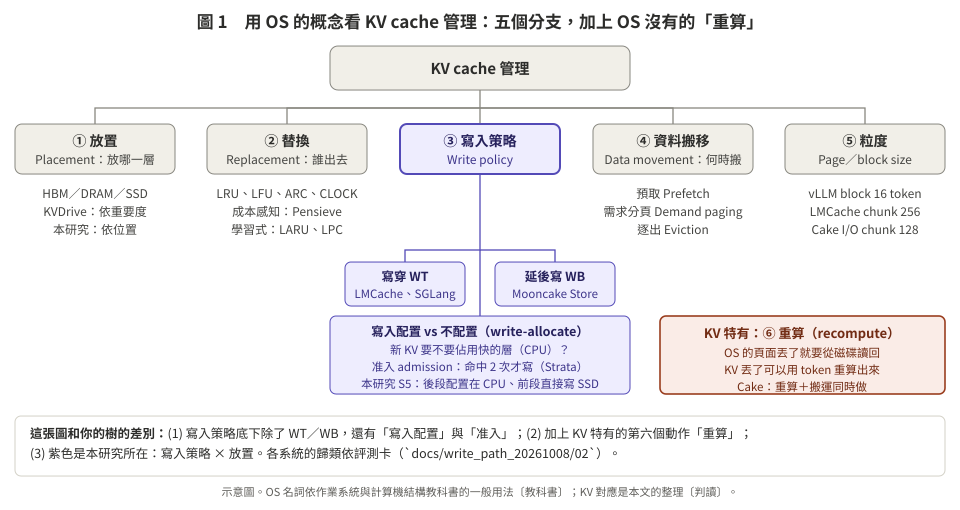
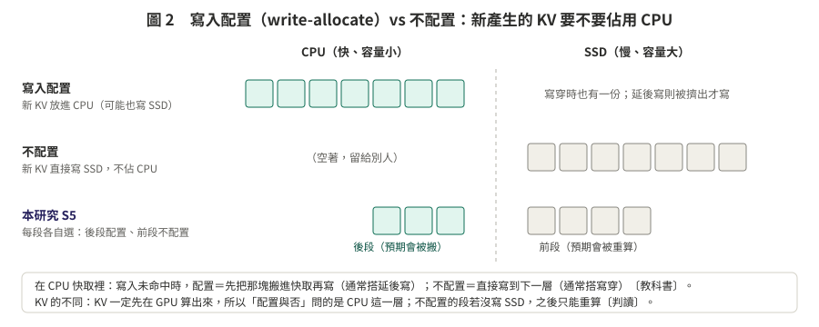
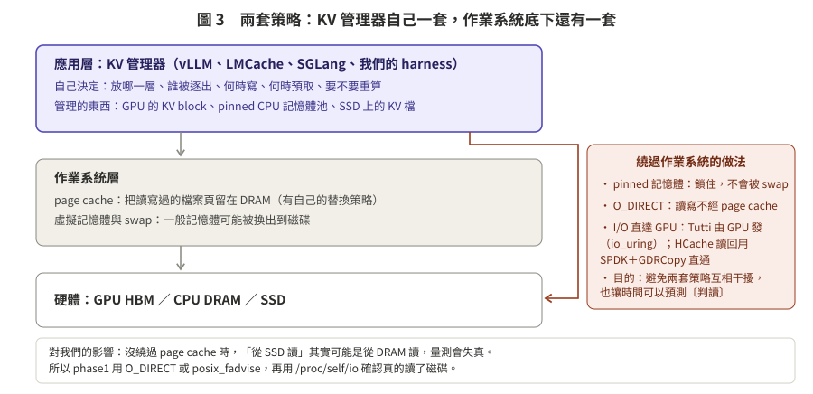

# 01 用 OS 的概念看 KV cache

> **一句話**：KV cache 管理幾乎可以一對一對應到 OS 的記憶體與快取管理：放置、替換、寫入策略、資料搬移、粒度。但有三個 OS 沒有的特點：
> 1. KV 一旦算出來就**不會再被修改**，所以沒有 dirty 的問題；
> 2. KV 丟了可以**重算**，不一定要從下一層讀回；
> 3. 重算的代價**依位置而不同**。
>
> 本研究做的是其中的「寫入策略 × 放置」。

**標記**：OS 名詞依作業系統與計算機結構教科書的一般用法〔教科書〕；KV 的對應是本文的整理〔判讀〕；系統的例子都取自評測卡（`03_paper_map.md`）。

---

## 1. 對照總表

| OS | KV cache | 例子 | 備註 |
|:--|:--|:--|:--|
| CPU 快取 | GPU HBM | — | KV 一定先在 GPU 算出來，算注意力時也一定要在 GPU |
| 主記憶體 | CPU DRAM（pinned） | — | — |
| 磁碟 | SSD、遠端儲存 | — | — |
| （沒有對應） | **重算**：從 token 再算一次 | Cake、Pensieve、HCache | KV 特有。丟掉的 KV 不一定要從下一層讀回，可以重算 |
| page | KV block／chunk | vLLM block 16 token、LMCache chunk 256、我們用 512 | — |
| page table | block table | vLLM PagedAttention | vLLM 明說是仿照 OS 的分頁（E01） |
| page fault | KV 未命中：前綴在 GPU 裡找不到 | — | 未命中之後有三條路：從下一層搬、重算、兩者同時（Cake） |
| 需求分頁 | 請求來了才還原 KV | Cake、LMCache 的載入 | — |
| 預取 | 請求到之前先把 KV 搬到快的層 | CachedAttention、LMCache、Strata | — |
| 替換（LRU 等） | 空間不夠時，選誰離開快的層 | LMCache、Mooncake 預設 LRU | 見 `02` |
| 逐出 | 離開快的層：**搬到下一層**（offload），或**直接丟**（之後重算） | Pensieve（從開頭丟） | OS 的乾淨頁可以直接丟；KV 每一塊都「可以丟」，因為能重算 |
| 寫穿 | 一產生就同時寫到下一層 | LMCache、SGLang 預設 | — |
| 延後寫 | 先只放快的層，被擠出時才寫到下一層 | Mooncake Store | — |
| 寫入配置／不配置 | 新的 KV 要不要佔用 CPU 這一層 | 本研究 S5 每段各自選 | 見 §3 |
| 准入（admission） | 要不要存（例如命中 2 次才存） | Strata、HiCache、`store_threshold` | 准入是快取的一般概念〔教科書〕，在 KV 很常見 |
| dirty bit | 這塊 KV 在下一層**有沒有副本** | — | KV 不會被修改，「dirty」只代表還沒有備份，見 §4 |
| 工作集 | 一段時間內會被回來使用的 session 的 KV 總量 | CachedAttention 的容量需求比 | — |
| page cache（OS 自己的） | 作業系統替 SSD 上的 KV 檔做的快取 | — | 會和 KV 管理器打架，見 §5 |

### 你貼的對照表，哪些對、哪些要改

| 你貼的 | 判斷 | 建議改成 |
|:--|:--|:--|
| Cache ↔ GPU HBM | ✅ | — |
| Memory ↔ CPU DRAM | ✅ | — |
| Disk ↔ SSD | ✅，但少了一個 | 補上「重算」：KV 丟了可以重算，這是 OS 沒有的 |
| Dirty bit ↔ KV 是否有更新 | ❌ | KV 算完就不會再改。dirty 在 KV 的意思是「下一層還沒有副本」，見 §4 |
| LRU ↔ KV reuse／importance | ⚠️ 混在一起 | reuse（會不會再被用）是跨請求的替換；importance（對答案多重要）是單一請求內、有損的 token 逐出，兩者是不同問題，見 `02` |
| Page ↔ KV block | ✅ | — |
| Page fault ↔ KV miss | ✅ | 補上：KV 未命中可以重算，不一定要讀下一層 |
| Eviction ↔ KV offload | ⚠️ 只對一半 | 逐出有兩種：搬到下一層（offload），或直接丟（之後重算） |
| Prefetch ↔ KV prefetch | ✅ | — |
| Write-back ↔ KV → lower memory | ❌ 太寬 | 「KV 寫到下一層」寫穿也會做。延後寫的重點是**時間點**：先不寫，被擠出時才寫 |

---

## 2. 五個分支，加上 KV 特有的「重算」

| 分支 | 問的問題 | OS 的做法 | KV 的特別之處 |
|:--|:--|:--|:--|
| ① 放置 | 放哪一層 | 依階層：快取 → 記憶體 → 磁碟 | 每段 KV 回來時的用法不同（後段一定搬、前段多半重算），所以可以依位置放（`../phase1_20261008/02` §4） |
| ② 替換 | 誰出去 | FIFO、LRU、LFU、CLOCK、ARC、LRU-K | 每塊被踢掉後的代價不同：重算越後面越貴。所以有成本感知（Pensieve）。還有前綴的依賴：在標準前綴快取裡，後面的塊要前面的在才有用（有系統放寬，見 `02` §3）〔複核補充〕 |
| ③ 寫入策略 | 何時寫、要不要寫 | 寫穿／延後寫；寫入配置／不配置 | KV 不會被修改，延後寫不必擔心「沒寫回去就遺失」，最壞就是重算（§4） |
| ④ 資料搬移 | 何時搬 | 預取、需求分頁、逐出 | 還原時可以「一邊搬、一邊算」（Cake），OS 沒有這條路 |
| ⑤ 粒度 | 一次處理多大 | page 4 KB 等 | block 太小會吃不滿頻寬（LMCache、Strata 都提到），太大則命中率下降 |
| ⑥ 重算 | 丟了怎麼辦 | 沒有對應 | KV 特有的第六個動作 |

---

## 3. 寫入策略：寫穿、延後寫、寫入配置、准入

OS（CPU 快取）裡，寫入策略有兩個獨立的問題〔教科書〕：
- **寫入命中時**：同時寫下一層（**寫穿**），還是先只改快取、被替換時才寫回（**延後寫**）？
- **寫入未命中時**：先把那塊搬進快取再寫（**寫入配置**），還是直接寫到下一層、不進快取（**不配置**）？

通常的搭配是「延後寫＋寫入配置」和「寫穿＋不配置」。

**對應到 KV**：
- KV 一定先在 GPU 算出來，所以 GPU 這一層一定「配置」。真正可以選的是 **CPU 這一層要不要配置**：新的 KV 要佔用 CPU，還是直接寫到 SSD？
- **延後寫**：KV 先只放 CPU，被擠出時才寫 SSD（Mooncake Store）。
- **寫穿**：KV 一產生就同時寫 CPU 和 SSD（LMCache）。
- **准入**：要存幾份、存不存，例如命中 2 次才從 GPU 備份到 CPU（Strata 的 selective、HiCache 的 `write_through_selective`），或存取頻率 ≥2 才寫磁碟（Dynamo KVBM）。〔複核修正：原寫「命中 2 次才寫 SSD（Strata）」。Strata 的 selective 是 HiRadixTree 節點存取次數超過門檻才**備份到 host（CPU）**，主實驗只用 CPU 層（E04 Strata 卡「分層實作」，[S] p.9 §4.4、p.10 §5.1）；「頻率 ≥2 才寫磁碟」的是 Dynamo KVBM（EVAL §2.4）〕
- **本研究 S5**：每一段各自選。預期會被搬的後段「配置」在 CPU；預期會被重算的前段「不配置」，直接寫 SSD 當備份。

所以用 OS 的語言說，本研究是**依位置、逐段決定寫入配置與否**〔判讀〕。

---

## 4. 為什麼 KV 沒有 dirty 的問題？

**OS 的 dirty bit**：快取裡的資料被改過、比下一層新，就標成 dirty。被替換時一定要寫回去，不然資料會遺失。延後寫之所以需要 dirty bit，就是為了這件事。

**KV 不一樣**〔判讀〕：
1. **算完就不改。** 因果注意力下，第 i 個 token 的 KV 只依賴第 1 到 i 個 token。同一段前綴、同一個模型，算出來的 KV 就固定了，之後不會被「更新」。
2. **丟了不會遺失。** 原始的 token 還在，所以 KV 永遠可以重算回來。丟掉的代價是重算的時間，不是資料遺失。
3. **所以「dirty」只剩一個意思**：這塊 KV 在下一層還沒有副本。如果在這時把它從快的層丟掉，之後就只能重算。

所以 KV 的延後寫比 OS 自由很多：被擠出時可以選擇寫下去，也可以直接丟掉（之後重算）。OS 對 dirty 的頁沒有這個選擇。

**「不穩」要注意的兩件事**：
- **「無損」在 MI300X 上還不能假設是逐位元相同。** RUNLOG_MI300X 發現 13：GSM8K 60 題 × 3 設定，KV 從 CPU／SSD 載回的 `cpu_lru`、`tier_fs` 和全在 GPU 的 `full_gpu` 相比，輸出 sha1 有 36/120 不同，**最終答案有 8/120 不同**。原因還沒判定：缺「同一設定重跑兩次是否本來就位元相同」的對照；RUNLOG 推測可能是 ROCm 注意力 kernel 在不同 prefill 分塊邊界下的浮點差異。所以不論是重算還是載回，在數值上都可能和原本不同，而且差異不一定「極小」（會改變取樣）。這不是一致性問題，但正確性檢查要考慮（`../phase1_20261008/05` §3）。〔複核修正：原寫「重算不一定逐位元相同……不同設定下的輸出不完全一樣……可能有極小的差別」。發現 13 比的是卸載路徑（載回）對全 GPU，不是重算對原本；而且 8/120 的最終答案不同，不能說是「極小的差別」；原因仍是「待判定」（`git show 9deda4f:results/RUNLOG_MI300X.md` 發現 13）〕
- **會「改寫」KV 的技術也有**：例如量化（KIVI，換成低精度）、拼接時部分重算（CacheBlend）、存的時候去掉位置編碼（CachedAttention 的截斷）。這些會產生新版本的 KV，但都不是原地更新，第一階段也都沒有用到。

---

## 5. 兩套策略：KV 管理器一套，作業系統一套

**是的，有兩套**〔判讀〕：
- **應用層**：vLLM、LMCache、SGLang（以及我們的 harness）自己決定放哪一層、誰被逐出、何時寫、何時預取、要不要重算。這些是**我們自己設定的策略**。
- **作業系統層**：作業系統也有自己的快取與替換。例如 page cache 會把讀過的檔案頁留在 DRAM；一般記憶體可能被 swap 出去。

**兩套會互相干擾**，例如 SSD 上的 KV 檔，作業系統可能已經幫你快取在 DRAM 裡。這時「從 SSD 讀」其實是從 DRAM 讀，量到的時間就失真了。

**所以 KV 系統通常會繞過作業系統**：
- 用 pinned 記憶體：鎖住，不會被 swap；
- 用 O_DIRECT：讀寫不經 page cache；
- 讓 I/O 繞過作業系統、直達 GPU：Tutti 讓 GPU 自己發 I/O（GPU io_uring，讀和寫都走這條路）；HCache 讀回時用 SPDK＋GDRCopy 把 SSD 的資料直接 P2P 寫進 GPU（寫入則是先 cudaMemcpy 到主機、再由主機 daemon 寫 SSD）。〔複核修正：原寫「讓 GPU 直接發 I/O：Tutti 用 io_uring，HCache 用 SPDK＋GDRCopy」。HCache 不是由 GPU 發 I/O，而且只有讀回走直通（E03 HCache 卡「I/O 怎麼實現」；`../write_path_20261008/02` §2B）〕

這樣只剩一套策略（我們的），時間也比較好預測。第一階段的做法也是這樣：pinned 記憶體、O_DIRECT 或 `posix_fadvise`，再用 `/proc/self/io` 確認真的讀了磁碟（`../phase1_20261008/05` §5.2）。
