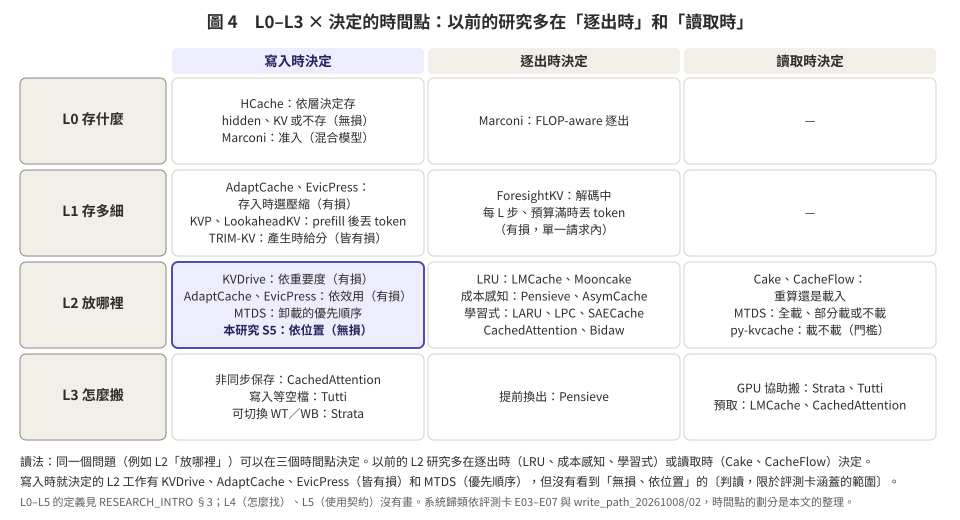

# 04 本研究在哪裡：L0–L5、OS 概念，以及「從讀取轉到寫入」

> **一句話**：L0–L5 是依「決定的對象」分（存什麼、存多細、放哪、怎麼搬、怎麼找、怎麼用）；OS 的概念是依「動作」分（放置、替換、寫入、搬移、粒度）。兩者交叉之後看得出：以前的 L2 研究多在逐出時或讀取時決定；本研究把 L2 的決定提前到寫入時，所以一定要談寫入策略。

---

## 1. 之前的 L0–L5 是什麼

出自 RESEARCH_INTRO §3（表 5），依「決定的對象」由下往上分：

| 層級 | 問題 | 決定什麼 | 代表 |
|:--|:--|:--|:--|
| L5 | 誰在用、用多久 | 使用方式與快取契約（保留時間、計價） | 商業 API 的快取契約 |
| L4 | 如何找到 | 只認前綴，或允許非前綴重用 | CacheBlend |
| L3 | 如何搬運 | CPU／SSD／網路 → GPU 的傳輸 | Strata、Tutti |
| **L2** | **放在哪裡** | **GPU、CPU、SSD，或捨棄後重算** | **Cake、CacheFlow、Pensieve、Bidaw** |
| L1 | 存多細 | BF16／FP8／INT4 | KIVI、KVTuner |
| L0 | 存什麼 | KV，或 hybrid 模型的狀態 | Marconi |

**L0–L5 沒有漏掉寫入，而是沒有把「什麼時候決定」分開。** 寫入策略分散在各層裡：
- L2 的「放哪」可以在寫入時、逐出時、或讀取時決定；
- L1 的「存多細」可以在寫入時量化（KIVI），也可以離線定好（KVTuner）；
- L5 的保留時間也算一種寫入或保留策略。

以前把 Cake 放在 L2，但 Cake 決定的其實是「**讀取時**哪段重算、哪段搬」，它假設 KV 早就全部存好了。

---

## 2. 加上「什麼時候決定」這一軸

把每篇論文依「層級 × 什麼時候決定」放進表格（完整清單見 `03_paper_map.md`）：

| | 寫入時決定 | 逐出時決定 | 讀取時決定 |
|:--|:--|:--|:--|
| L0 存什麼 | HCache（依層存 hidden、KV 或不存）、Marconi（准入） | Marconi（FLOP-aware 逐出） | — |
| L1 存多細 | AdaptCache、EvicPress（有損壓縮）；KIVI；KVP、LookaheadKV（prefill 後一次丟 token，有損）；TRIM-KV（產生時給分，有損） | ForesightKV（解碼中每 L 步丟 token，有損） | — |
| **L2 放哪裡** | KVDrive（依重要度，有損）、MTDS（優先順序）、AdaptCache、EvicPress（依整段 context 的效用，有損壓縮）、**本研究（依位置，無損）** | LRU 系統、Pensieve、AsymCache、Fancy-eviction、LARU、LPC、SAECache、CachedAttention、Bidaw | Cake、CacheFlow、MTDS、py-kvcache（載不載） |
| L3 怎麼搬 | 非同步寫（CachedAttention）、寫入等空檔（Tutti）、可切換的寫入策略（Strata） | 提前換出（Pensieve） | Strata、Tutti、LMCache 的預取與搬運 |

**讀法**〔判讀，限於評測卡涵蓋的範圍〕：L2 的研究集中在中間和右邊兩欄。寫入時就決定的有 KVDrive（有損）、MTDS（優先順序），以及 AdaptCache、EvicPress（有損壓縮、以整段 context 為單位），沒有「無損、依位置」的。無損而且在寫入時依成本決定的是 L0 的 HCache，但它的單位是層、不是 token 位置。

〔複核修正〕這張表原本與 `03` 的分類有三處不一致，已改成和 `03` 一致：
- LookaheadKV 原放在「逐出時」，`03` 與 `02` §4 都是 prefill 時（寫入時）（E06 LookaheadKV 卡）；
- KVP 原放在「逐出時」，卡片是「只在 prefill 後壓一次」（E06 KVP 卡，[KVP] p17）；
- L2「寫入時」原本漏了 AdaptCache、EvicPress。`03` §F 把它們列為「放置 × 寫入時」，`../write_path_20261008/02` §1 已讀原文確認是存入時決定（AdaptCache arXiv v2 p.2 §2；EvicPress p.6–7 §4.4、§5）。原讀法「寫入時就決定的只有 KVDrive 和 MTDS」因此不成立。
另外把 py-kvcache 加到 L2「讀取時」（見 `03` A4）。

---

## 3. 為什麼以前只考慮讀取？為什麼你要轉到寫入？

**以前只看讀取的原因**：
- **前提**：Cake、CacheFlow 都假設 KV 早就存好了，問題只剩「怎麼最快拿回來」（Cake 原文：「we precompute and store all requests' KV cache in advance」，ICML p5；E03 Cake 卡「重用結構」）〔複核修正：原引文是節錄，改成卡片記錄的原句〕。
- **系統**：生產系統多半「全部寫」，而且寫入在背景，不會直接出現在 TTFT 裡，所以容易被忽略（`../write_path_20261008/02`）。
- **評測**：在評測卡涵蓋的論文裡，量的多是 TTFT 和吞吐，很少量寫入量、寫入頻寬佔用，或讀寫互相干擾（`../write_path_20261008/03` 開頭一句話：五種寫入瓶頸「各篇大多只量到其中一兩種」）〔複核修正：補上範圍限定與出處〕。

**你的轉變**：你在讀取**之前**就做決定，打破「KV 全部都存好」這個前提：
- 寫入時就依位置決定每段的狀態；
- 原本 Cake 在讀取時才知道的會合點，提前在寫入時估計（`../phase1_20261008/03` 演算法 1）。

所以一定要談寫入，原因有三：
1. **決定的時間點變了**：從讀取時、逐出時，提前到寫入時。
2. **寫入本身有代價**：五種瓶頸，見 `../write_path_20261008/01` §2。
3. **最強的對手都是寫入策略**：延後寫入、選擇性寫入、成本感知逐出。老師點名要比的延後寫入、成本感知逐出（以及「先寫再丟」「一開始不寫」）都在其中；選擇性寫入是 `../write_path_20261008/03` §3.2 建議加的，老師沒有點名。〔複核修正：原寫「老師點名要比的，也正是這些」；老師 10/7 原文點名的是延後寫入、成本感知逐出、先寫再丟、一開始不寫，沒有選擇性寫入（`../phase1_20261008/01` §1）〕

---

## 4. 這麼多概念，哪個最重要？

依第一階段要回答的問題排序〔判讀〕：

| 重要性 | 概念 | 為什麼 | 第一階段怎麼處理 |
|:--|:--|:--|:--|
| ★★★ | **寫入策略 × 放置** | 本研究的貢獻就在這裡；也是評測卡範圍內看到的空白（動手前要再查新）〔複核修正：原寫「也是唯一的空白」，沒有範圍限定〕 | 主角：S5，以及對手 S4、S4+、S1、S2b（建議加 S1s 選擇性寫入） |
| ★★★ | **重算**（KV 特有） | 讓「前段放慢的層、甚至不存」成立；也是 Cake 的基礎 | 還原方式固定用 Cake |
| ★★ | **替換** | 容量不夠時決定誰離開，是最強的簡單對手 | LRU（S1、S4）vs 成本感知（S2b、S4+） |
| ★★ | **資料搬移：需求分頁 vs 預取** | 還原時間的主體；預取需要「何時回來」的預測 | 第一階段只做需求分頁（回來才搬）；預取留給第三階段的預測器 |
| ★ | **粒度** | 會影響搬運效率和命中率，但不是研究問題 | 固定 512 token，結果註明 |
| — | **注意力重要度（有損）** | 會改變答案，是另一類問題 | 第一階段不做；第二階段的精度才相關 |
| — | **OS 層（page cache、swap）** | 會干擾量測，不是研究對象 | 用 pinned 記憶體、O_DIRECT 繞過（`01` §5） |

**結論**：先把「寫入策略 × 放置」做清楚，替換只當對手，預取和精度留到後面。這和老師的兩週要求一致：先固定精度與還原方式，比較寫入的做法。
