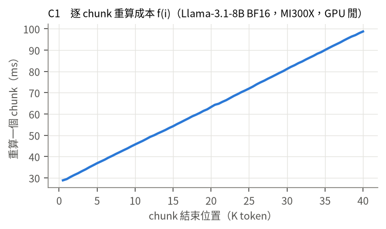
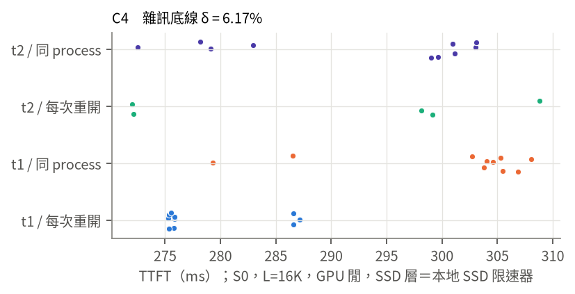
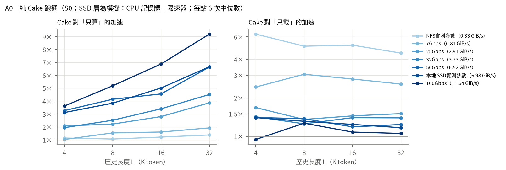
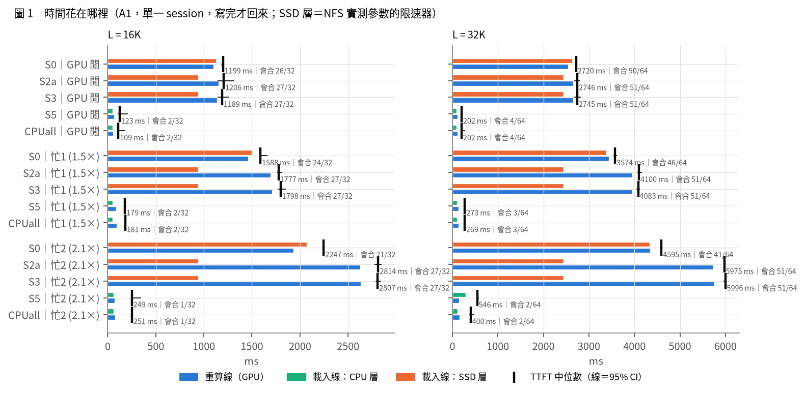
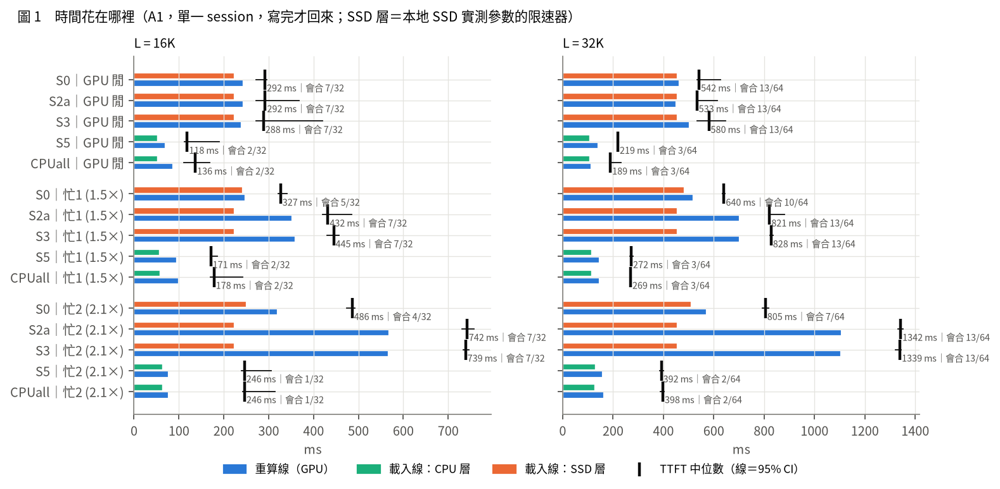
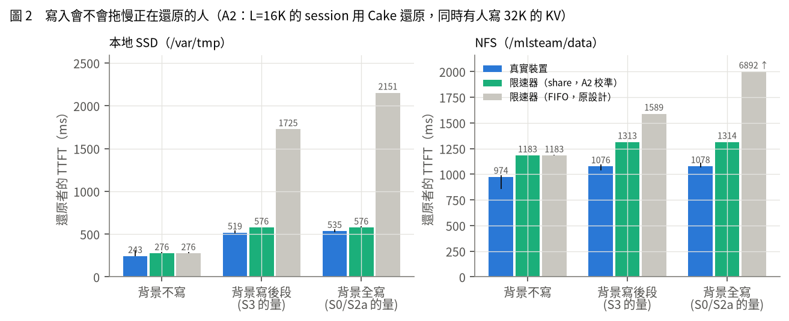
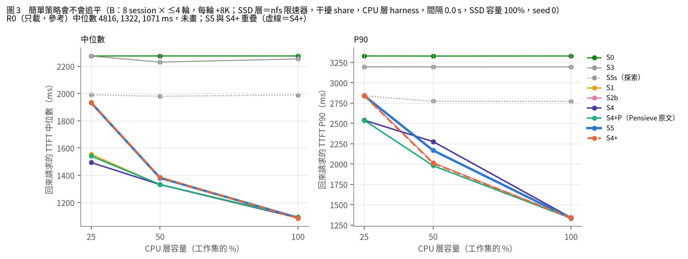

# 07 第一階段實驗報告（AMD MI300X，2026-10-08）

> **一句話**：在 MI300X＋Llama-3.1-8B 上，**「寫入時依位置放置」（S5）沒有贏過任何簡單策略**：它和「延後寫入＋依位置逐出」（S4+）在每一個設定下都只差 ≤3%，而容量緊時兩者多半比 LRU 類的簡單策略（S1／S4）慢（25% 容量時慢到 12–33%，見結論 5）。照 `05` §6 寫死的判準，結論是 **< 5%：簡單策略追平（甚至更好）**，核心問題要調整。原因是這台機器上 CPU 層載入比重算便宜 16 倍，「前段反正會被重算」的前提只對慢的層成立。

**範圍**：照 `05` 的設計，在一天內把 C（校準）、A0、A1、A2、B 都跑完，另外補了 C6（vLLM 對照）和文獻查新。
**誠實性**：本檔每一個數字都來自 `results/m7_write_policy_mi300x/` 的 CSV（每列都有 `run_id`），由 `code/m7_analyze.py` 自動彙整成 `verdict.json` 與 `summary_*.csv`；圖由同一支程式產生。**沒有估計值**；沒量的寫 `NOT_MEASURED`。判讀是 **self-review，不是 cross-model review**（CLAUDE.md §5）。
**原始輸出**：`/mlsteam/data/tiara/runs/<run_id>/`（附錄 A）。流水帳：`results/RUNLOG_MI300X.md`。
**文獻**：`report/related_papers_update.md`（Cake／Pensieve 逐項核對、12 個系統的寫入路徑、14 篇新論文）。

---

## 0. 總表：每一項判準的結果（判準照 `05` §6，開跑前寫死）

| 項目 | 判準（`05` §6） | 結果 | 判定 |
|:--|:--|:--|:--|
| 正確性 | 載入的 chunk 逐位元組相同；重算 KV 誤差不大於平台對照 | 平台兩次 prefill 位元相同；重算 KV 逐位元組相同；GPU↔pinned 往返相同；所有實驗 `kv_bad`＝0 | ✅ 通過 |
| C1 重算曲線 | f(i) 隨位置上升 | 28.9 → 98.8 ms（4K→40K），斜率 0.888 ms／chunk | ✅ 通過 |
| C3 會合點 | 預測與實測差 ≤1 chunk | 28／28 格 ≤1 chunk | ✅ 通過 |
| C4 雜訊 | δ ≤ 10% | δ＝6.2%（雙峰：會合點 6／7 跳動） | ✅ 通過 |
| C7 限速器自檢 | 誤差 ≤5% | 第一次 40 GiB/s −6.5% ❌ → 修正後：-0.0%／-0.0%／-0.0%／-0.1%／-0.3%（設定 0.25／1／5／20／40 GiB/s）→ **通過** | ✅ 修正後通過（A0 用修正前版本，見 D3） |
| A0 Cake 跑通 | 三個趨勢條件都成立 | 條件 1、2 成立；條件 3：27／28 格成立，4K×100 Gbps Cake 慢 5.6% | ⚠️ **嚴格說未通過**（1 格），依規則要找老師 |
| Q1 省下的寫入有沒有縮短等待 | S3 在 A1、A2、B 都沒有比 S2a 快 >δ → 「只剩空間的價值」 | A1：寫完才回來時 0／24 格；寫入一提交就回來時 6／24 格快 3.7–13%。A2：少寫（13 或 51 個 chunk）和全寫（64）讓別人慢的程度差 ≤3% | **大致沒有**：只在「寫入還沒寫完就回來」時有一點 |
| Q2 GPU 忙時沒有備份 | 報 S3 相對 S0 慢多少 | 忙 1：+13～+36%（16K、32K）；忙 2：+23～+66%（NFS 8K 以上；本地全部） | **代價明顯** → 支持「每段都存」 |
| **Q4 S5 vs 最好的簡單策略** | **<5% 追平；5–15% 找老師；>15% 進第二階段** | 主設定 25%：**−29.4%**；50%：**−3.7%**；100%：−0.4%（負值＝S5 比較慢）；所有敏感度設定都是負值或 <1% | ❌ **簡單策略追平（容量緊時更好）** |
| S5 vs S4+（「寫入時決定」的淨價值） | — | 所有設定 -3.0%～+0.3%（中位數；正值＝S5 較好） | **沒有淨價值** |
| Q5 空間在哪些容量下才是瓶頸 | 所有策略都在雜訊內 → 那個容量下空間不是瓶頸 | 100%：有 CPU 層的策略差 ≤1.1%（< δ）；25%：差到 29% | 空間只在 ≤50% 時是瓶頸 |

---

## 1. 結論先講

1. **最接近的 baseline（Cake）在 MI300X 上跑通了，但好處的大小強烈依賴頻寬**（A0）：對「只算」快 1.0–9.2 倍；對「只載」在慢的層（NFS 參數）快 4.5–6.3 倍，在 ≥6.5 GiB/s 的層只快 1.05–1.4 倍，最短×最快的一格（4K、100 Gbps）還慢 5.6%。量測工具本身可信：正確性全過、會合點預測誤差 ≤1 chunk、雜訊 δ＝6.2%。
2. **老師的 Q1（省下的寫入有沒有縮短等待）：大致沒有。** 寫完才回來時沒有任何差別；寫入還在進行就回來時，48 格只有 6 格快 4–13%。真實裝置（A2）上，寫入確實會拖慢別人的讀取（本地 SSD 讀取慢 3.3 倍、TTFT 2.2 倍），**但少寫幾乎沒有幫助**：只要還有寫入在進行就會被拖慢，寫 13 個或 64 個 chunk 差不多。
3. **老師的 Q2（GPU 忙時沒有備份）：代價明顯。** 「一開始不寫前段」在 GPU 忙時慢 13–66%（16K 以上），GPU 閒時沒有差別。這支持「每段都存」的修正。
4. **核心問題 Q3（寫入時就放好 vs 等滿了再搬）：沒有差別。** S5 和 S4+ 在每一個設定都只差 ≤3%，而且在 B 主設定的 25%／50%／100% 容量是 +0.1%／+0.3%／−0.3%。原因很直接：以 CPU 層算出的分界 b 只有 0–3 個 chunk，因為 CPU 載入比重算最便宜的 chunk 還便宜 16 倍；寫入當下沒有東西可以決定。
5. **更大的發現：依位置的逐出（S4+、S5、S2b）在容量緊時常常比 LRU 差**：25% 容量、share 干擾、跑完的 7 個設定裡，有 6 個最好的簡單策略是 LRU 類（S1 或 S4），S5（＝S4+）比它慢 12–33%（中位數）；其餘 SSD 層＝NFS 參數，seed 2（最好的是 S4+，S5 差 -0.0%）；FIFO 干擾下 S5 慢 70%（但平均幾乎相同，見 §8.4）。依位置逐出會把每個 session 的前段都擠到慢的層，包括馬上要回來的 session；LRU 則保留整個最近的 session。在這台機器上，「誰會先回來」比「哪個位置便宜」重要。把閒置時間放進成本的 Pensieve 原文版本（S4+P）和 LRU 一樣好，有時更好。
6. **容量才是主因**（Q5）：CPU 容量 100% 時所有有 CPU 層的策略差 ≤1.1%；25% 時差到 29%。和 2609.16215 的結論一致。
7. **照 `05` §6 的判準：< 5% → 簡單策略追平。** 這是寫死的停損點，不是失敗：它告訴我們「寫入時依位置」這個機制，在**快的 CPU 層＋強 GPU＋GQA 模型**的組合下沒有用武之地。

**建議的下一步（給 10/9、10/13 和老師討論）**：
- **不要把現在的 S5 做大。** 判準已經說話了。
- 如果要保留這條線，條件要換到「前段真的該去慢的層」的地方：**CPU 層很小或很慢（例如 vLLM 實測的 4 GiB/s，或 CPU 給別的用途）、模型是 MHA（KV 大 4 倍）、或 GPU 算力弱**。這些情況下 b 才會大，S5 和 S4+ 才可能不同。第一階段的 CPU＝vLLM 速度敏感度已經顯示 b 變大，但仍然沒差；要再往這個方向走，需要先用演算法 1 算出「b 至少要多大才可能有差」，再挑硬體／模型。
- 比 S5 更值得做的方向，是第一階段意外量到的兩件事：(a) **「誰會回來」比「位置」重要**（S4+P／LRU 勝過依位置），這和第三階段的預測器（會不會回來、何時回來）直接相關；(b) **寫入干擾只在「還有寫入在進行」時發生，量多少不重要**，所以「什麼時候寫」（避開別人回來的時段）可能比「寫多少」重要。
- CVPR：本次沒有視覺情境的結果。若要爭取，要回到 `research_20261007_vlm/` 選情境，第一階段的證據不支持把 S5 帶過去。

---

## 2. 實際怎麼做的（和設計的差異都列在 §2.3）

### 2.1 平台與程式

| 項目 | 實際 |
|:--|:--|
| 機器 | AMD Instinct MI300X（gfx942，192 GiB，SPX/NPS1），MLSteam Lab；PCIe Gen5 x16（`amd-smi static --bus`，calib_c0.csv） |
| 軟體 | ROCm 7.2.2；torch 2.10.0+rocm7.0（HIP 7.0.51831）；transformers 5.17.0；vLLM 0.28（C6，`venv/tiara-v028`） |
| 模型 | Llama-3.1-8B-Instruct（`unsloth/Llama-3.1-8B-Instruct`，與 NousResearch 版同權重），權重與 KV 都是 BF16；每 token KV 128 KiB，chunk＝512 token＝64 MiB |
| harness | `code/m7_model.py`：重用 HF 的權重與 RoPE，注意力與 KV 緩衝自管（SDPA → flash kernel，GQA，右下角對齊的因果遮罩）。`code/m7_restore_harness.py`：限速器（演算法 4）與三種還原（演算法 2、3）。`code/m7_write_policy.py`：C3–C7、A0–A2、B 的驅動 |
| 記錄 | 每次 run 都走 `runsh`：`/mlsteam/data/tiara/runs/<RUN_ID>/{cmd.sh,context.txt,stdout.log,stderr.log,exit_code,gpu_guard.json}`；CSV 每列都有 `run_id`、`ts` |
| 爭用 | 每個 run 一個 `GpuWatcher`（amd-smi 輪詢，自己的背景負載 pid 列白名單）；真實磁碟量測前後讀 `/proc/diskstats` 的 sda |

### 2.2 正確性（`results/m7_write_policy_mi300x/correctness.json`，run `20261008-125951-m7-correctness`）

| 檢查 | 結果 |
|:--|:--|
| 平台對照：HF 整段 prefill 跑兩次 | 最後 token 的 logits **位元相同** |
| 自管前向 vs HF（L=8K） | argmax 相同；top-5 重疊 5/5；logits 最大絕對差 0.094（BF16、切法不同） |
| 同樣切法重算兩次 | KV **逐位元組相同** |
| GPU→pinned→GPU 往返 | **逐位元組相同** |
| 每次實驗的還原後檢查（`kv_bad` 欄） | A0、A1、C7、B 的第一個 rep：有存的 chunk 還原後與存的那份逐位元組比對，`kv_bad` 總和＝0（A0、A1、C7 錨點、B 主設定） |

### 2.3 和 `05` 設計不同的地方（全部照實列出）

| # | 設計 | 實際 | 為什麼／影響 |
|:--|:--|:--|:--|
| D1 | 限速器讀寫共用一個 t空閒（FIFO） | 主要結果改用 **share 模型**：讀、寫各自排隊，寫入進行中時讀取變慢 k 倍；k 由 A2 真實裝置校準（本地 SSD 3.31、NFS 1.67、CPU 1.16）。FIFO 保留為悲觀的敏感度分析 | A2 實測：真實本地 SSD 在背景寫 4 GiB 時，還原者 TTFT 只從 0.24 s 變 0.52 s；FIFO 限速器卻變 2.15 s（讀被整批寫入擋住）。FIFO 會把寫入代價放大好幾倍，對「多寫」的策略不公平 |
| D2 | SSD 層參數＝實測最慢×0.9，另加固定開銷 c | c 設 0；頻寬用「每個 chunk 一個檔」的持續讀寫最小值×0.9（已含開檔與每次 I/O 開銷） | 避免把每次 I/O 的開銷算兩次；迴歸截距（本地 2.5 ms、NFS 0.8 ms）只記錄在 tier_params.json |
| D3 | C7 自檢誤差 ≤5% | 第一次自檢在 40 GiB/s 慢 6.5%（20 GiB/s 以下 ≤3.6%）。已修：連續讀取時，距上一筆完成 <0.5 ms 視為背靠背。A0 用的是修正前的版本（A0 只用到 ≤11.6 GiB/s，誤差 ≤~1.5%）；A1、B 用修正後的版本 | 見 §3.1 C7 |
| D4 | GPU 忙＝背景負載 | 照做：duty 0.4（忙 1，實測 1.48×）、0.7（忙 2，實測 2.07×）。**沒有**照 Cake 用 token budget 比例定義 | Cake 的定義是「分到的 budget」，不是真的有別人在用 GPU，兩者不能直接對照 |
| D5 | I/O chunk 和計算 chunk 都是 512 | 照做（Cake 原文 I/O chunk 是 128） | 已在 `04` 註明；沒有加跑 128 的對照 |
| D6 | B 用事件順序 | 照做；請求一個接一個、間隔 gap（主要 0 s，敏感度 2 s）；寫入在背景用限速器計時 | gap=0 是寫入干擾最大的情況 |
| D7 | B 的策略 8 個 | 另加兩個**事後新增**的組：**S4+P**（照 Pensieve 原文的保留值 V＝f(i)／T，文獻查核建議）、**S5s**（分界 b 以 SSD 層算，見 §8.3）。**判定仍只用 05 §6 寫死的 S0、S1、S2b、S4、S4+** | 新增的組另外報，不影響判定 |
| D8 | B 每輪「生成回答」 | 不做 decode；每輪＝還原歷史＋prefill 新的 8K，TTFT 量到第一個 token | 第一階段只量 TTFT |
| D9 | CPU 降級時 | CPU 空間在降級當下立刻釋放（不等 SSD 寫完） | 對延後寫入（S4、S4+）有利，是對本研究不利的簡化 |
| D10 | 每格 ≥6 次 | A0、A1：6 次；B 主設定：6 次（分兩段 3＋3）；B 敏感度：3 次，標「探索」 | — |

---

## 3. 校準（C）

### 3.1 I/O 路徑與裝置（C0、C2、C7）

```
GPU（MI300X，HBM3）
  ↑↓ PCIe Gen5 x16（amd-smi：MAX_PCIE_SPEED 32 GT/s、WIDTH 16）
  │   pinned H2D 52.9 GiB/s、D2H 44.8 GiB/s（64 MiB，中位數，5 次）
  │   64 MiB chunk 放進 KV 緩衝的非連續視圖：H2D 50.0、D2H 42.9 GiB/s
  │   H2D 與 D2H 同時跑：H2D 53.5 → 46.1 GiB/s（−14%）
主機記憶體（pinned）
  ├─ 本地 SSD（/var/tmp，overlay on sda）O_DIRECT，每 chunk 一個檔：讀 7,943–9,152 MiB/s、寫 2,174–2,192 MiB/s
  └─ NFS（/mlsteam/data/tiara，NetApp nfs4）O_DIRECT：讀 377–447 MiB/s、寫 684–822 MiB/s
```
（`calib_c0.csv`、`calib_c0_duplex.csv`、`calib_c2.csv`；本地 SSD／NFS 各 3 次、每次 64 個 64 MiB 檔）

- **page cache 有繞過**：每次真實讀取的 `/proc/self/io` `read_bytes` 都等於讀的量（C2、C7 錨點全部成立），sda 的計數器也只看到我們自己的 I/O（鄰居的外來 I/O ≤1.1 MiB，沒有任何 run 被標 `CONTAMINATED_DISK`）。
- **限速器參數**（`tier_params.json`，規則：實測最慢×0.9）：

| 層 | 讀 GiB/s | 寫 GiB/s | 每個 chunk 的載入時間 ℓ | 寫入進行中時讀取變慢 k（A2 校準） |
|:--|--:|--:|--:|--:|
| CPU | 35.4 | 35.5 | 1.76 ms | 1.16 |
| 本地 SSD | 6.98 | 1.91 | 8.95 ms | 3.31 |
| NFS | 0.331 | 0.601 | 188.8 ms | 1.67 |

- **C7 自檢**（設 X、量實得）：第一次在 0.25／1／5／20／40 GiB/s 的誤差是 −0.1／−0.3／−1.0／−3.6／**−6.5%** → 40 GiB/s 超過 5% 的判準，**未過**。修正（背靠背讀取不計軟體開銷）後重做：-0.0%／-0.0%／-0.0%／-0.1%／-0.3%（設定 0.25／1／5／20／40 GiB/s）→ **通過**。
- **C7 錨點（限速器 vs 真實裝置，`summary_c7_anchor.csv`）**：

| 裝置 | 還原方式 | 8K：模擬／真實 | 16K | 32K |
|:--|:--|--:|--:|--:|
| 本地 SSD | 只載 | 1.25 | 1.31 | 1.22 |
| 本地 SSD | Cake | 0.95 | 1.08 | 0.82 |
| NFS | 只載 | 2.66 | 2.66 | 1.27 |
| NFS | Cake | 1.41 | 1.36 | 1.37 |

  解讀：限速器刻意比實測最慢再慢 10%，所以「模擬／真實」大多 >1。NFS 的偏差最大，因為 NFS 本身在不同時段差很多（C2 讀 377 MiB/s；同一天稍後的錨點與 A2 實得約 500–830 MiB/s），參數取的是最慢那次。**所以 NFS 參數的結果是「慢 NFS」的情況，不是 NFS 的平均情況。**
  CPU 層的「真實」Cake 錨點不可用：不限速時，重算執行緒和載入執行緒在 Python 端互相干擾（每個 chunk 3–4 ms，而限速模式下是 1.77 ms，見 §10 限制 L3）。

### 3.2 重算曲線 f(i)（C1）與 GPU 忙（C5）



- f(i) 隨位置線性上升：第 1 個 chunk 28.9 ms，第 80 個（40K）98.8 ms；斜率 0.888 ms／chunk。3 次之間的最大差 0.8%。**C1 通過**（Cake 的前提「越後面越貴」在這台機器上成立）。
- 注意力用的是 flash kernel（SDPA；32K 時每層 1.63 ms，和 f 的增量一致），不是 math fallback。
- **重算 vs 載入的比例**（決定 Cake 會合點的關鍵）：重算一個 chunk 至少 28.9 ms；從 CPU 層載入 1.76 ms（16 倍）、本地 SSD 8.95 ms（3.2 倍）、NFS 188.8 ms（重算比較便宜，在 32K 以前都是）。
- **C5**：背景 matmul 的 duty 0.4 → 重算慢 1.48 倍（忙 1）；0.7 → 2.07 倍（忙 2）。各 3 次。

### 3.3 會合點校準（C3）

用演算法 1（C1 的 f、限速器的 ℓ，假設 GPU 閒）預測會合點，和 A0 裡 Cake 實際的重算 chunk 數比：**28／28 格的誤差 ≤1 個 chunk。C3 通過。**

### 3.4 雜訊底線（C4）



S0、L=16K、GPU 閒、本地 SSD 限速器：

| 時段 | 跑法 | 次數 | TTFT 中位數 | 95% CI | δ（CI 半寬／中位數） |
|:--|:--|--:|--:|:--|--:|
| t1 | 每次重開 process | 10 | 276 ms | 275–287 ms | 2.0% |
| t1 | 同一個 process 連跑 | 10 | 304 ms | 287–307 ms | 3.3% |
| t2 | 每次重開 process | 5 | 298 ms | 272–309 ms | 6.2% |
| t2 | 同一個 process 連跑 | 10 | 299 ms | 278–303 ms | 4.2% |

- **δ = 6.2%**（四組取最大），低於 10% 的判準 → **C4 通過**。之後的比較，差距要 >6.2% 而且 CI 不重疊才算數。t1＝13:22–13:29，t2＝18:33–18:37（UTC）。
- 雜訊的來源主要是**會合點的離散跳動**：同一個設定，有時重算線多拿一個 chunk（會合在 6 而不是 7），TTFT 就從 0.275 s 跳到 0.287–0.304 s。這是 chunk 粒度（512 token）造成的，不是量測雜訊。
- t1 時，同一個 process 連跑和每次重開 process 的中位數差約 10%（0.304 vs 0.276 s），t2 時沒有差（0.299 vs 0.298 s）；差別主要是會合點 6／7 的比例不同。**所以比較只在同一種跑法內做**：B 的所有策略都在同一個 process 內依序跑。

---

## 4. A0：純 Cake 跑通



S0（全部存在模擬 SSD 層），三種還原方式 × L ∈ {4K, 8K, 16K, 32K} × 7 個讀取頻寬，每格 6 次（run `20261008-133544-m7-a0`）。

**Cake 的 TTFT 中位數（ms）**；「只算」4K／8K／16K／32K 分別是 283／645／1,439／3,759 ms：

| 讀取頻寬 | 4K | 8K | 16K | 32K | 對只載的加速（4K→32K） |
|:--|--:|--:|--:|--:|:--|
| NFS 實測參數（0.33 GiB/s） | 248 | 607 | 1,183 | 2,723 | 6.29 → 4.47× |
| 7 Gbps（0.81 GiB/s） | 274 | 420 | 895 | 1,952 | 2.43 → 2.56× |
| 25 Gbps（2.91 GiB/s） | 136 | 290 | 514 | 972 | 1.68 → 1.50× |
| 32 Gbps（3.73 GiB/s） | 145 | 256 | 423 | 833 | 1.42 → 1.39× |
| 56 Gbps（6.52 GiB/s） | 87 | 156 | 316 | 566 | 1.40 → 1.24× |
| 本地 SSD 實測參數（6.98 GiB/s） | 91 | 168 | 287 | 565 | 1.40 → 1.17× |
| 100 Gbps（11.6 GiB/s） | 78 | 124 | 210 | 409 | **0.94** → 1.05× |

三個趨勢條件：
1. **對只算的加速隨長度變大**：7／7 個頻寬成立（例：本地 SSD 3.1 → 6.7 倍）。✅
2. **對只載的加速隨頻寬變大而變小**：4／4 個長度在兩端成立（NFS 參數 4.5–6.3 倍 → 100 Gbps 0.94–1.27 倍），但中間不完全單調（25 Gbps 的值常比 7 Gbps 小、又比 32 Gbps 大）。✅（兩端）
3. **Cake 不比只算或只載慢**：27／28 格成立。**例外：4K、100 Gbps，Cake 78 ms vs 只載 74 ms（慢 5.6%）**。❌

**判定：嚴格照判準，A0 未完全通過（1／28 格）**，照 `05` §6 應該找老師。這一格是「最短 × 最快頻寬」，正是 Cake 不該有好處的地方：只有 8 個 chunk，重算線拿走的第一個 chunk 要 29 ms，同樣時間載入線可以搬 5 個 chunk，兩條線並行的同步開銷就超過收益。**Cake 原文 Table 6 的 GQA Llama-3.1-8B 在 32 Gbps、低 util 時也是 0.98 倍**（原論文數字，不是我們量的；`report/related_papers_update.md` a1）。其餘 27 格趨勢都和 Cake 一致，所以我們繼續跑完 A1、A2、B，讓老師一次判斷；**所有以 Cake 為基礎的結論都以這個例外為前提**。

---

## 5. A1：單一 session 的寫入與還原（Q1、Q2）




5 個策略 × L 4 種 × GPU 3 種 × SSD 參數 2 種 × 回來時機 2 種，每格 6 次，共 1,440 次還原（run `20261008-134526-m7-a1`）；`kv_bad` 總和 0（每格第一次還原後，所有有存的 chunk 與存的那份逐位元組相同）。
「回來時機」：`inf`＝寫完才回來；`0`＝寫入一提交就回來（寫入還在佔裝置）。

**TTFT 中位數（ms），寫完才回來，GPU 閒**：

| SSD 參數 | 策略 | 4K | 8K | 16K | 32K | 32K 時寫進 SSD 的 chunk | 32K 會合點 |
|:--|:--|--:|--:|--:|--:|--:|--:|
| 本地 SSD | S0 純 Cake | 86 | 172 | 292 | 542 | 64 | 13 |
| | S2a 先寫再丟 | 103 | 156 | 292 | 533 | 64（寫完刪 13） | 13 |
| | S3 一開始不寫 | 95 | 156 | 288 | 580 | 51 | 13 |
| | S5 依位置 | 57 | 70 | 118 | 219 | 3（其餘 61 進 CPU） | 3 |
| | 全放 CPU（上界） | 57 | 65 | 136 | 189 | 0 | 3 |
| NFS | S0 | 328 | 602 | 1,199 | 2,720 | 64 | 50 |
| | S2a | 250 | 525 | 1,206 | 2,746 | 64（寫完刪 51） | 51 |
| | S3 | 340 | 533 | 1,189 | 2,745 | 13 | 51 |
| | S5 | 57 | 66 | 123 | 202 | 3 | 4 |
| | 全放 CPU | 86 | 88 | 109 | 202 | 0 | 4 |

**Q1：省下的寫入有沒有縮短等待？**（S3 vs S2a：最後留下的東西完全一樣，只差有沒有先寫過）
- **寫完才回來（inf）**：兩者的版面完全相同，差距只是雜訊（同設定的兩組，差距最大 9%，例：本地 32K 533 vs 580 ms，CI 重疊）。**沒有任何一格 S3 顯著較快。**
- **寫入一提交就回來（0）**：48 格裡只有 **6 格** S3 顯著比 S2a 快（CI 不重疊且 >δ），幅度 3.7–13%：本地 SSD GPU 閒 4K（−13.0%）、8K（−3.8%）；NFS GPU 閒 8K（−12.0%）、16K（−5.0%）、32K（−6.5%）；NFS 忙 1 32K（−3.7%）。其他 42 格沒有差別。
- 原因（看 A2）：只要還有寫入在進行，讀取就變慢；寫 13 個 chunk 和寫 64 個 chunk，在還原期間都還沒寫完，所以「少寫」幫不太上忙。**只有在少寫讓寫入「在還原開始前就寫完」時才有用。**

**Q2：GPU 忙時，沒有備份要付多少？**（S3 vs S0，寫完才回來）

| SSD 參數 | GPU | 4K | 8K | 16K | 32K |
|:--|:--|--:|--:|--:|--:|
| 本地 SSD | 閒 | +10.7%（不顯著） | −9.3%（不顯著） | −1.1%（不顯著） | +7.1%（不顯著） |
| | 忙 1（1.5×） | −1.0% | +0.2% | **+36.2%** | **+29.2%** |
| | 忙 2（2.1×） | **+45.6%** | **+29.2%** | **+52.0%** | **+66.4%** |
| NFS | 閒 | +3.5% | −11.5% | −0.8% | +0.9% |
| | 忙 1 | −3.1% | +1.1% | **+13.2%** | **+14.2%** |
| | 忙 2 | −0.8% | **+23.3%** | **+24.9%** | **+30.5%** |

（粗體＝CI 不重疊；正值＝S3 比 S0 慢）
- **老師的第二個疑問被證實**：GPU 一忙，「一開始不寫前段」就要多等 13–66%，越長越嚴重。GPU 閒時沒有差別。
- 這支持 `02` §6 把設計改成「每段都存」：前段有備份，GPU 忙時會合點可以往前移。

**S5 vs S0**：S5 在每一格都快很多（寫完才回來時快 54–94%），但**這幾乎全部來自「有 CPU 層」本身**，不是「寫入時依位置」：A1 沒有容量限制，S5 的 b 只有 0–3 個 chunk，版面幾乎等於全放 CPU。兩者在 GPU 閒時的差距（−34%～+16%）是雜訊，不是策略差異：例如 NFS 4K、8K 的「全放 CPU」被一段 GPU 變慢的插曲打到（見 §10 L8；同一段時間 t_new 從 27 ms 變 42 ms），所以看起來比 S5 慢。
**一個要注意的例外**：NFS、GPU 忙 2、32K，S5（546 ms）比全放 CPU（400 ms）慢 37%。因為 b 是假設 GPU 閒算出來的（3 個 chunk 放 NFS），GPU 一忙，會合點往前移，那 3 個 chunk 就得從很慢的 NFS 搬。**寫入時用「GPU 閒」的假設決定，GPU 忙時會吃虧。**

---

## 6. A2：寫入會不會拖慢別人（真實裝置）



session X（16K）用 Cake 從**真實**檔案還原，同時背景有另一個 session 正在寫它的 32K KV（run `20261008-131619-m7-a2`、`20261008-132038-m7-a2share`；真實裝置 9 次、限速器 3–6 次）：

| 裝置 | 背景寫入 | 還原者 TTFT 中位數 | 每個 chunk 的讀取時間 | 背景寫入花多久 |
|:--|:--|--:|--:|--:|
| 本地 SSD | 不寫 | 243 ms | 7.5 ms | — |
| | 寫後段（S3 的量，51 chunk） | 519 ms（+113%） | 24.5 ms | 1.46 s |
| | 全寫（S0 的量，64 chunk） | 535 ms（+120%） | 24.8 ms | 1.81 s |
| NFS | 不寫 | 974 ms | 80.5 ms | — |
| | 寫後段（13 chunk） | 1,076 ms（+10%） | 127 ms | 1.35 s |
| | 全寫（64 chunk） | 1,078 ms（+11%） | 128 ms | 5.95 s |

- **寫入確實會拖慢別人**：本地 SSD 上讀取變慢 3.3 倍、還原者的 TTFT 變 2.2 倍；NFS 上讀取變慢 1.6 倍，但 TTFT 只多 10%（因為 Cake 在 NFS 上本來就大多在重算）。
- **但「少寫」幾乎沒有幫助**：寫 51 個和 64 個 chunk（本地），或 13 個和 64 個（NFS），TTFT 只差 3% 和 0.2%。原因：還原只要 0.2–1 秒，兩種寫入在這段時間內都還沒寫完。
- **原設計的 FIFO 限速器嚴重高估干擾**（本地 2.15 s、NFS 6.89 s，真實是 0.54、1.08 s），因為它讓讀取排在整批寫入後面；真實裝置會穿插讀寫。所以 B 的主要結果改用依 A2 校準的 share 模型（§2.3 D1），FIFO 當敏感度。share 模型和真實裝置的差距：本地 +8%、NFS +22%（NFS 參數本來就取最慢）。

---

## 7. C6：和真實系統（vLLM）對照

vLLM 0.28＋`OffloadingConnector`（CPUOffloadingSpec，48 GiB，LRU），同一個 prompt 送兩次：第一次整段 prefill（同時存進 CPU 層），`/reset_prefix_cache` 之後第二次從 CPU 層載入（run `20261008-141324-m7-c6-vllm`，每格 6 次）：

| L | vLLM cold（整段算） | 本 harness 只算＊ | vLLM warm（從 CPU 載入） | vLLM 的 CPU→GPU 實得頻寬（自己的 metrics） | 本 harness CPU 層 |
|:--|--:|--:|--:|--:|--:|
| 8K | 443 ms | 645 ms | 292 ms | 4.02 GiB/s | 35.4 GiB/s（限速）／50 GiB/s（裸） |
| 16K | 1,304 ms | 1,439 ms | 553 ms | 4.09 GiB/s | 同上 |
| 32K | 4,584 ms | 3,759 ms | 1,080 ms | 4.11 GiB/s | 同上 |

＊harness 的「只算」還多算了 256 個新 token；兩者的切法也不同（vLLM chunked prefill 一次 16,384 token）。

- **計算端相當**：harness 的整段重算和 vLLM 在同一個量級（8K 慢 46%、16K 慢 10%，32K 反而快 18%），所以 f(i) 不是一個被做弱的稻草人。
  - **更正（2026-10-10，F1 發現）**：這裡的 vLLM 開了 OffloadingConnector。在 ROCm 上，vLLM 0.28 只要設定任何 KV connector，就會從 ROCM_ATTN 退回較慢的 TRITON_ATTN。所以這裡比的是 vLLM 的**慢路徑**，「計算端相當」不成立。和預設的 vLLM（ROCM_ATTN，32K cold 2.24 s）比，harness 重算約慢 1.7–2 倍〔實測，見 `docs/research_20261010_followup/F1_offload_slowdown.md`〕。f(i) 偏大會讓 κ＝ℓ／f 偏小、b 偏小，Cake 有效的頻寬帶的絕對數字要重量。**這正好落在 09 標為「還沒排除的例外」的區域**：09 的模擬裡，重算便宜（f×0.25–0.5）時有少數寫入時策略存活。F5 依 f 拆開重算：free 時 f×0.5 是 0／48 格通過、最大領先 3.3%，f×0.25 有 1 個設定存活；hold 時另有 2 個設定存活〔模擬，`sim_sweep_gain.csv`、`sim_probe.csv`，F5 重算〕。這些只比了兩個對手，也沒上 GPU。**要用快的 attention 重量 f(i)，再用完整的對手集合重跑**，結論才算數。
- **CPU 層差 9–12 倍**：vLLM 的 OffloadingConnector 在 MI300X 上只跑到 4.1 GiB/s（舊紀錄發現 11 也看到 2.3 GB/s），而裸 PCIe 是 53 GiB/s。**本 harness 的 CPU 層代表「做得好的 CPU 層」，比現在的 vLLM 快很多。** 這會直接影響 S5 的結論（CPU 越快，b 越小，S5 越像 S4+），所以 B 另外跑了一組 CPU 層＝vLLM 實測速度的敏感度（§8.4）。

---

## 8. B：多 session、容量有限——簡單策略會不會追平（Q3、Q4、Q5）



**主設定**：8 個 session、每個最多 4 輪、每輪追加 8K（歷史 8K→24K，回來時再算新的 8K）；一次服務一個、請求之間不間隔（gap 0，寫入干擾最大）；SSD 層＝NFS 實測參數（最慢、最容易看出寫入的影響）；干擾＝share 模型；CPU 層容量＝工作集（32 GiB）的 25／50／100%；workload seed 0（**這個 seed 恰好 8 個 session 都回來 4 輪，沒有人中途離開**）。
只統計「回來的請求」（第 2–4 輪），每次 24 個。判準裡的關鍵格（25%、50%）每個策略 6 次（144 個請求），其餘 3 次。第一次重複的每個回來請求都逐位元組驗證 KV：`kv_bad` 總和 0。

### 8.1 主設定的結果

| 策略 | 25%：中位數〔95% CI〕／平均／P90（s） | 50%：中位數〔95% CI〕／平均／P90（s） | 100%：中位數〔95% CI〕／平均／P90（s） |
|:--|--:|--:|--:|
| R0 | 4.82〔4.57–5.07〕／4.70／8.32（3 次） | 1.32〔1.07–1.33〕／3.15／8.04（3 次） | 1.07〔1.07–1.09〕／1.08／1.33（3 次） |
| S0 | 2.28〔2.27–2.29〕／2.35／3.33（3 次） | 2.28〔2.27–2.29〕／2.35／3.33（3 次） | 2.28〔2.27–2.29〕／2.35／3.33（3 次） |
| S1 | 1.55〔1.42–1.68〕／1.70／2.54（6 次） | 1.33〔1.10–1.34〕／1.42／2.28（6 次） | 1.09〔1.07–1.10〕／1.08／1.34（3 次） |
| S2b | 1.93〔1.67–1.98〕／1.89／2.85（6 次） | 1.38〔1.33–1.42〕／1.43／2.02（6 次） | 1.08〔1.07–1.10〕／1.08／1.34（3 次） |
| S3 | 2.27〔2.21–2.29〕／2.28／3.20（3 次） | 2.23〔2.20–2.28〕／2.27／3.20（3 次） | 2.25〔2.21–2.28〕／2.27／3.19（3 次） |
| S4 | 1.49〔1.42–1.68〕／1.70／2.54（6 次） | 1.33〔1.10–1.34〕／1.42／2.28（6 次） | 1.09〔1.07–1.10〕／1.09／1.34（3 次） |
| S4+ | 1.93〔1.68–1.98〕／1.89／2.84（6 次） | 1.38〔1.34–1.42〕／1.44／2.01（6 次） | 1.08〔1.07–1.09〕／1.08／1.34（3 次） |
| S4+P | 1.54〔1.42–1.68〕／1.65／2.54（6 次） | 1.33〔1.10–1.42〕／1.36／1.98（6 次） | 1.09〔1.07–1.10〕／1.08／1.33（3 次） |
| S5 | 1.93〔1.68–1.98〕／1.89／2.84（6 次） | 1.38〔1.33–1.42〕／1.44／2.17（6 次） | 1.09〔1.07–1.11〕／1.08／1.33（3 次） |
| S5s | 1.99〔1.97–2.28〕／2.12／2.84（6 次） | 1.98〔1.97–2.09〕／2.06／2.77（6 次） | 1.99〔1.92–2.16〕／2.07／2.77（3 次） |

（R0＝只載還原，只當參考；S5s、S4+P 是事後新增的組，不進判定）

### 8.2 判定（05 §6：S5 vs S0、S1、S2b、S4、S4+ 裡中位數最低的那一個）

| 設定 | CPU 容量 | 最好的簡單策略 | 它的中位數 | S5 中位數 | S5 相對最好簡單策略 | S5 vs S4+ | 成對平均 | 重複 | 判讀 |
|:--|--:|:--|--:|--:|--:|--:|--:|--:|:--|
| SSD 層＝本地 SSD 參數，seed 0 | 25% | S4 | 1.235 s | 1.441 s | -16.7% | -0.9% | -10.1% | 3 | S5 比最好的簡單策略差 16.7%（中位數；CI 重疊） |
| SSD 層＝本地 SSD 參數，seed 0 | 50% | S1 | 1.092 s | 1.134 s | -3.8% | -0.4% | -2.0% | 3 | 差距 -3.8%（< 5%）：簡單策略追平 |
| SSD 層＝NFS 參數，干擾＝FIFO，seed 0 | 25% | S4 | 1.687 s | 2.869 s | -70.0% | -0.1% | -51.1% | 3 | S5 比最好的簡單策略差 70.0%（CI 不重疊） |
| SSD 層＝NFS 參數，干擾＝FIFO，seed 0 | 50% | S4 | 1.358 s | 2.640 s | -94.4% | -0.1% | -40.7% | 3 | S5 比最好的簡單策略差 94.4%（中位數；CI 重疊） |
| SSD 層＝NFS 參數，SSD 容量 50%，seed 0 | 25% | S4 | 1.509 s | 1.932 s | -28.0% | -0.2% | -19.1% | 3 | S5 比最好的簡單策略差 28.0%（中位數；CI 重疊） |
| SSD 層＝NFS 參數，SSD 容量 50%，seed 0 | 50% | S1 | 1.331 s | 1.381 s | -3.8% | -0.0% | -7.3% | 3 | 差距 -3.8%（< 5%）：簡單策略追平 |
| SSD 層＝NFS 參數，seed 0 | 25% | S4 | 1.494 s | 1.933 s | -29.4% | +0.1% | -18.8% | 6 | S5 比最好的簡單策略差 29.4%（中位數；CI 重疊） |
| SSD 層＝NFS 參數，seed 0 | 50% | S1 | 1.331 s | 1.381 s | -3.7% | +0.3% | -7.2% | 6 | 差距 -3.7%（< 5%）：簡單策略追平 |
| SSD 層＝NFS 參數，seed 0 | 100% | S2b | 1.083 s | 1.088 s | -0.4% | -0.3% | +0.1% | 3 | 差距 -0.4%（< 5%）：簡單策略追平 |
| SSD 層＝NFS 參數，間隔 2 s，seed 0 | 25% | S1 | 1.487 s | 1.828 s | -22.9% | -2.6% | -15.9% | 3 | S5 比最好的簡單策略差 22.9%（中位數；CI 重疊） |
| SSD 層＝NFS 參數，間隔 2 s，seed 0 | 50% | S1 | 1.326 s | 1.332 s | -0.4% | -0.2% | -4.4% | 3 | 差距 -0.4%（< 5%）：簡單策略追平 |
| SSD 層＝NFS 參數，CPU 層＝vLLM 實測速度（3.69 GiB/s），seed 0 | 25% | S4 | 1.637 s | 1.835 s | -12.1% | -0.7% | -11.6% | 3 | S5 比最好的簡單策略差 12.1%（中位數；CI 重疊） |
| SSD 層＝NFS 參數，CPU 層＝vLLM 實測速度（3.69 GiB/s），seed 0 | 50% | S4 | 1.437 s | 1.436 s | +0.1% | +0.2% | -3.4% | 3 | 差距 +0.1%（< 5%）：簡單策略追平 |
| SSD 層＝NFS 參數，seed 1 | 25% | S1 | 1.071 s | 1.421 s | -32.6% | -3.0% | -35.9% | 3 | S5 比最好的簡單策略差 32.6%（中位數；CI 重疊） |
| SSD 層＝NFS 參數，seed 1 | 50% | S4 | 1.073 s | 1.084 s | -1.0% | -0.2% | -4.6% | 3 | 差距 -1.0%（< 5%）：簡單策略追平 |
| SSD 層＝NFS 參數，seed 2 | 25% | S4+ | 1.436 s | 1.436 s | -0.0% | -0.0% | -0.5% | 3 | 差距 -0.0%（< 5%）：簡單策略追平 |
| SSD 層＝NFS 參數，seed 2 | 50% | S4 | 1.104 s | 1.129 s | -2.3% | +0.0% | +2.3% | 3 | 差距 -2.3%（< 5%）：簡單策略追平 |

「S5 相對最好簡單策略」＝（最好簡單策略的中位數 − S5 的中位數）÷ 最好簡單策略的中位數，正值代表 S5 比較好。「成對平均」＝同一個回來請求（同一 rep、同一事件）的 S5 與最好簡單策略的 TTFT 差，取平均。δ＝6.2%（C4）。

### 8.3 為什麼會這樣（看 25% 容量、主設定）

每個回來請求的平均（6 次 × 24 個請求；`b_share.csv`，cpu_frac=0.25、wl_seed=0）：

| 第幾輪 | 指標 | S1 寫穿＋LRU | S4 延後寫＋LRU | S4+P 延後寫＋Pensieve | S4+ 延後寫＋位置 | S5 寫入時依位置 |
|:--|:--|--:|--:|--:|--:|--:|
| 2（歷史 16 chunk） | TTFT 中位數 | 1.140 s | 1.133 s | 1.133 s | 1.140 s | 1.131 s |
| 3（32 chunk） | TTFT 中位數 | 1.675 s | 1.675 s | 1.675 s | 1.978 s | 1.978 s |
| | 重算 chunk | 13.0 | 13.0 | 13.0 | 19.1 | 19.1 |
| | 從 CPU 載入 chunk | 17.3 | 17.3 | 17.3 | 10.3 | 10.3 |
| 4（48 chunk） | TTFT 中位數 | 2.239 s | 2.171 s | **1.933 s** | 2.688 s | 2.690 s |
| | 重算 chunk | 22.8 | 22.7 | 19.7 | 28.2 | 28.2 |
| | 從 CPU 載入 chunk | 21.7 | 21.7 | 25.4 | 15.5 | 15.5 |
| 全部 | 整段歷史都在 CPU 的回來請求 | 33% | 33% | 33% | 12% | 12% |

1. **S5 和 S4+ 完全一樣**（每個容量差距 ≤0.3%，寫進 SSD 的量、降級次數也一樣：25% 時都是 24 GiB、384 次）。原因是 b：以 CPU 層算出的分界 b 只有 0–3 個 chunk（A1），因為從 CPU 載入一個 chunk（1.76 ms）比重算最便宜的第 1 個 chunk（28.9 ms）便宜 16 倍。所以 S5 在寫入當下幾乎把所有 chunk 都放 CPU，之後的行為就和 S4+ 一模一樣。**「寫入時就決定」在這台機器上沒有東西可以決定。**
2. **依位置的逐出（S4+、S5、S2b）在容量緊時反而比 LRU 差。** 它每次逐出「全部 session 裡位置最前面的 chunk」，於是每個 session 都只剩後段在 CPU，包括馬上要回來的 session。回來時前段在 NFS（比重算還慢），只好重算：第 4 輪平均重算 28.2 個 chunk，LRU 是 22.7 個。LRU 整個 session 一起逐出，留在 CPU 的 session 回來時幾乎不用重算（33% 的回來請求整段都在 CPU，依位置的只有 12%）。
3. **「前段便宜，可以重算」這個前提，只有相對於慢的層才成立。** 相對於 CPU 層，最便宜的前段 chunk 也比載入貴 16 倍，所以 CPU 裡的每一個 chunk 都值得留，不管它在哪個位置。真正有用的訊號是**誰會先回來**（recency）：照 Pensieve 原文、把閒置時間放進分母的 S4+P，在第 4 輪是最好的（1.933 s）。
4. **S5s（分界以 SSD 層算）最差**（25%／50%／100% 都約 1.98–1.99 s）：以 NFS 算出的 b 很大（約 80% 的 chunk），寫入時就把大部分歷史放進 NFS，就算 CPU 還有空間也不用。這直接示範了「依位置放到慢的層」的代價。
5. **容量才是主因（Q5）**：CPU 容量 100% 時，所有有 CPU 層的策略都在 1.083–1.095 s 之間（差 ≤1.1%，小於 δ），空間不是瓶頸，「省空間」在那裡沒有用；25% 時同一批策略差到 29%。這和 2609.16215「好處主要來自容量」一致。
6. **Cake 在全部都在 CPU 時略慢於只載**：100% 容量時 R0（只載）1.071 s，有 Cake 的策略 1.083–1.095 s（慢 1–2%）；和 A0 的例外同一個現象（層夠快時，重算線拿走的第一個 chunk 反而拖慢）。

### 8.4 敏感度

所有敏感度都只跑關鍵的容量（25%、50%）與 6 個策略（S1、S4、S4+、S4+P、S5、S5s），每格 3 次，標「探索」。完整數字在 §8.2 的表。

| 改了什麼 | 為什麼要看 | 結果 |
|:--|:--|:--|
| **workload seed 1**（8 個 session 裡 3 個只來 1 輪、1 個 2 輪、1 個 3 輪） | 延後寫入的好處（不回來就不用寫）只在有人中途離開時出現 | 25%：S1 1.071 s、S4 1.073 s，S5 1.421 s（−32.6%）；50%：都在 1.07–1.08 s。**延後寫入確實少寫**（S4 寫 12 GiB vs 寫穿 S1 20 GiB），但 TTFT 一樣 |
| **CPU 層＝vLLM 實測速度**（3.69 GiB/s，C6） | CPU 層變慢，b 會變大，S5 才有東西可以「寫入時決定」 | b 變大了（S5 的降級次數 25%：336 vs S4+ 384），但 S5 和 S4+ 仍只差 −0.7%／+0.2%；25% 時仍比 S4 慢 12.1% |
| **SSD 層＝本地 SSD 參數**（快 21 倍） | NFS 是最慢的情況 | 25%：S4 1.235 s、S5 1.441 s（−16.7%）；50%：−3.8%。方向不變 |
| **干擾＝FIFO**（原設計，悲觀） | 寫入干擾放到最大時，「不在擠的時候大量寫」的好處才會出現 | S5＝S4+（−0.1%）。**這是唯一看得到「寫入尖峰」的設定**：S4（LRU 整個 session 一次降級）的 P90 是 6.2 s，S4+／S5（一次降級一個 chunk）是 3.5 s；但平均 S4 2.75 s ≈ S5 2.76 s，中位數 S4 1.69 s vs S5 2.87 s。尾端的好處來自「逐 chunk 降級」，S4+ 也有，不是「寫入時決定」帶來的 |
| SSD 層＝NFS 參數，SSD 容量 50%，seed 0（25%） | 補充設定 | S5 1.932 s vs 最好簡單 S4 1.509 s（-28.0%）；S5 vs S4+ -0.2% |
| SSD 層＝NFS 參數，SSD 容量 50%，seed 0（50%） | 補充設定 | S5 1.381 s vs 最好簡單 S1 1.331 s（-3.8%）；S5 vs S4+ -0.0% |
| SSD 層＝NFS 參數，間隔 2 s，seed 0（25%） | 補充設定 | S5 1.828 s vs 最好簡單 S1 1.487 s（-22.9%）；S5 vs S4+ -2.6% |
| SSD 層＝NFS 參數，間隔 2 s，seed 0（50%） | 補充設定 | S5 1.332 s vs 最好簡單 S1 1.326 s（-0.4%）；S5 vs S4+ -0.2% |
| SSD 層＝NFS 參數，seed 2（25%） | 補充設定 | S5 1.436 s vs 最好簡單 S4+ 1.436 s（-0.0%）；S5 vs S4+ -0.0% |
| SSD 層＝NFS 參數，seed 2（50%） | 補充設定 | S5 1.129 s vs 最好簡單 S4 1.104 s（-2.3%）；S5 vs S4+ +0.0% |

**敏感度的共同結論**：在全部 17 個（設定 × 容量）組合裡，S5 相對最好簡單策略的中位數差距是 -94.4%～+0.1%，**沒有一個 >5%**；S5 和 S4+ 的差距在 -3.0%～+0.3%。


---

## 9. 和相關論文的關係（摘要；細節見 `report/related_papers_update.md`）

- **S5 的新穎點要收窄**：「寫入時就決定放哪一層」已經有 Lachesis（2610.08378，10/6，依壽命，HBM／HBF）、EfficientAgent（2609.33762，寫入准入）、HCache（依層）、EvicPress／AdaptCache（依整段 context，有損）。還沒看到「依 token 位置／重算成本 × 無損 × 多層 × 對齊雙向還原的會合點」的組合（限本次搜尋範圍；投稿前要查引用 Cake 的論文清單）。
- **Pensieve 的成本感知照原文是 V＝Cost／T**，不是 `03` 的「先比位置再比 LRU」。本次新增 S4+P 照原文做（§2.3 D7）。
- **Where Should the KV Cache Live?**（2609.16215）的結論「好處主要來自容量，不是放置策略」和本次的結果方向一致（§8）。
- **CacheFlow v2**（2026-09-26）已經比 Cake 強；第一階段固定用 Cake 沒問題，但 b 是用 Cake 的還原模型推的，換還原方式要重推。
- Cake 原文有 6 處沒寫或我們刻意偏離（I/O chunk 128→512、GPU 忙的定義、c 和讀寫干擾、同步方式、沒存的 chunk、TTFT 是否含新 token），已列在 §2.3 與文獻檔 a1。

---

## 10. 限制（這些結論不能推廣到哪裡）

- **L1　單一模型、單一平台**：Llama-3.1-8B（GQA，KV 128 KiB／token）、MI300X。GQA 讓 KV 小、載入相對便宜；MHA 模型（KV 大 4 倍）或算力較弱的 GPU，重算／載入的比例會完全不同，S5 的 b 也會不同。
- **L2　模擬的儲存層**：SSD 與 CPU 層都是 pinned 記憶體＋限速器。參數取實測最慢×0.9；干擾模型由 A2 的單一情境（16K 讀＋32K 寫）校準。真實裝置的寫入懸崖、page cache、檔案系統開銷、鄰居都不在模擬裡（C7 錨點的偏差見 §3.1）。
- **L3　Python harness**：兩條線是兩個 Python 執行緒。限速模式下 CPU 層每個 chunk 1.77 ms（和設定的 1.76 ms 一致），但不限速時兩條線會互相干擾（CPU 真實錨點每個 chunk 3–4 ms）。生產系統（C++／CUDA graph）不會有這個開銷。
- **L4　工作負載是合成的**：8 session × 最多 4 輪 × 每輪 8K、一次服務一個、沒有 decode；回來順序與是否回來由固定 seed 決定（seed 0 恰好 8 個都回來 4 輪，seed 1、2 有中途離開的）。不是真實 trace（Mooncake／TraceLab 留到之後）。
- **L5　GPU 只放正在服務的請求**：刻意限制，用來製造容量壓力（`05` §1）。
- **L6　chunk 粒度 512**：會合點的離散跳動是雜訊的主要來源（C4）；Cake 原文的 I/O chunk 是 128。
- **L8　GPU 短暫變慢**：沒有外來 process（GpuWatcher 乾淨），但純 GPU 計算偶爾在幾秒內慢 1.3–2.5 倍（A1 GPU 閒的 480 列中 68 列的 t_new 超過最小值 15%）。原因未明：候選是 GpuWatcher 每 3 秒呼叫 amd-smi、或節點上鄰居共用電源／主機資源。B 的判定另外報「排除這些事件」的版本（§8）。
- **L7　沒有做的**：Cake 的調適排程、token-budget 定義的 GPU 忙、I/O chunk 128 的對照、S5-oracle、真實 trace、第二個模型。

---

## 附錄 A：run_id 對照

| run_id | exit | 用途 |
|:--|:--|:--|
| `20261008-125951-m7-correctness` | 0 | `python code/test_m7_correctness.py results/m7_write_policy_mi300x/correctness.json` |
| `20261008-130257-m7-c0` | 0 | `code/m7_calib.py c0 --out /mlsteam/workspace/paper-hierarchical-kv-state/results/m7_write_policy_mi300x/calib_` |
| `20261008-130316-m7-c1` | 0 | `code/m7_calib.py c1 --out /mlsteam/workspace/paper-hierarchical-kv-state/results/m7_write_policy_mi300x/calib_` |
| `20261008-130438-m7-c2` | 0 | `code/m7_calib.py c2 --out /mlsteam/workspace/paper-hierarchical-kv-state/results/m7_write_policy_mi300x/calib_` |
| `20261008-130834-m7-c5` | 0 | `code/m7_write_policy.py busy-calib --duties 0.2 0.4 0.6 0.8 1.0` |
| `20261008-130956-m7-c5b` | 0 | `code/m7_write_policy.py busy-calib --duties 0.7` |
| `20261008-131619-m7-a2` | 0 | `code/m7_write_policy.py a2 --L 16384 --reps 6 --devs local nfs` |
| `20261008-132007-m7-duplex` | 0 | `code/m7_duplex.py /mlsteam/workspace/paper-hierarchical-kv-state/results/m7_write_policy_mi300x/calib_c0_duple` |
| `20261008-132038-m7-a2share` | 0 | `code/m7_write_policy.py a2 --L 16384 --reps 3 --devs local nfs` |
| `20261008-132233-m7-c4-same-t1` | 0 | `code/m7_write_policy.py noise --reps 10 --slot t1 --proc-mode same` |
| `20261008-132320-m7-c4-restart-t1` | 0 | `code/m7_write_policy.py noise --reps 1 --slot t1 --proc-mode restart` |
| `20261008-132352-m7-c4-restart-t1` | 0 | `code/m7_write_policy.py noise --reps 1 --slot t1 --proc-mode restart` |
| `20261008-132437-m7-c4-restart-t1` | 0 | `code/m7_write_policy.py noise --reps 1 --slot t1 --proc-mode restart` |
| `20261008-132510-m7-c4-restart-t1` | 0 | `code/m7_write_policy.py noise --reps 1 --slot t1 --proc-mode restart` |
| `20261008-132552-m7-c4-restart-t1` | 0 | `code/m7_write_policy.py noise --reps 1 --slot t1 --proc-mode restart` |
| `20261008-132623-m7-c4-restart-t1` | 0 | `code/m7_write_policy.py noise --reps 1 --slot t1 --proc-mode restart` |
| `20261008-132708-m7-c4-restart-t1` | 0 | `code/m7_write_policy.py noise --reps 1 --slot t1 --proc-mode restart` |
| `20261008-132739-m7-c4-restart-t1` | 0 | `code/m7_write_policy.py noise --reps 1 --slot t1 --proc-mode restart` |
| `20261008-132824-m7-c4-restart-t1` | 0 | `code/m7_write_policy.py noise --reps 1 --slot t1 --proc-mode restart` |
| `20261008-132858-m7-c4-restart-t1` | 0 | `code/m7_write_policy.py noise --reps 1 --slot t1 --proc-mode restart` |
| `20261008-132940-m7-c7self` | 0 | `code/m7_calib.py c7 --out /mlsteam/workspace/paper-hierarchical-kv-state/results/m7_write_policy_mi300x/calib_` |
| `20261008-133016-m7-c7anchor` | 0 | `code/m7_write_policy.py anchor --L 8192 16384 32768 --reps 3` |
| `20261008-133544-m7-a0` | 0 | `code/m7_write_policy.py a0 --reps 6` |
| `20261008-134526-m7-a1` | 0 | `code/m7_write_policy.py a1 --reps 6` |
| `20261008-141014-m7-b-nfs-gap0` | 1 | `code/m7_write_policy.py b --reps 3 --ssd-dev nfs --gap 0 --wl-seed 0 --verify` |
| `20261008-141324-m7-c6-vllm` | 0 | `code/m7_c6_vllm.py --out /mlsteam/workspace/paper-hierarchical-kv-state/results/m7_write_policy_mi300x/c6_vllm` |
| `20261008-142647-m7-b-nfs-gap0` | 0 | `code/m7_write_policy.py b --reps 3 --ssd-dev nfs --gap 0 --wl-seed 0 --verify` |
| `20261008-161514-m7-b-nfs-gap0-r36` | 0 | `code/m7_write_policy.py b --reps 3 --rep-start 3 --ssd-dev nfs --gap 0 --wl-seed 0 --cpu-fracs 0.25 0.5 --stra` |
| `20261008-164801-m7-b-nfs-seed1` | 0 | `code/m7_write_policy.py b --reps 3 --ssd-dev nfs --gap 0 --wl-seed 1 --cpu-fracs 0.25 0.5 --strategies S1 S4 S` |
| `20261008-170104-m7-b-nfs-cpuvllm` | 0 | `code/m7_write_policy.py b --reps 3 --ssd-dev nfs --gap 0 --wl-seed 0 --cpu-fracs 0.25 0.5 --strategies S1 S4 S` |
| `20261008-173051-m7-b-local-gap0` | 0 | `code/m7_write_policy.py b --reps 3 --ssd-dev local --gap 0 --wl-seed 0 --cpu-fracs 0.25 0.5 --strategies S1 S4` |
| `20261008-175305-m7-b-nfs-fifo` | 0 | `code/m7_write_policy.py b --reps 3 --ssd-dev nfs --gap 0 --wl-seed 0 --cpu-fracs 0.25 0.5 --strategies S1 S4 S` |
| `20261008-183255-m7-c7self-fixed` | 0 | `code/m7_calib.py c7 --out /mlsteam/workspace/paper-hierarchical-kv-state/results/m7_write_policy_mi300x/calib_` |
| `20261008-183330-m7-c4-same-t2` | 0 | `code/m7_write_policy.py noise --reps 10 --slot t2 --proc-mode same` |
| `20261008-183417-m7-c4-restart-t2` | 0 | `code/m7_write_policy.py noise --reps 1 --slot t2 --proc-mode restart` |
| `20261008-183450-m7-c4-restart-t2` | 0 | `code/m7_write_policy.py noise --reps 1 --slot t2 --proc-mode restart` |
| `20261008-183534-m7-c4-restart-t2` | 0 | `code/m7_write_policy.py noise --reps 1 --slot t2 --proc-mode restart` |
| `20261008-183604-m7-c4-restart-t2` | 0 | `code/m7_write_policy.py noise --reps 1 --slot t2 --proc-mode restart` |
| `20261008-183649-m7-c4-restart-t2` | 0 | `code/m7_write_policy.py noise --reps 1 --slot t2 --proc-mode restart` |
| `20261008-183724-m7-b-nfs-seed2` | 0 | `code/m7_write_policy.py b --reps 3 --ssd-dev nfs --gap 0 --wl-seed 2 --cpu-fracs 0.25 0.5 --strategies S1 S4 S` |
| `20261008-185709-m7-b-nfs-gap2` | 0 | `code/m7_write_policy.py b --reps 3 --ssd-dev nfs --gap 2 --wl-seed 0 --cpu-fracs 0.25 0.5 --strategies S1 S4 S` |
| `20261008-200242-m7-b-nfs-ssd50` | 0 | `code/m7_write_policy.py b --reps 3 --ssd-dev nfs --gap 0 --wl-seed 0 --cpu-fracs 0.25 0.5 --ssd-frac 0.5 --str` |

## 附錄 B：怎麼重跑

```bash
cd /mlsteam/workspace/paper-hierarchical-kv-state
source code/m7_env.sh                    # venv、HF_HOME、HIP_VISIBLE_DEVICES、m7run
m7run m7-correctness python code/test_m7_correctness.py $R/correctness.json
m7run m7-c0 python code/m7_calib.py c0 --out $R/calib_c0.csv --reps 5
m7run m7-c1 python code/m7_calib.py c1 --out $R/calib_c1.csv --reps 3 --max-chunks 80
m7run m7-c2 python code/m7_calib.py c2 --out $R/calib_c2.csv --reps 3 --n-sustained 64 \
      --dev local=/var/tmp/m7io nfs=/mlsteam/data/tiara/runs/_m7io
python code/m7_params.py $R               # → tier_params.json（k_read 由 A2 補上，見 RUNLOG）
code/m7_run_phase1.sh                     # C4、C7、A0、A1（以及當時的 B）
code/m7_run_phase1f.sh                    # B 主設定之後的重複與敏感度
python code/m7_analyze.py                 # → verdict.json、summary_*.csv、report/figs/*.png
```
