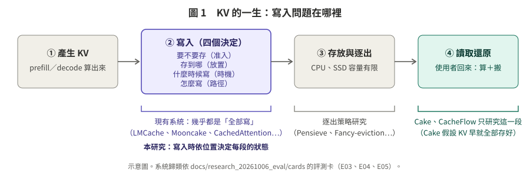
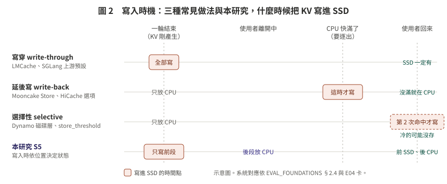
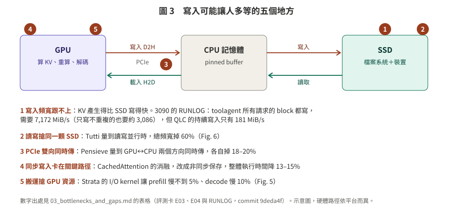
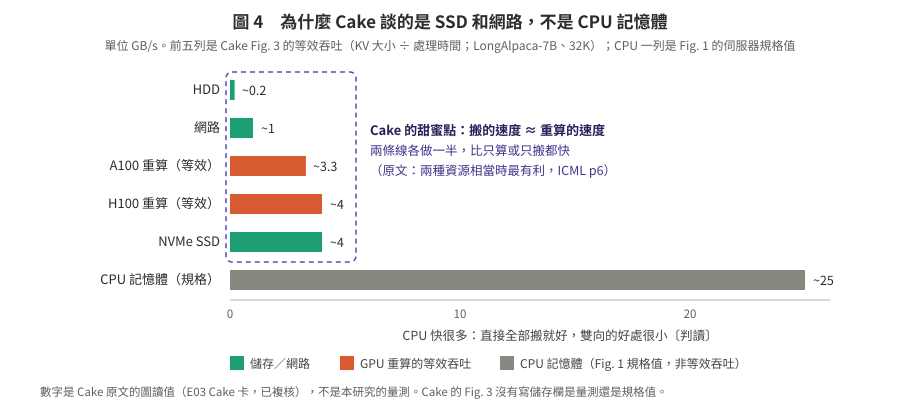

# 寫入問題：大家怎麼寫 KV、瓶頸在哪

> **一句話**：幾乎所有系統都是「KV 產生了就全部寫」。差別在三處：寫入時機（寫穿、延後寫、命中兩次才寫）、怎麼寫才不擋路（非同步、讀取優先、批次），以及少寫一點（只寫新的、壓縮）。寫入在五種情況下會讓人多等。在評測卡涵蓋的範圍內，沒有一篇比較「寫入策略 × 容量壓力」，也沒有系統在寫入時依位置決定放哪一層〔複核修正：補範圍限定〕。Cake 只研究讀取，前提是 KV 早就全部存好。

**日期**：2026-10-08
**狀態**：文獻整理，沒有新的實驗結果。
**出處**：只用 `docs/research_20261006_eval/cards/` 的評測卡、`docs/EVAL_FOUNDATIONS_20261007.md`，以及 RUNLOG／RUNLOG_MI300X（commit `9deda4f`）。評測卡已讀過原文並獨立複核；本資料夾另外做了一次複核（見檔末）。
**標記**：〔原文〕〔判讀〕〔計算〕〔二手〕〔未查證〕。

---

## 怎麼讀

| 檔案 | 內容 |
|:--|:--|
| [01_write_problem.md](01_write_problem.md) | 寫入問題是什麼：KV 的一生、寫入要做的四個決定、寫入什麼時候會讓人等、**Cake 為什麼只談 SSD 而且不管寫入**、本研究的「多寫」是什麼 |
| [02_sota_write_techniques.md](02_sota_write_techniques.md) | 17 個系統怎麼寫（大表）、寫入技巧的四種分類、用「依什麼決定」來定位本研究 |
| [03_bottlenecks_and_gaps.md](03_bottlenecks_and_gaps.md) | 五種瓶頸的證據、這個領域的空白、對第一階段的意義（**建議加一個「選擇性寫入」對照組**） |

## 圖

| 圖 | 內容 |
|:--|:--|
|  | 圖 1：KV 的一生，寫入在第 2 步；Cake 只研究第 4 步 |
|  | 圖 2：三種常見寫入時機和本研究，什麼時候把 KV 寫進 SSD |
|  | 圖 3：寫入可能讓人多等的五個地方 |
|  | 圖 4：為什麼 Cake 談的是 SSD 和網路，不是 CPU 記憶體 |

---

## 五個重點

1. **寫入要做四個決定**：要不要存、存到哪、什麼時候寫、怎麼寫。現有系統大多只在「怎麼寫」上下功夫，其他三個多半是「全部、一律、馬上」。
2. **寫入會讓人等的五種情況**：
   - 寫入頻寬跟不上；
   - 讀寫搶同一顆 SSD（Tutti：−60%）；
   - PCIe 雙向同時傳（Pensieve：各 −18–20%）；
   - 同步寫入卡在關鍵路徑；
   - 搬運搶 GPU 資源。

   不碰到這些情況時，多寫只是多佔空間。
3. **Cake 不是「只寫 SSD」，而是不管寫入**：它假設 KV 事先全部存好。它選 SSD 和網路，是因為這些速度和 GPU 重算差不多，雙向還原才有明顯好處；CPU 記憶體快很多，直接搬就好〔判讀〕。
4. **空白**：寫入策略很少被比較；也沒有系統依**位置**上的「重算 vs 搬運」成本在寫入時決定放哪（評測卡範圍內）。寫入時就決定的前例有：KVDrive（依注意力重要度，有損，各請求不共享的批次 decode）、HCache（依層比較重算與傳輸，無損，離線定死）、AdaptCache／EvicPress（依整段 context 的效用，有損壓縮）。〔複核修正：原寫「也沒有系統依『重算 vs 搬運』的成本在寫入時決定放哪」，與 HCache 不符（HCache p.7、p.10 表 3；E03）；原寫 KVDrive 是「單一請求 decode」，E04 卡指出主實驗是 batch 2–8〕
5. **對第一階段**：
   - 我們的策略分別對應到 LMCache、Mooncake Store、Pensieve 等真實系統的做法；
   - 建議加一組「命中 2 次才寫」，這是 Strata 論文的預設，SGLang、vLLM 也有類似的開關（計數語意不同，見 `03` §3.2）〔複核修正〕；
   - 建議多量兩件事：延後寫入在逐出那一刻的「寫入尖峰」，以及總寫入量。

---

## 複核紀錄

- **複核者**：zero-context subagent（沒有看過這份文件怎麼寫出來的）。**注意：與撰寫者同一個模型家族，是 self-review，不是 cross-model review**（專案 CLAUDE.md §5）。
- **日期**：2026-10-08
- **方法**：逐句、逐格回到出處。評測卡 E02、E03、E04、E05、E07，EVAL_FOUNDATIONS §2，`9deda4f` 的 RUNLOG 與 RUNLOG_MI300X，`phase1_20261008/03`、`05`（策略名與實驗代號）。另外重新下載原文、用 `pdftotext -layout` 依換頁符號標頁碼後查證：Cake（ICML'25 PMLR 版）、CachedAttention（ATC'24 USENIX 版）、Strata（OSDI'26 USENIX 版）、Mooncake（FAST'25 USENIX 版）、Bidaw（FAST'26 USENIX 版）、Tutti v1、Pensieve v3、HCache v1、CacheGen v6、LMCache v2、KVDrive v1、AdaptCache v2、EvicPress v1、CacheFlow v2（`papers/` 本地檔）、MTDS（`papers/mtds2026.pdf`）。卡片與原文衝突時以原文為準。頁碼一律是 PDF 頁。
- **計數**：逐格／逐句共檢查 **345 處**（README 25、01 52、02 127、03 49、四張圖的文字 92）。**✅ 298 處**；**❌ 22 個錯誤，分布在 42 處**（同一個錯誤出現在多個檔案只算一個，下面列出位置）；**⚠️ 4 個，5 處**。另在 01、02、03 加了 14 個〔複核補充〕標記（補條件或補漏掉的前例；原句沒有錯，原句算在 ✅ 裡）。01、02、03 內共 38 個〔複核修正〕標記，README 正文另有 3 個；SVG 裡沒有加標記，改了什麼列在下面 ❌1、❌3、❌20–22。
- **沒有做的**：E01、E06、E08–E11 沒有逐張讀，只抽查了 E06、E08 裡「寫入時／prefill 後」的段落；SVG 改完有用 `xml.dom.minidom` 驗證並用 `rsvg-convert` 看過排版。RUNLOG 本身沒有改（見 ❌1）。

### ❌ 錯誤（已就地改正，標〔複核修正〕）

1. **7,172 MiB/s 的寫法**（01 §2 表 #1、03 §1 表 #1、圖 3 第 1 條）：「每個新 block 都寫」→「每個請求的 block 都寫」，並補「只寫不重複的 block 約 3,086 MiB/s」。出處：RUNLOG 的 202.9M token ≈ 23,608 筆 × 平均 8,596（E04 Mooncake 卡表 2），也等於同檔 12,694,731 次 block 存取 ×16，是**所有請求的輸入 token 總和**；同檔的不重複 block 是 5,457,182 個（87.3M token）〔計算〕。結論方向不變（仍是 181 MiB/s 的約 17 倍）。**錯誤源自 RUNLOG 原句，RUNLOG 要另外更正。**
2. **Pensieve 18–20% 的頁碼**（01 §2 #3、02 表、03 §1 #3）：p.6–7 → p.9（§5 Implementation 的「Prioritize data retrieval over eviction」段）。25% 門檻在 p.6，正確。出處：Pensieve arXiv v3 p.9。
3. **CachedAttention 13–15% 是什麼指標**（01 §2 #4、02 表、03 §1 #4、圖 3 第 4 條）：「非同步保存帶來 13–15% 的改善」→「整體執行時間降 13–15%（prompt 1K–1.6K、decode 20 步；對照是整輪結束後一次寫完）」。出處：[CA] ATC 版 p.11 §4.3.2、p.7 Fig. 8。
4. **Strata 的搬運單位**（03 §1 #5）：「2 個 1024-thread 的 I/O kernel」→「2 個各 1024 thread 的 CUDA block（H200）」。出處：[S] p.6「two CUDA blocks of 1024 threads each」。
5. **Cake「80% 命中在磁碟」的位置**（01 §3(3)）：「ICML p2 Fig. 1」→「ICML p2 正文 §1」。出處：Cake ICML p.2。
6. **Cake 頻寬點的頁碼**（01 §3(4)）：「ICML p5」→「p5 §5.1（延遲注入）、p6 Table 2（7–100 Gbps）」。出處：Cake ICML p.5–6。
7. **HCache 那一列**（02 表）：「什麼時候寫」「有沒有量寫入的代價」原為「—」→ 補上兩段式存檔（cudaMemcpy 快照到主機＋主機 daemon 寫 SSD）、每層存 hidden／KV／不存由離線 profile 決定、TBT 最多高 4%、DirectIO 時 TBT 高 34%（7B、batch 16）與 13%（13B、batch 32）。出處：HCache v1 p.6–8 §4.1–4.2、p.10、p.12 Fig. 14。
8. **「沒有系統依重算 vs 搬運成本在寫入時決定」**（README 重點 4、03 §2 #3）：→ 限定為「依**位置**」，並寫明 HCache 已在寫入時依層、依重算 vs 傳輸決定存什麼（OPT-30B＝40 層 hidden＋8 層重算，那 8 層不存）。出處：HCache p.7 §4.1.2、§4.2，p.10 表 3；E03 共同模式 4 的複核修正。EVAL §2.4 的「沒有一個」只涵蓋 E02 的 5 個 KV 層系統。
9. **KVDrive「單一請求 decode」**（README 重點 4、02 §3）：→「每個請求各自一段長 context、彼此不共享的批次 decode（360K 時 batch 2）」。出處：E04 KVDrive 卡「與既有整理不一致 ②」與「到達與併發」列。
10. **CacheGen 的 622 MB**（02 表）：「Mistral-7B 從 622 MB 降到 176 MB」→「8-bit 量化是 622 MB，CacheGen 是 176 MB」。出處：CacheGen v6 p.2 Table 1。
11. **EvicPress 的決定時機**（02 表）：「從名稱看是逐出時決定〔判讀〕」→「新 KV 存入時就依最高效用選壓縮與層；層滿時再調整既有的」。出處：EvicPress v1 p.6–7 §4.4、p.7 §5、p.16 Alg. 1。
12. **讓 GPU 發 I/O 的路徑**（02 §2.B 第 4 列）：「Tutti、HCache 主要用在讀回的路徑」→「Tutti 讀寫都由 GPU io_uring 發出；只有 HCache 是讀回限定」。出處：Tutti v1 p.7 §3.3（寫入排在讀取後、由 gio_uring 發出）、p.8（P2P DMA 寫入）；HCache p.8。
13. **「慢層沒真的量到」的名單**（03 §2 #4）：Cake 原引「E04 共同模式 1」→ E03 共同模式 1；補上 HCache、py-kvcache（真實 NVMe）與 Strata 的 DeepSeek-V3 子實驗；限定「E04 的 8 篇」。出處：E03、E04 共同模式 1。
14. **「54 篇論文與系統」**（03 §2）：→ 改為「評測卡涵蓋的範圍」，並寫明 54 是 11 份卡的論文數（另有 5 個 KV 層系統等），本資料夾只讀了其中 5 份卡。出處：EVAL_FOUNDATIONS 第 8 行。
15. **「沒有人做」缺範圍限定**（README 一句話、02 一句話、02 §2.D、03 一句話、03 §2 #2、03 §3.1 的 S5 列）：補「評測卡涵蓋的範圍內」或「E04 的 8 篇」。出處：E04 共同模式 2 的範圍是 E04 的 8 篇。
16. **「只有 Strata 把寫入策略做成可切換」**（03 §2 #1）：→ 限定「E04 的 8 篇論文裡」，並列出範圍外的例外（SGLang、vLLM、Dynamo 的開關；HCache 依層不存；AdaptCache、EvicPress 存入時決定）。出處：E02 B3–B4、E03 HCache 卡、E05。
17. **「命中 2 次才寫，SGLang、vLLM（、Dynamo）都有的開關」**（README 重點 5、03 §3.2）：→「也有類似的開關」，並註明三者計數不同：SGLang 門檻寫死 2；vLLM v0.28.0 計 `lookup()` 次數、main 計被提議儲存次數；Dynamo 是頻率 ≥2（初值 1、命中加倍、時間衰減）。出處：E04 Strata 卡（SGLang `542addad`）、EVAL §2.3、E02 B3。
18. **SSD 寫入耗損「沒有找到證據」**（03 §1、§4）：→ 補上 Dynamo KVBM 磁碟層過濾的理由就是延長 SSD 壽命。出處：E02 B3〔文件〕。
19. **02 的出處清單漏了 E05**（02 開頭）：補上 E05（AdaptCache、EvicPress、Fancy-eviction 都出自 E05）。
20. **圖 1**：「Cake、CacheFlow 只研究這一段（假設 KV 早就全部存好）」→ 括號改成「（Cake 假設 KV 早就全部存好）」。出處：CacheFlow v2 p.6 把被逐出而不可用的狀態設為無限成本，並不假設全部存好。
21. **圖 2**：選擇性寫入的方框原本畫在「一輪結束」，和圖例「寫進 SSD 的時間點」及 03 §3.2 S1s 的「第 2 次被命中時才寫」矛盾 → 「一輪結束」改成「只放 CPU」，方框移到「使用者回來」並標「第 2 次命中才寫」。出處：[S] p.9（存取次數超過門檻才備份）；本檔 03 §3.2。
22. **圖 4**：副標題「Cake Fig. 1、Fig. 3 的讀值；LongAlpaca-7B、32K」把兩種數字混為一談 → 改成「前五列是 Fig. 3 的等效吞吐（LongAlpaca-7B、32K）；CPU 一列是 Fig. 1 的伺服器規格值」；列名「CPU↔GPU（PCIe）」→「CPU 記憶體（規格）」，圖例同步改。出處：Cake ICML p.2 Fig. 1 圖說（參數取自 LambdaLab 伺服器規格）、p.4 Fig. 3 圖說。

### ⚠️ 出處找不到或原標〔未查證〕（已改寫）

1. **01 §3(2)「CPU 記憶體經 PCIe 約 25 GB/s」**：原文只寫 CPU Memory「bandwidth: ∼25GB/s」，沒寫經 PCIe → 改成「CPU 記憶體的頻寬約 25 GB/s」，「經 PCIe」改標〔判讀〕，並註明是規格值。出處：Cake ICML p.2。
2. **02 §2.B「非同步、逐層寫」列出 Bidaw**：Bidaw 原文只說「writing KVs to storage is not on the critical path」，沒有說逐層 → 改成「非同步寫，不在關鍵路徑上」，逐層只標在 CachedAttention、LMCache。出處：Bidaw p.3。
3. **03 §1 #5「我們的搬運用 copy engine（`cudaMemcpyAsync`）」**：`phase1_20261008` 沒有規定搬運方式，且平台是 MI300X → 改標〔判讀，建議〕，API 改為 `hipMemcpyAsync`。
4. **AdaptCache 的決定時機〔未查證〕**（02 表、03 §4）：已查原文 → 「新 KV entry 產生時，對新 entry 與所有已存 entry 重新評估」。出處：AdaptCache v2 p.2 §2。

### 〔複核補充〕（沒有錯，補條件）

QLC 181 MiB/s 是整機爭用 HEAVY 下的三次中位數（RUNLOG 稱下界）；MI300X 的 `/var/tmp` 是本地 overlay、O_DIRECT 8 GiB × 3 次（RUNLOG_MI300X）；CachedAttention 99.6% 的條件是 128 GB DRAM＋10 TB SSD 與排程感知預取，LRU／FIFO 的 DRAM 命中只有約 0.6%／0.5%（[CA] p.12）；MTDS 在 Random、LLaMa-13B 上命中率由 0.380 降到 0.215（[M] p.14）；Tutti 的「寫入頻寬影響小於讀取」是引前作 [41]，它自己的 store 頻寬約 10 GB/s（[T] p.10）；Mooncake 的「逐出時才寫 SSD」出自開源 Store 文件不是 FAST 論文（E02 B3）；LMCache 在 02 §2.C 補「程式碼預設不存 decode KV」以和 §1 一致；HCache 補進 02 §2.B 兩列、§2.D、§3 表，並建議查新時一併引用；01 §2 #4 補 HCache 的 DirectIO 證據；03 §3.2 的「多 1/8」補上 B 實驗目前有 8 個策略。

### 給使用者的提醒

最需要注意的是 ❌8：「寫入時依重算 vs 傳輸成本決定存不存」**已有前例 HCache**（依層、無損、離線定死）。本研究的空白只剩「依 token 位置、在跨請求重用下決定」；查新與論文的相關工作必須把 HCache 和 KVDrive 一起處理。
